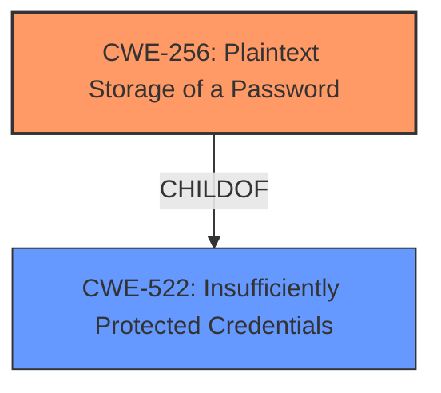

# Analysis for CVE-2024-5960

# Summary
| CWE ID | CWE Name | Confidence | CWE Abstraction Level | CWE Vulnerability Mapping Label | CWE-Vulnerability Mapping Notes |
|---|---|---|---|---|---|
| CWE-256 | Plaintext Storage of a Password | 1.0 | Base | Allowed | Primary CWE. Matches the root cause directly. |

## Evidence and Confidence

*   **Confidence Score:** 1.0
*   **Evidence Strength:** HIGH

## Relationship Analysis
The primary CWE is CWE-256, which is a Base level CWE. While it has a parent CWE (CWE-522 Insufficiently Protected Credentials), CWE-256 is a more specific and accurate representation of the vulnerability. There are no chain relationships relevant in this case.

## Vulnerability Chain
The vulnerability chain is straightforward:
1.  **Root Cause:** CWE-256 - Plaintext Storage of a Password
2.  **Impact:** Use of Known Domain Credentials (as stated in the description)

## Summary of Analysis
The vulnerability description clearly states "**plaintext storage of password**". The retriever results also list CWE-256 as the top candidate.

CWE-256 (Plaintext Storage of a Password) is the most appropriate CWE because it directly addresses the **root cause** of the vulnerability. The description explicitly mentions the storage of passwords in plaintext, which aligns perfectly with the definition of CWE-256. The vulnerability's impact, "Use of Known Domain Credentials", is a direct consequence of this **plaintext storage**.

Other CWEs were considered, especially those related to credential protection. However, they were not as precise as CWE-256:

*   CWE-312 (Cleartext Storage of Sensitive Information): This is a broader category. While it applies, CWE-256 is more specific to passwords.
*   CWE-916 (Use of Password Hash With Insufficient Computational Effort): This applies to weak hashing, not plaintext storage.
*   CWE-257 (Storing Passwords in a Recoverable Format): This is about reversible encryption, not plaintext.
*   CWE-522 (Insufficiently Protected Credentials): This is a higher-level class.
Relevant CWE Information: