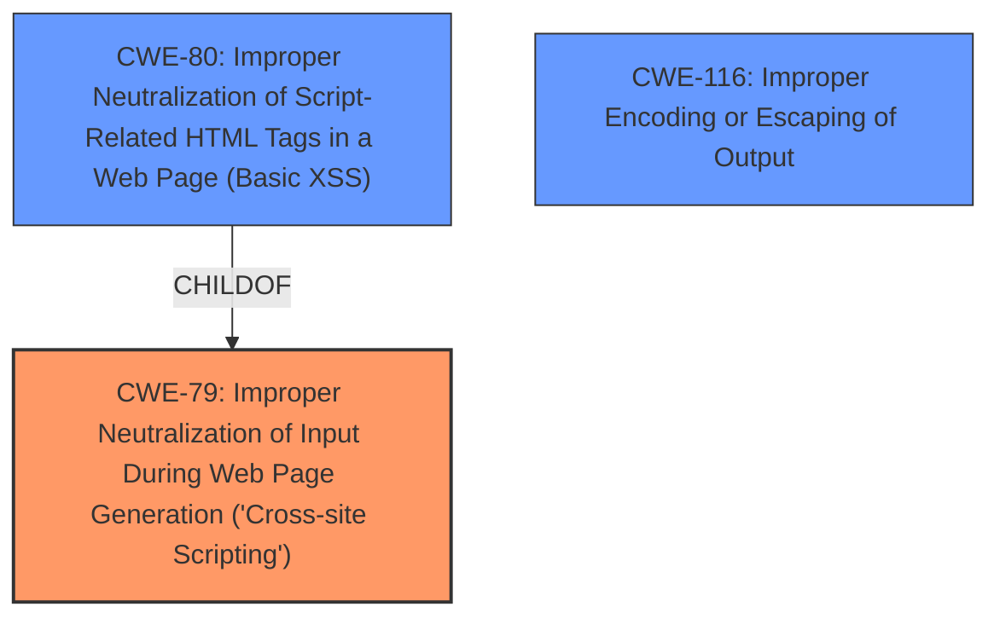

# Raw Analyzer Response for CVE-2024-5964

# Summary
| CWE ID | CWE Name | Confidence | CWE Abstraction Level | CWE Vulnerability Mapping Label | CWE-Vulnerability Mapping Notes |
|---|---|---|---|---|---|
| CWE-79 | Improper Neutralization of Input During Web Page Generation ('Cross-site Scripting') | 1.0 | Base | Primary | Allowed |
| CWE-116 | Improper Encoding or Escaping of Output | 0.7 | Class | Secondary | Allowed-with-Review |

## Evidence and Confidence

*   **Confidence Score:** 0.9
*   **Evidence Strength:** HIGH

## Relationship Analysis
The primary weakness is **CWE-79 [Improper Neutralization of Input During Web Page Generation ('Cross-site Scripting')]**, which is a Base level CWE. **CWE-80 [Improper Neutralization of Script-Related HTML Tags in a Web Page (Basic XSS)]** is a Variant of **CWE-79 [Improper Neutralization of Input During Web Page Generation ('Cross-site Scripting')]**, but the description doesn't specify the vulnerability is limited to script-related HTML tags, so **CWE-79 [Improper Neutralization of Input During Web Page Generation ('Cross-site Scripting')]** is more appropriate. **CWE-116 [Improper Encoding or Escaping of Output]** is a Class-level CWE related to output handling, and could be a contributing factor.

## Vulnerability Chain
The vulnerability chain starts with **insufficient input sanitization and output escaping** which leads to the **Stored Cross-Site Scripting** vulnerability. An attacker exploits this by injecting arbitrary web scripts into pages, which execute when a user accesses the injected page.
- **Root Cause:** **Insufficient input sanitization and output escaping**
- **Weakness:** **CWE-79 [Improper Neutralization of Input During Web Page Generation ('Cross-site Scripting')]**
- **Impact:** Arbitrary web script injection and execution

## Summary of Analysis
The primary CWE is **CWE-79 [Improper Neutralization of Input During Web Page Generation ('Cross-site Scripting')]** because the vulnerability description clearly states that there is **insufficient input sanitization and output escaping**, which allows an attacker to inject arbitrary web scripts. This aligns perfectly with the definition of **CWE-79 [Improper Neutralization of Input During Web Page Generation ('Cross-site Scripting')]**. The evidence is strong, as indicated by the vulnerability description and the CVE reference links content summary.

The retriever results also support this selection, with **CWE-79 [Improper Neutralization of Input During Web Page Generation ('Cross-site Scripting')]** being a top result. The relationship analysis confirms that **CWE-79 [Improper Neutralization of Input During Web Page Generation ('Cross-site Scripting')]** is the appropriate level of abstraction, as it is a Base CWE. **CWE-80 [Improper Neutralization of Script-Related HTML Tags in a Web Page (Basic XSS)]** is a more specific Variant, but the description doesn't limit the vulnerability to just script-related tags.

**CWE-116 [Improper Encoding or Escaping of Output]** was also considered, as output escaping is part of the root cause. While not the primary issue, it is a contributing factor and thus included as a secondary CWE. Other CWEs were considered but deemed less relevant. **CWE-352 [Cross-Site Request Forgery (CSRF)]**, **CWE-434 [Unrestricted Upload of File with Dangerous Type]**, **CWE-425 [Direct Request ('Forced Browsing')]** do not align with the provided description.

Relevant CWE Information:

# Enhanced Context (25 CWEs)
The following CWEs were identified as potentially relevant to this vulnerability:

## CWE-352: Cross-Site Request Forgery (CSRF)
**Abstraction Level**: Compound
**Similarity Score**: 0.74
**Source**: dense

**Description**:
The web application does not, or can not, sufficiently verify whether a well-formed, valid, consistent request was intentionally provided by the user who submitted the request.

**Mapping Guidance**:
- Usage: Allowed
- Rationale: This is a well-known Composite of multiple weaknesses that must all occur simultaneously, although it is attack-oriented in nature.

## CWE-96: Improper Neutralization of Directives in Statically Saved Code ('Static Code Injection')
**Abstraction Level**: Base
**Similarity Score**: 0.70
**Source**: dense

**Description**:
The product receives input from an upstream component, but it does not neutralize or incorrectly neutralizes code syntax before inserting the input into an executable resource, such as a library, configuration file, or template.

**Mapping Guidance**:
- Usage: Allowed
- Rationale: This CWE entry is at the Base level of abstraction, which is a preferred level of abstraction for mapping to the root causes of vulnerabilities.

## CWE-80: Improper Neutralization of Script-Related HTML Tags in a Web Page (Basic XSS)
**Abstraction Level**: Variant
**Similarity Score**: 0.70
**Source**: dense

**Description**:
The product receives input from an upstream component, but it does not neutralize or incorrectly neutralizes special characters such as "<", ">", and "&" that could be interpreted as web-scripting elements when they are sent to a downstream component that processes web pages.

**Mapping Guidance**:
- Usage: Allowed
- Rationale: This CWE entry is at the Variant level of abstraction, which is a preferred level of abstraction for mapping to the root causes of vulnerabilities.

## CWE-425: Direct Request ('Forced Browsing')
**Abstraction Level**: Base
**Similarity Score**: 0.69
**Source**: dense

**Description**:
The web application does not adequately enforce appropriate authorization on all restricted URLs, scripts, or files.

**Mapping Guidance**:
- Usage: Allowed
- Rationale: This CWE entry is at the Base level of abstraction, which is a preferred level of abstraction for mapping to the root causes of vulnerabilities.

## CWE-434: Unrestricted Upload of File with Dangerous Type
**Abstraction Level**: Base
**Similarity Score**: 0.69
**Source**: dense

**Description**:
The product allows the upload or transfer of dangerous file types that are automatically processed within its environment.

**Mapping Guidance**:
- Usage: Allowed
- Rationale: This CWE entry is at the Base level of abstraction, which is a preferred level of abstraction for mapping to the root causes of vulnerabilities.

## CWE-472: External Control of Assumed-Immutable Web Parameter
**Abstraction Level**: Base
**Similarity Score**: 0.69
**Source**: dense

**Description**:
The web application does not sufficiently verify inputs that are assumed to be immutable but are actually externally controllable, such as hidden form fields.

**Mapping Guidance**:
- Usage: Allowed
- Rationale: This CWE entry is at the Base level of abstraction, which is a preferred level of abstraction for mapping to the root causes of vulnerabilities.

## CWE-116: Improper Encoding or Escaping of Output
**Abstraction Level**: Class
**Similarity Score**: 0.67
**Source**: dense

**Description**:
The product prepares a structured message for communication with another component, but encoding or escaping of the data is either missing or done incorrectly. As a result, the intended structure of the message is not preserved.

**Mapping Guidance**:
- Usage: Allowed-with-Review
- Rationale: This CWE entry is a Class and might have Base-level children that would be more appropriate

## CWE-79: Improper Neutralization of Input During Web Page Generation ('Cross-site Scripting')
**Abstraction Level**: Base
**Similarity Score**: 0.67
**Source**: dense

**Description**:
The product does not neutralize or incorrectly neutralizes user-controllable input before it is placed in output that is used as a web page that is served to other users.

**Mapping Guidance**:
- Usage: Allowed
- Rationale: This CWE entry is at the Base level of abstraction, which is a preferred level of abstraction for mapping to the root causes of vulnerabilities.

## CWE-790: Improper Filtering of Special Elements
**Abstraction Level**: Class
**Similarity Score**: 0.66
**Source**: dense

**Description**:
The product receives data from an upstream component, but does not filter or incorrectly filters special elements before sending it to a downstream component.

**Mapping Guidance**:
- Usage: Allowed-with-Review
- Rationale: This CWE entry is a Class and might have Base-level children