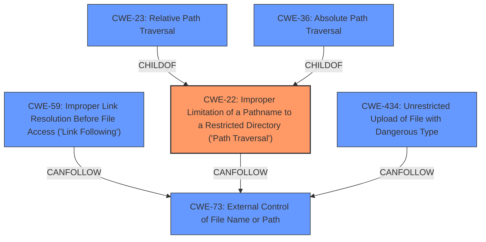

# Analysis Report for CVE-2024-5980

# Vulnerability Analysis Report: CVE-2024-5980

## Description

A vulnerability in the /v1/runs API endpoint of lightning-ai/pytorch-lightning v2.2.4 allows attackers to exploit **path traversal** when extracting tar.gz files. When the LightningApp is running with the plugin_server, attackers can deploy malicious tar.gz plugins that embed arbitrary files with **path traversal** vulnerabilities. This can result in arbitrary files being written to any directory in the victims local file system, potentially leading to remote code execution.

## Vulnerability Description Key Phrases

- **Weakness:** path traversal
- **Impact:** ['arbitrary file write', 'remote code execution']
- **Product:** lightning-ai/pytorch-lightning
- **Version:** v2.2.4
- **Component:** /v1/runs API endpoint

## Analysis (with Relationship Data)

# Summary
| CWE ID | CWE Name | Confidence | CWE Abstraction Level | CWE Vulnerability Mapping Label | CWE-Vulnerability Mapping Notes |
|---|---|---|---|---|---|
| CWE-22 | Improper Limitation of a Pathname to a Restricted Directory ('Path Traversal') | 1.0 | Base | Allowed | Primary CWE. The product **does not properly neutralize** special elements within the pathname that can cause the pathname to resolve to a location that is outside of the restricted directory. |
| CWE-434 | Unrestricted Upload of File with Dangerous Type | 0.5 | Base | Allowed | Secondary Candidate. The product allows the upload or transfer of dangerous file types that are automatically processed within its environment. |

## Evidence and Confidence

*   **Confidence Score:** 0.8
*   **Evidence Strength:** MEDIUM

## Relationship Analysis
The primary CWE is CWE-22, which is a base level weakness. Other CWEs like CWE-23 and CWE-36 are children of CWE-22, representing more specific cases of path traversal (relative and absolute, respectively). The retriever results also suggest CWE-59 and CWE-73, which are related to file access and external control of file names, respectively. The hierarchical relationships and retriever results support the selection of CWE-22 as the most appropriate base CWE, because the vulnerability involves writing files outside the intended directory.



## Vulnerability Chain
The vulnerability chain starts with the unrestricted upload of a tar.gz file (potentially CWE-434), followed by **improper path handling** during extraction, leading to **path traversal** (CWE-22), and finally, arbitrary file write, potentially leading to remote code execution.
  - **Root Cause:** CWE-22 (Improper Limitation of a Pathname to a Restricted Directory)
  - **Impact:** Arbitrary file write, Remote Code Execution

## Summary of Analysis
The primary weakness is the **improper limitation of a pathname to a restricted directory ('Path Traversal')**, as the application **does not properly neutralize** path elements. The vulnerability description explicitly mentions "**path traversal** when extracting tar.gz files" and that "attackers can deploy malicious tar.gz plugins that embed arbitrary files with **path traversal** vulnerabilities." This clearly indicates CWE-22 as the root cause. CWE-434 is included as a secondary candidate because it represents the unrestricted upload of a dangerous file type, which is a prerequisite for the path traversal to occur.

The selection of CWE-22 is at the optimal level of specificity because it directly addresses the **path traversal** vulnerability. While CWE-23 and CWE-36 are more specific (relative and absolute path traversal, respectively), the provided description does not specify which type of **path traversal** is occurring, so using the base CWE-22 is more appropriate.

CWE-434 (Unrestricted Upload of File with Dangerous Type) was considered because the vulnerability involves uploading a tar.gz file. However, it's a prerequisite for the path traversal, not the root cause itself. Therefore, it's a secondary issue.

CWE-59 (Improper Link Resolution Before File Access) was also considered, but the vulnerability description focuses on **path traversal** rather than link following. Therefore, it was not selected as the primary CWE.


## CWE Relationship Analysis

Current CWEs represent these abstraction levels: .


### Vulnerability Chain Analysis

**Chain starting from CWE-22:**
- 22 (Improper Limitation of a Pathname to a Restricted Directory ('Path Traversal')) - ROOT


**Chain starting from CWE-59:**
- 59 (Improper Link Resolution Before File Access ('Link Following')) - ROOT


### CWE Relationship Diagram

```mermaid
graph TD
    classDef primary fill:#f96,stroke:#333,stroke-width:2px
    classDef secondary fill:#69f,stroke:#333
    classDef tertiary fill:#9e9,stroke:#333
```


*Report generated on 2025-07-14 01:04:47*
