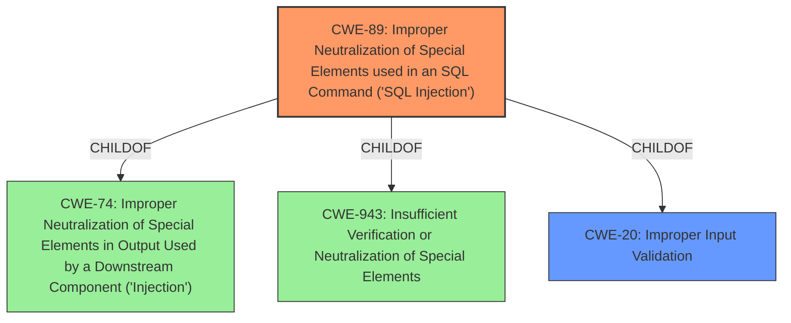

# Raw Analyzer Response for CVE-2024-5989

# Summary
| CWE ID | CWE Name | Confidence | CWE Abstraction Level | CWE Vulnerability Mapping Label | CWE-Vulnerability Mapping Notes |
|---|---|---|---|---|---|
| CWE-89 | Improper Neutralization of Special Elements used in an SQL Command ('SQL Injection') | 1.0 | Base | Allowed | Primary CWE. The vulnerability description explicitly states that an unauthenticated threat actor can invoke **SQL injection**. |
| CWE-20 | Improper Input Validation | 0.7 | Class | Discouraged | Secondary CWE. The vulnerability is caused by **improper input validation**. |

## Evidence and Confidence

*   **Confidence Score:** 0.9
*   **Evidence Strength:** HIGH

## Relationship Analysis
The primary CWE is CWE-89, which is a base-level CWE that directly addresses the **SQL Injection** vulnerability. CWE-89 is a child of CWE-74 (Improper Neutralization of Special Elements in Output Used by a Downstream Component ('Injection')) and CWE-943 (Insufficient Verification or Neutralization of Special Elements). The secondary CWE is CWE-20, which is a class-level CWE that describes **improper input validation**. CWE-20 is a parent of CWE-89, indicating that the **SQL Injection** is a result of **improper input validation**. Choosing CWE-89 provides a more specific classification than CWE-20.

## Vulnerability Chain
The vulnerability chain starts with **improper input validation** (CWE-20), which allows a malicious message to inject **SQL** commands (CWE-89). This leads to remote code execution on the affected device.
  - CWE-20: Improper Input Validation (Root Cause)
  - CWE-89: Improper Neutralization of Special Elements used in an SQL Command ('SQL Injection')
  - Remote Code Execution (Impact)

## Summary of Analysis
The vulnerability is due to an **improper input validation** that allows an unauthenticated threat actor to send a malicious message to invoke **SQL injection** into the program and cause a remote code execution condition on the Rockwell Automation ThinManager ThinServerTM.

The vulnerability description explicitly states that the root cause is **improper input validation** and the weakness is **SQL injection**. The retriever results also list CWE-89 as the top candidate with a score of 1.0.

The relationship analysis shows that CWE-89 is a child of CWE-20, which means that CWE-89 is a more specific classification of the vulnerability.

The mapping guidance for CWE-89 states that it is at the Base level of abstraction, which is a preferred level of abstraction for mapping to the root causes of vulnerabilities. The mapping guidance for CWE-20 states that it is a Class and is discouraged because lower-level CWEs could be used instead.

Based on the evidence, relationship analysis, and mapping guidance, the primary CWE is CWE-89 and the secondary CWE is CWE-20.

CWEs Considered but not Used:
*   CWE-116, CWE-138, CWE-74, CWE-1284, CWE-73, CWE-502: These were considered but were ultimately not selected because the provided vulnerability description clearly indicates an SQL injection vulnerability due to improper input validation. The **improper input validation** is listed as the ROOTCAUSE, and the resulting **SQL Injection** is listed as the WEAKNESS.