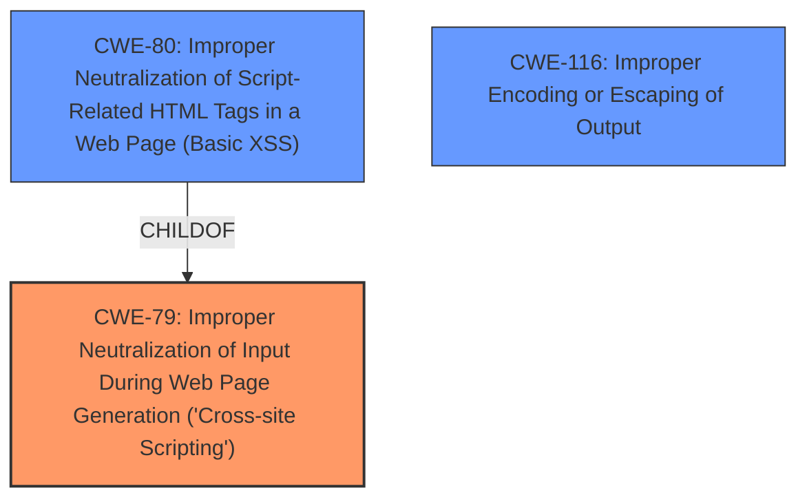

# Raw Analyzer Response for CVE-2024-6072

# Summary
| CWE ID | CWE Name | Confidence | CWE Abstraction Level | CWE Vulnerability Mapping Label | CWE-Vulnerability Mapping Notes |
|---|---|---|---|---|---|
| CWE-79 | Improper Neutralization of Input During Web Page Generation ('Cross-site Scripting') | 1.0 | Base | Allowed | Primary CWE. The product does not neutralize or incorrectly neutralizes user-controllable input before it is placed in output that is used as a web page that is served to other users. |
| CWE-80 | Improper Neutralization of Script-Related HTML Tags in a Web Page (Basic XSS) | 0.7 | Variant | Allowed | Secondary candidate. The product receives input from an upstream component, but it does not neutralize or incorrectly neutralizes special characters such as "<", ">", and "&" that could be interpreted as web-scripting elements when they are sent to a downstream component that processes web pages. |
| CWE-116 | Improper Encoding or Escaping of Output | 0.6 | Class | Allowed-with-Review | Secondary candidate. The product prepares a structured message for communication with another component, but encoding or escaping of the data is either missing or done incorrectly. As a result, the intended structure of the message is not preserved. |

## Evidence and Confidence

*   **Confidence Score:** 0.9
*   **Evidence Strength:** HIGH

## Relationship Analysis
The primary weakness is CWE-79 [Improper Neutralization of Input During Web Page Generation ('Cross-site Scripting')], which is caused by the plugin's failure to sanitize the `$_SERVER['REQUEST_URI']` parameter. CWE-79 has child CWEs like CWE-80 [Improper Neutralization of Script-Related HTML Tags in a Web Page (Basic XSS)], a more specific variant. CWE-116 [Improper Encoding or Escaping of Output] is a class-level CWE that could apply.

## Vulnerability Chain
The vulnerability chain starts with the **lack of sanitization** of the `$_SERVER['REQUEST_URI']` parameter, leading to the possibility of injecting malicious scripts into a web page, which results in a reflected XSS vulnerability.
  - **Root Cause:** **Lack of sanitization** of `$_SERVER['REQUEST_URI']`
  - **Weakness:** Reflected XSS
  - **Impact:** Execution of malicious scripts in the victim's browser

## Summary of Analysis
The analysis indicates that the wp-cart-for-digital-products WordPress plugin before 8.5.5 does not properly sanitize the `$_SERVER['REQUEST_URI']` parameter before outputting it, leading to a Reflected Cross-Site Scripting (XSS) vulnerability. The primary CWE is CWE-79 [Improper Neutralization of Input During Web Page Generation ('Cross-site Scripting')], as the plugin **fails to neutralize user-controllable input**. The evidence from the CVE Reference Links Content Summary explicitly states that the **root cause is the plugin's failure to sanitize the `$_SERVER['REQUEST_URI']` parameter**.

CWE-80 [Improper Neutralization of Script-Related HTML Tags in a Web Page (Basic XSS)] is a more specific variant of CWE-79 and a candidate since the XSS occurs due to script-related HTML tags. CWE-116 [Improper Encoding or Escaping of Output] is also a potential candidate, but CWE-79 directly addresses the **improper neutralization of input**, making it a better fit.

I am confident in this assessment based on the provided evidence and the CWE specifications. The selection of CWE-79 is at the optimal level of specificity as it captures the root cause of the vulnerability.

Relevant CWE Information: