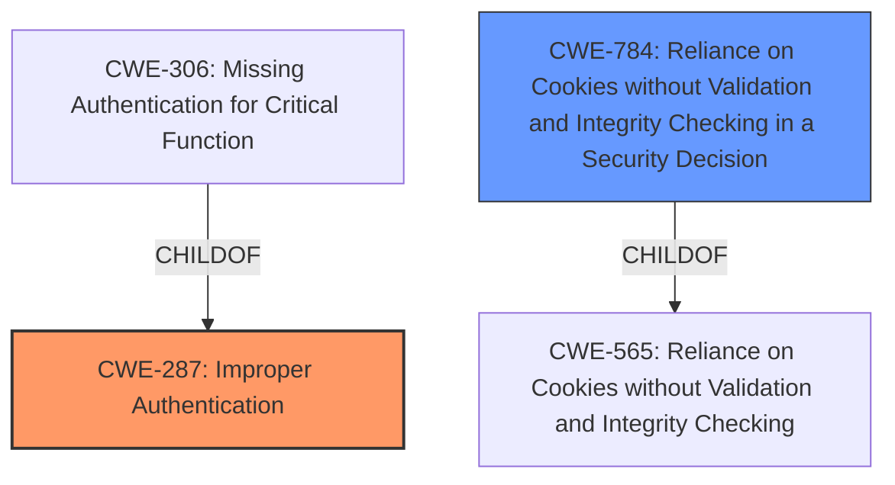

# Analysis for CVE-2024-6078

# Summary
| CWE ID | CWE Name | Confidence | CWE Abstraction Level | CWE Vulnerability Mapping Label | CWE-Vulnerability Mapping Notes |
|---|---|---|---|---|---|
| CWE-287 | Improper Authentication | 1.0 | Class | Primary CWE | Discouraged |
| CWE-784 | Reliance on Cookies without Validation and Integrity Checking in a Security Decision | 0.7 | Variant | Secondary Candidate | Allowed |

## Evidence and Confidence

*   **Confidence Score:** 0.9
*   **Evidence Strength:** MEDIUM

## Relationship Analysis
The primary CWE is CWE-287, which is a class-level CWE. While it's generally discouraged to use class-level CWEs when more specific options exist, the vulnerability description centers around **improper authentication**. CWE-287 has child CWEs like CWE-306 (Missing Authentication for Critical Function), but the description doesn't explicitly state that authentication is missing entirely, only that it is **improper**. CWE-784 is a Variant of CWE-565 (Reliance on Cookies without Validation and Integrity Checking) and describes the specific mechanism by which the **improper authentication** is exploited.

## Vulnerability Chain
The chain of events starts with **improper authentication** (CWE-287). This leads to the ability to generate cookies for any user ID without proper credentials. The reliance on these cookies without validation (CWE-784) allows an attacker to assume the identity of a legitimate user and modify data.

## Summary of Analysis
Initially, the vulnerability description clearly points to an **improper authentication vulnerability**. The description indicates that a malicious user can generate cookies for any user ID without a username or password. This suggests that the authentication process is flawed, allowing unauthorized access.

The Retriever Results list CWE-287 (Improper Authentication) and CWE-784 (Reliance on Cookies without Validation and Integrity Checking in a Security Decision) as top candidates.

CWE-287 is selected as the primary CWE because the root cause is the **improper authentication**. The MITRE guidance for Authentication vs Authorization helped clarify this. CWE-784 is included as a secondary CWE as it describes the specific mechanism of exploiting the **improper authentication** i.e. reliance on cookies without proper validation or integrity checking.

The evidence for **improper authentication** is derived from the "Vulnerability Description Key Phrases": "**rootcause:** **improper authentication vulnerability**".

# Relevant CWE Information:

## CWE-807: Reliance on Untrusted Inputs in a Security Decision
Not selected. This CWE focuses on security decisions based on untrusted inputs. While cookies are inputs, the core issue isn't the reliance on the input but the **improper authentication** that allows their creation.

## CWE-303: Incorrect Implementation of Authentication Algorithm
Not selected. This CWE is about incorrect implementation of specific authentication algorithms. There is no information about what algorithm or if any algorithm was incorrectly implemented.

## CWE-1391: Use of Weak Credentials
Not selected. This CWE relates to the use of weak passwords, default keys, or other easily compromised credentials. The vulnerability allows cookie generation without any username or password, it is **improper authentication** not the use of weak credentials.

## CWE-472: External Control of Assumed-Immutable Web Parameter
Not selected. This CWE is about web applications that don't verify inputs assumed to be immutable. While cookies could be considered parameters, the core issue is not immutability but the **improper authentication** process.

## CWE-1390: Weak Authentication
Not selected. Similar to CWE-1391, this is a more general authentication problem.

## CWE-288: Authentication Bypass Using an Alternate Path or Channel
Not selected. This CWE is about bypassing authentication via an alternate path. The description mentions **improper authentication**, not a bypass.

## CWE-41: Improper Resolution of Path Equivalence
Not selected. This CWE is about file system vulnerabilities and path manipulation.

## CWE-330: Use of Insufficiently Random Values
Not selected. This CWE focuses on the use of weak random numbers.

## CWE-204: Observable Response Discrepancy
Not selected. This CWE is about information leakage through different responses.

## CWE-639: Authorization Bypass Through User-Controlled Key
Not selected. While this CWE involves bypassing authorization, it requires modifying a key value. The described vulnerability allows cookie generation without a username or password, indicating an **improper authentication** issue rather than an authorization bypass.

## CWE-863: Incorrect Authorization
Not selected. The vulnerability is related to **improper authentication**, not authorization.

## CWE-285: Improper Authorization
Not selected. The vulnerability is related to **improper authentication**, not authorization.

## CWE-1390: Weak Authentication
Not selected. The vulnerability is related to **improper authentication**, not weak authentication.

## CWE-306: Missing Authentication for Critical Function
Not selected. It is **improper authentication** rather than missing authentication.

## CWE-259: Use of Hard-coded Password
Not selected. This CWE is about using hard-coded passwords.

## CWE-79: Improper Neutralization of Input During Web Page Generation ('Cross-site Scripting')
Not selected. This CWE is about Cross-site Scripting.

## CWE-306: Missing Authentication for Critical Function
Not selected. It is **improper authentication** rather than missing authentication.

## CWE-798: Use of Hard-coded Credentials
Not selected. This CWE is about using hard-coded credentials.

## CWE-565: Reliance on Cookies without Validation and Integrity Checking
Not selected. This CWE is about using Cookies without validation. CWE-784 is the variant of this CWE, and the description provides the specific case of **improper authentication**.

## CWE-321: Use of Hard-coded Cryptographic Key
Not selected. This CWE is about using hard-coded cryptographic keys.

## CWE-613: Insufficient Session Expiration
Not selected. This CWE is about session expiration, and isn't the root cause of the issue.

## CWE-184: Incomplete List of Disallowed Inputs
Not selected. This CWE is about incomplete lists of disallowed inputs.

## CWE-494: Download of Code Without Integrity Check
Not selected. This CWE is about downloading code without integrity checks.