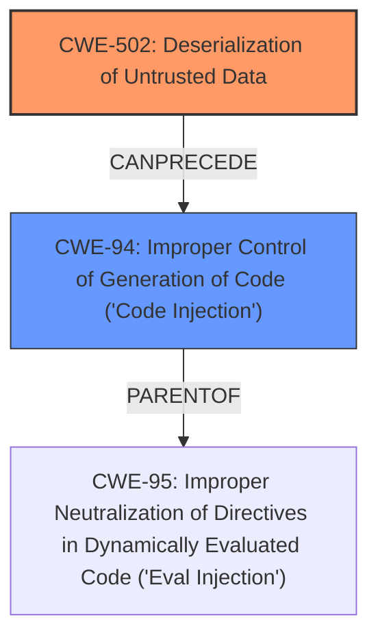

# Enhanced Analysis for CVE-2024-6096

# Summary
| CWE ID | CWE Name | Confidence | CWE Abstraction Level | CWE Vulnerability Mapping Label | CWE-Vulnerability Mapping Notes |
|---|---|---|---|---|---|
| CWE-502 | Deserialization of Untrusted Data | 0.9 | Base | Allowed | Primary CWE |
| CWE-94 | Improper Control of Generation of Code ('Code Injection') | 0.6 | Base | Allowed-with-Review | Secondary Candidate |

## Evidence and Confidence

*   **Confidence Score:** 0.9
*   **Evidence Strength:** HIGH

## Relationship Analysis
The primary CWE is CWE-502, which describes deserialization of untrusted data without proper validation. This can lead to code injection (CWE-94) if the deserialized data is then used to generate code. CWE-502 is a Base level CWE, and CWE-94 is also a Base level CWE. CWE-94 is a parent of CWE-95 (Improper Neutralization of Directives in Dynamically Evaluated Code ('Eval Injection')) and CWE-96 (Improper Neutralization of Special Elements Used in Dynamically-Generated Code ('Dynamic Code Evaluation')). This parent-child relationship shows how code injection can occur through various mechanisms. The relationship between CWE-502 and CWE-94 indicates a potential vulnerability chain where deserialization of untrusted data leads to code injection.



## Vulnerability Chain
The vulnerability chain starts with the deserialization of untrusted data (CWE-502). Due to **insecure type resolution**, this leads to object injection, and subsequently to code execution. Therefore, the chain is: CWE-502 -> Object Injection -> Code Execution.

## Summary of Analysis
The primary weakness is the **insecure type resolution** leading to object injection. Based on the evidence, the most appropriate CWE is CWE-502 (Deserialization of Untrusted Data). The CVE description states "a code execution attack is possible through object injection via an **insecure type resolution** vulnerability." The **CVE Reference Links Content Summary** elaborates that "The vulnerability stems from an insecure type resolution within Telerik Reporting. This allows for object injection attacks" and highlights "The core weakness is that the application is vulnerable to object injection due to **insecure type resolution**." This is a strong indication that untrusted data is being deserialized without proper validation, making CWE-502 the most relevant. While the vulnerability leads to code execution, the root cause is the deserialization process. CWE-94 (Improper Control of Generation of Code ('Code Injection')) is a potential secondary CWE, as it describes the consequence of the **insecure type resolution**. The Retriever Results also lists CWE-502 as the top candidate. I'm not fully confident in CWE-94 being a secondary CWE since the vulnerability description is specific about the Object Injection.

Relevant CWE Information:

# Enhanced Context (25 CWEs)
The following CWEs were identified as potentially relevant to this vulnerability:

## CWE-74: Improper Neutralization of Special Elements in Output Used by a Downstream Component ('Injection')
**Abstraction Level**: Class
**Similarity Score**: 0.74
**Source**: dense

**Description**:
The product constructs all or part of a command, data structure, or record using externally-influenced input from an upstream component, but it does not neutralize or incorrectly neutralizes special elements that could modify how it is parsed or interpreted when it is sent to a downstream component.

**Mapping Guidance**:
- Usage: Discouraged
- Rationale: CWE-74 is high-level and often misused when lower-level weaknesses are more appropriate.

*Explanation:* This CWE is too high-level and doesn't directly address the root cause of **insecure type resolution** during deserialization.

## CWE-668: Exposure of Resource to Wrong Sphere
**Abstraction Level**: Class
**Similarity Score**: 0.73
**Source**: dense

**Description**:
The product exposes a resource to the wrong control sphere, providing unintended actors with inappropriate access to the resource.

**Mapping Guidance**:
- Usage: Discouraged
- Rationale: CWE-668 is high-level and is often misused as a catch-all when lower-level CWE IDs might be applicable. It is sometimes used for low-information vulnerability reports [REF-1287]. It is a level-1 Class (i.e., a child of a Pillar). It is not useful for trend analysis.

*Explanation:* This CWE is too general and doesn't specifically describe the deserialization issue.

## CWE-497: Exposure of Sensitive System Information to an Unauthorized Control Sphere
**Abstraction Level**: Base
**Similarity Score**: 0.73
**Source**: dense

**Description**:
The product does not properly prevent sensitive system-level information from being accessed by unauthorized actors who do not have the same level of access to the underlying system as the product does.

**Mapping Guidance**:
- Usage: Allowed
- Rationale: This CWE entry is at the Base level of abstraction, which is a preferred level of abstraction for mapping to the root causes of vulnerabilities.

*Explanation:* This CWE is not relevant as the vulnerability is related to object injection and code execution, not information exposure.

## CWE-917: Improper Neutralization of Special Elements used in an Expression Language Statement ('Expression Language Injection')
**Abstraction Level**: Base
**Similarity Score**: 0.73
**Source**: dense

**Description**:
The product constructs all or part of an expression language (EL) statement in a framework such as a Java Server Page (JSP) using externally-influenced input from an upstream component, but it does not neutralize or incorrectly neutralizes special elements that could modify the intended EL statement before it is executed.

**Mapping Guidance**:
- Usage: Allowed
- Rationale: This CWE entry is at the Base level of abstraction, which is a preferred level of abstraction for mapping to the root causes of vulnerabilities.

*Explanation:* While related to injection, this CWE is specific to Expression Language, which is not mentioned in the vulnerability description.

## CWE-95: Improper Neutralization of Directives in Dynamically Evaluated Code ('Eval Injection')
**Abstraction Level**: Variant
**Similarity Score**: 0.73
**Source**: dense

**Description**:
The product receives input from an upstream component, but it does not neutralize or incorrectly neutralizes code syntax before using the input in a dynamic evaluation call (e.g. "eval").

**Mapping Guidance**:
- Usage: Allowed
- Rationale: This CWE entry is at the Variant level of abstraction, which is a preferred level of abstraction for mapping to the root causes of vulnerabilities.

*Explanation:* This is more specific than CWE-94, but the **insecure type resolution** isn't specific to dynamic evaluation calls like 'eval'.

## CWE-610: Externally Controlled Reference to a Resource in Another Sphere
**Abstraction Level**: Class
**Similarity Score**: 0.73
**Source**: dense

**Description**:
The product uses an externally controlled name or reference that resolves to a resource that is outside of the intended control sphere.

**Mapping Guidance**:
- Usage: Discouraged
- Rationale: This CWE entry is a level-1 Class (i.e., a child of a Pillar). It might have lower-level children that would be more appropriate

*Explanation:* While related to external control, it's not specific to deserialization or object injection.

## CWE-472: External Control of Assumed-Immutable Web Parameter
**Abstraction Level**: Base
**Similarity Score**: 0.73
**Source**: dense

**Description**:
The web application does not sufficiently verify inputs that are assumed to be immutable but are actually externally controllable, such as hidden form fields.

**Mapping Guidance**:
- Usage: Allowed
- Rationale: This CWE entry is at the Base level of abstraction, which is a preferred level of abstraction for mapping to the root causes of vulnerabilities.

*Explanation:* This is not related to deserialization or object injection.

## CWE-116: Improper Encoding or Escaping of Output
**Abstraction Level**: Class
**Similarity Score**: 0.73
**Source**: dense

**Description**:
The product prepares a structured message for communication with another component, but encoding or escaping of the data is either missing or done incorrectly. As a result, the intended structure of the message is not preserved.

**Mapping Guidance**:
- Usage: Allowed-with-Review
- Rationale: This CWE entry is a Class and might have Base-level children that would be more appropriate

*Explanation:* This is not relevant as it is about output encoding, not deserialization.

## CWE-13


## CWE Relationship Analysis

Current CWEs represent these abstraction levels: .


### Vulnerability Chain Analysis

**Chain starting from CWE-502:**
- 502 (Deserialization of Untrusted Data) - ROOT


**Chain starting from CWE-94:**
- 94 (Improper Control of Generation of Code ('Code Injection')) - ROOT


### CWE Relationship Diagram

```mermaid
graph TD
    classDef primary fill:#f96,stroke:#333,stroke-width:2px
    classDef secondary fill:#69f,stroke:#333
    classDef tertiary fill:#9e9,stroke:#333
```