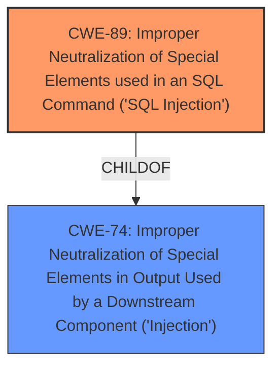

# Analysis Report for CVE-2024-6159

# Vulnerability Analysis Report: CVE-2024-6159

## Description

The Push Notification for Post and BuddyPress WordPress plugin before 1.9.4 **does not properly sanitise and escape a parameter** before using it in a SQL statement via an AJAX action available to unauthenticated users, leading to a **SQL injection**

## Vulnerability Description Key Phrases

- **Rootcause:** does not properly sanitise and escape a parameter
- **Weakness:** SQL injection
- **Attacker:** unauthenticated users
- **Product:** Push Notification for Post and BuddyPress WordPress plugin
- **Version:** before 1.9.4

## Analysis (with Relationship Data)

# Summary
| CWE ID | CWE Name | Confidence | CWE Abstraction Level | CWE Vulnerability Mapping Label | CWE-Vulnerability Mapping Notes |
|---|---|---|---|---|---|
| CWE-89 | Improper Neutralization of Special Elements used in an SQL Command ('SQL Injection') | 1.0 | Base | Allowed | Primary CWE: The plugin does not properly sanitize and escape user input before using it in a SQL query via an AJAX action, leading to SQL injection. |

## Evidence and Confidence

*   **Confidence Score:** 1.0
*   **Evidence Strength:** HIGH

## Relationship Analysis
The primary relationship that influences this decision is that CWE-89 is a Base level CWE that directly addresses the root cause of the vulnerability: **improper neutralization leading to SQL Injection**. While other CWEs like CWE-74 (Improper Neutralization) are related, they are at a higher abstraction level. The vulnerability description, especially the key phrases and CVE reference summary, points directly to the **lack of proper sanitization and escaping of input before being used in an SQL statement**. This directly aligns with the definition and characteristics of CWE-89.



## Vulnerability Chain
The vulnerability chain starts with the **improper sanitization and escaping of a parameter** before using it in a SQL statement. This **root cause** directly leads to the **weakness** which is a **SQL injection vulnerability**. An unauthenticated attacker can then exploit this to execute arbitrary SQL commands. Therefore, the chain is:

1.  **Improper Input Handling (Missing Sanitization/Escaping)**
2.  **SQL Injection (CWE-89)**

## Summary of Analysis
The analysis strongly supports the classification of this vulnerability as CWE-89 (Improper Neutralization of Special Elements used in an SQL Command ('SQL Injection')). The vulnerability description explicitly mentions the **lack of proper sanitization and escaping** of a parameter before using it in an SQL statement, leading to SQL injection.

Evidence:
*   "**does not properly sanitise and escape a parameter** before using it in a SQL statement"
*   "leading to a **SQL injection**"
*   "The plugin does not properly sanitize and escape user input before using it in a SQL query via an AJAX action. Specifically, the `$onesignal_externalid` parameter is directly inserted into a SQL statement without proper escaping."

The retriever results also ranked CWE-89 as the top candidate, further solidifying this classification. The graph relationships show that while CWE-74 is a parent, CWE-89 is a more specific and accurate representation of the vulnerability. The selection is based on provided evidence, graph relationships, and retriever rankings. CWE-89 is at the optimal level of specificity because it directly addresses the root cause and the resulting vulnerability.

Relevant CWE Information:

# Enhanced Context (25 CWEs)

## CWE-89: Improper Neutralization of Special Elements used in an SQL Command ('SQL Injection')
**Abstraction Level**: Base
**Similarity Score**: 1.00 (from retriever results)

**Description**:
The product constructs all or part of an SQL command using externally-influenced input from an upstream component, but it does not neutralize or incorrectly neutralizes special elements that could modify the intended SQL command when it is sent to a downstream component. Without sufficient removal or quoting of SQL syntax in user-controllable inputs, the generated SQL query can cause those inputs to be interpreted as SQL instead of ordinary user data.

**Mapping Guidance**:
- Usage: Allowed
- Rationale: This CWE entry is at the Base level of abstraction, which is a preferred level of abstraction for mapping to the root causes of vulnerabilities.

**Considered but not used CWEs:**

*   **CWE-74:** Improper Neutralization of Special Elements in Output Used by a Downstream Component ('Injection') - While related, this is a more general class of injection vulnerabilities. CWE-89 is more specific to SQL injection, which is the identified weakness.
*   **CWE-79:** Improper Neutralization of Input During Web Page Generation ('Cross-site Scripting') - This is for Cross-site scripting, not SQL Injection.
*   **CWE-352:** Cross-Site Request Forgery (CSRF) - This is not relevant as the vulnerability is related to SQL injection and not CSRF.
*   **CWE-116:** Improper Encoding or Escaping of Output - This is a more general class that can lead to various vulnerabilities, but SQL Injection is more precise.
*   **CWE-425:** Direct Request ('Forced Browsing') - This is related to authorization, which is not the primary weakness in this case.
*   **CWE-434:** Unrestricted Upload of File with Dangerous Type - This is related to file uploads, which is not the primary weakness in this case.
*   **CWE-472:** External Control of Assumed-Immutable Web Parameter - Not the best fit, as it describes a specific case of immutable parameters being externally controlled, while the primary issue is the lack of sanitization.
*   **CWE-639:** Authorization Bypass Through User-Controlled Key - Not the best fit, as it describes a specific authorization bypass using user-controlled keys, while the primary issue is the lack of sanitization leading to SQL injection.
*   **CWE-201:** Insertion of Sensitive Information Into Sent Data - Not applicable here.
*   **CWE-471:** Modification of Assumed-Immutable Data (MAID) - Not applicable here.
*   **CWE-494:** Download of Code Without Integrity Check - Not applicable here.
*   **CWE-183:** Permissive List of Allowed Inputs - Not applicable here.
*   **CWE-138:** Improper Neutralization of Special Elements - Not applicable here.


## CWE Relationship Analysis

Current CWEs represent these abstraction levels: .


### Vulnerability Chain Analysis

**Chain starting from CWE-183:**
- 183 (Permissive List of Allowed Inputs) - ROOT


**Chain starting from CWE-89:**
- 89 (Improper Neutralization of Special Elements used in an SQL Command ('SQL Injection')) - ROOT


### CWE Relationship Diagram

```mermaid
graph TD
    classDef primary fill:#f96,stroke:#333,stroke-width:2px
    classDef secondary fill:#69f,stroke:#333
    classDef tertiary fill:#9e9,stroke:#333
```


*Report generated on 2025-07-14 01:16:20*
