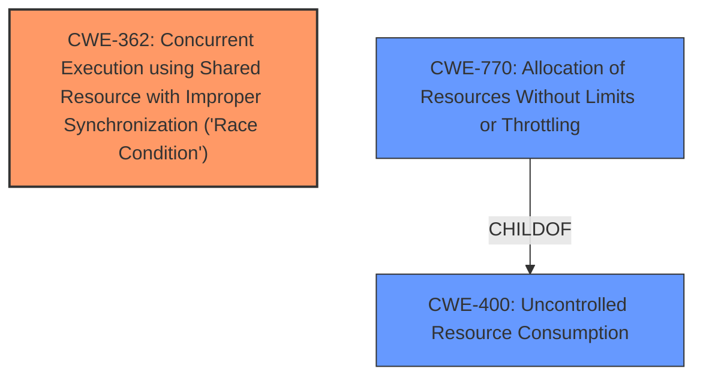

# Raw Analyzer Response for CVE-2024-6162

# Summary

| CWE ID  | CWE Name                                                                                                   | Confidence | CWE Abstraction Level | CWE Vulnerability Mapping Label | CWE-Vulnerability Mapping Notes |
| :-------- | :--------------------------------------------------------------------------------------------------------- | :---------- | :---------------------- | :------------------------------ | :-------------------------------- |
| CWE-362   | Concurrent Execution using Shared Resource with Improper Synchronization ('Race Condition')                   | 0.9         | Class                     | Primary                         | Allowed-with-Review               |
| CWE-400   | Uncontrolled Resource Consumption                                                                          | 0.7         | Class                     | Secondary                       | Discouraged                      |
| CWE-770   | Allocation of Resources Without Limits or Throttling                                                       | 0.6         | Base                      | Secondary                       | Allowed                          |

## Evidence and Confidence

*   **Confidence Score:** 0.8
*   **Evidence Strength:** MEDIUM

## Relationship Analysis

The primary CWE selected is CWE-362 (Concurrent Execution using Shared Resource with Improper Synchronization ('Race Condition')). This is a Class-level CWE. CWE-400 (Uncontrolled Resource Consumption) is selected as a secondary CWE because the race condition can lead to resource exhaustion. CWE-770 (Allocation of Resources Without Limits or Throttling) is a child of CWE-400 and is considered as a more specific root cause, where resources aren't properly managed during allocation.

## Vulnerability Chain

The vulnerability chain begins with a **race condition** (CWE-362) due to the **improper synchronization** of access to a shared buffer. This leads to **incorrect path handling**, which in turn can result in **uncontrolled resource consumption** (CWE-400) and potentially a denial-of-service. **Allocation of Resources Without Limits or Throttling** (CWE-770) contributes to the impact.

## Summary of Analysis

The initial analysis focused on the **race condition** described in the vulnerability, where the same buffer is used to decode paths for multiple requests concurrently, leading to incorrect path information. The "CVE Reference Links Content Summary" supports this, stating that "the vulnerability lies in how Undertow handles URL-encoded request paths, specifically when using the AJP listener" and that "the same buffer is used to decode paths for multiple concurrent requests". The primary impact is a denial of service.

CWE-362 (Concurrent Execution using Shared Resource with Improper Synchronization ('Race Condition')) is the most relevant because the core issue is the concurrent access to a shared resource (the buffer) without proper synchronization. CWE-400 (Uncontrolled Resource Consumption) and CWE-770 (Allocation of Resources Without Limits or Throttling) are included as contributing factors because the **incorrect path handling** caused by the **race condition** can potentially lead to resource exhaustion.

The relationships between the CWEs influenced the selection. CWE-770 is a child of CWE-400, indicating a potential path to resource exhaustion.

The selected CWEs are at the optimal level of specificity. CWE-362 captures the root cause of the vulnerability, while CWE-400 and CWE-770 capture the potential consequences of the **race condition**.
Relevant CWE Information:

# Enhanced Context (25 CWEs)
The following CWEs were identified as potentially relevant to this vulnerability:

## CWE-362: Concurrent Execution using Shared Resource with Improper Synchronization ('Race Condition')
**Abstraction Level**: Class
**Similarity Score**: 0.76
**Source**: dense

**Description**:
The product contains a concurrent code sequence that requires temporary, exclusive access to a shared resource, but a timing window exists in which the shared resource can be modified by another code sequence operating concurrently.

**Mapping Guidance**:
- Usage: Allowed-with-Review
- Rationale: This CWE entry is a Class and might have Base-level children that would be more appropriate

## CWE-400: Uncontrolled Resource Consumption
**Abstraction Level**: Class
**Similarity Score**: 0.76
**Source**: dense

**Description**:
The product does not properly control the consumption of resources, such as memory, CPU, or network bandwidth, which can lead to a denial of service.

**Mapping Guidance**:
- Usage: Discouraged
- Rationale: This CWE entry is a level-1 Class (i.e., a child of a Pillar). It might have lower-level children that would be more appropriate

## CWE-770: Allocation of Resources Without Limits or Throttling
**Abstraction Level**: Base
**Similarity Score**: 0.76
**Source**: dense

**Description**:
The product allocates resources, but it does not properly limit or throttle how many resources can be allocated, or the duration for which the resources are held. This can lead to excessive consumption of resources.

**Mapping Guidance**:
- Usage: Allowed
- Rationale: This CWE entry is at the Base level of abstraction, which is a preferred level of abstraction for mapping to the root causes of vulnerabilities.