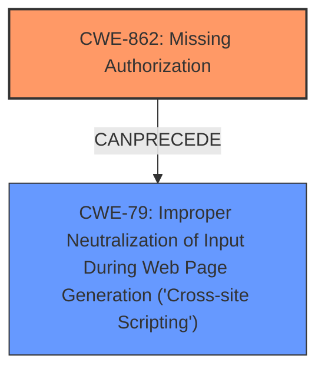

# Raw Analyzer Response for CVE-2024-6180

# Summary
| CWE ID | CWE Name | Confidence | CWE Abstraction Level | CWE Vulnerability Mapping Label | CWE-Vulnerability Mapping Notes |
|---|---|---|---|---|---|
| CWE-862 | Missing Authorization | 1.0 | Class | Primary | Allowed-with-Review |
| CWE-79 | Improper Neutralization of Input During Web Page Generation ('Cross-site Scripting') | 0.9 | Base | Secondary | Allowed |

## Evidence and Confidence

*   **Confidence Score:** 0.95
*   **Evidence Strength:** HIGH

## Relationship Analysis
The primary weakness is the **missing authorization** (CWE-862), which allows unauthorized modification of data. The secondary weakness is **improper neutralization of input** (CWE-79) leading to stored cross-site scripting. CWE-862 is a Class-level CWE, with more specific Base-level children that could be considered, but the provided information is not specific enough to select a child. CWE-79 is a Base-level CWE and is directly related to the stored XSS. CWE-862 can precede CWE-79 because the missing authorization allows an attacker to inject malicious code.

## Vulnerability Chain
The vulnerability chain starts with the **missing authorization** check (CWE-862). Because of this **missing authorization**, an unauthenticated attacker can modify plugin settings and inject malicious JavaScript code. This leads to the stored **cross-site scripting** vulnerability (CWE-79), where the injected code is executed when other users view the affected pages.

## Summary of Analysis
The primary CWE is CWE-862 (**Missing Authorization**), because the root cause of the vulnerability is the **missing capability check**. The vulnerability description states "The EventON plugin for WordPress is vulnerable to unauthorized modification of data due to a **missing capability check** on the eventon_import_settings ajax action". The "CVE Reference Links Content Summary" confirms this by stating: "Root cause of vulnerability: **Missing capability check** on the 'eventon_import_settings' ajax action."

The secondary CWE is CWE-79 (**Improper Neutralization of Input During Web Page Generation ('Cross-site Scripting')**), because the "Vulnerability Description" mentions "adding stored **cross-site scripting** to settings options displayed on event calendar pages." The "CVE Reference Links Content Summary" further confirms this by stating: "Weaknesses/vulnerabilities present: Unauthenticated stored **cross-site scripting** (XSS) and plugin settings updates due to missing authorization checks."

CWE-862 is at the Class level and is appropriate because the provided information doesn't give specifics to select a child. CWE-79 is at the Base level and is appropriate because it directly represents the stored XSS vulnerability.

The retriever results list several other CWEs, including CWE-352 (**Cross-Site Request Forgery (CSRF)**), CWE-116 (**Improper Encoding or Escaping of Output**), CWE-306 (**Missing Authentication for Critical Function**), CWE-434 (**Unrestricted Upload of File with Dangerous Type**), CWE-96 (**Improper Neutralization of Directives in Statically Saved Code ('Static Code Injection')**), and CWE-471 (**Modification of Assumed-Immutable Data (MAID)**). However, these are not as directly relevant as CWE-862 and CWE-79. CWE-306 is similar to CWE-862, but CWE-862 is more appropriate as it focuses on the **missing authorization** check. CWE-352 is not applicable because the vulnerability is not related to cross-site request forgery. CWE-116 is a general class and is not specific enough to the vulnerability. CWE-434 is not relevant because there is no file upload involved. CWE-96 is not relevant because it focuses on static code injection, which is not the case here. CWE-471 is not relevant because there is no modification of assumed-immutable data.