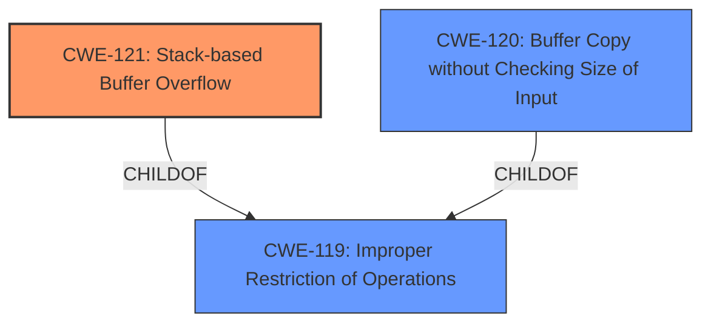

# Analysis for CVE-2024-6198

# Summary
| CWE ID | CWE Name | Confidence | CWE Abstraction Level | CWE Vulnerability Mapping Label | CWE-Vulnerability Mapping Notes |
|---|---|---|---|---|---|
| CWE-121 | Stack-based Buffer Overflow | 1.0 | Variant |  Primary | Allowed |
| CWE-120 | Buffer Copy without Checking Size of Input ('Classic Buffer Overflow') | 0.7 | Base | Secondary | Allowed-with-Review |
| CWE-119 | Improper Restriction of Operations within the Bounds of a Memory Buffer | 0.5 | Class | Secondary | Discouraged |

## Evidence and Confidence

*   **Confidence Score:** 0.9
*   **Evidence Strength:** HIGH

## Relationship Analysis
The primary weakness is CWE-121 Stack-based Buffer Overflow (Variant). CWE-121 is a child of CWE-119 Improper Restriction of Operations within the Bounds of a Memory Buffer (Class). CWE-120 Buffer Copy without Checking Size of Input ('Classic Buffer Overflow') (Base) is related to buffer overflows and is a peer of CWE-121. The relationship analysis highlights the specific nature of the buffer overflow (stack-based) and its connection to more general buffer handling issues. The variant level is more specific and appropriate than the class level.

## Vulnerability Chain
The vulnerability chain starts with **insecure path parsing** which leads to a stack buffer overflow due to the use of the `sscanf` function. This allows an attacker to overwrite memory on the stack and potentially execute arbitrary code.

Insecure Path Parsing -> Stack Buffer Overflow -> Arbitrary Code Execution

## Summary of Analysis
The initial assessment strongly points to CWE-121 Stack-based Buffer Overflow due to the vulnerability description explicitly mentioning a stack buffer overflow caused by **insecure path parsing**. The "CVE Reference Links Content Summary" section reinforces this by stating that the vulnerability is a stack buffer overflow caused by an unsafe call to `sscanf` when parsing the request URI.

The retriever results also list CWE-121 Stack-based Buffer Overflow as a potential candidate. While CWE-119 Improper Restriction of Operations within the Bounds of a Memory Buffer has the highest score in retriever results, it is a more general class, and CWE-121 provides a more specific classification.

CWE-120 Buffer Copy without Checking Size of Input ('Classic Buffer Overflow') is also considered as a secondary CWE since the vulnerability involves writing past the end of a buffer.

The evidence from the vulnerability description and the supporting CVE details, combined with the retriever results and relationship analysis, makes CWE-121 the most appropriate primary CWE.

Relevant CWE Information:

# Enhanced Context (25 CWEs)
The following CWEs were identified as potentially relevant to this vulnerability:

## CWE-121: Stack-based Buffer Overflow
**Abstraction Level**: Variant
**Similarity Score**: 0.72
**Source**: dense

**Description**:
A stack-based buffer overflow condition is a condition where the buffer being overwritten is allocated on the stack (i.e., is a local variable or, rarely, a parameter to a function).

**Mapping Guidance**:
- Usage: Allowed
- Rationale: This CWE entry is at the Variant level of abstraction, which is a preferred level of abstraction for mapping to the root causes of vulnerabilities.

## CWE-120: Buffer Copy without Checking Size of Input ('Classic Buffer Overflow')
**Abstraction Level**: Base
**Similarity Score**: 0.69
**Source**: dense

**Description**:
The product copies an input buffer to an output buffer without verifying that the size of the input buffer is less than the size of the output buffer, leading to a buffer overflow.

**Mapping Guidance**:
- Usage: Allowed-with-Review
- Rationale: There are some indications that this CWE ID might be misused and selected simply because it mentions "buffer overflow" - an increasingly vague term. This CWE entry is only appropriate for "Buffer Copy" operations (not buffer reads), in which where there is no "Checking [the] Size of Input", and (by implication of the copy) writing past the end of the buffer.

## CWE-119: Improper Restriction of Operations within the Bounds of a Memory Buffer
**Abstraction Level**: Class
**Similarity Score**: 0.70
**Source**: dense

**Description**:
The product performs operations on a memory buffer, but it reads from or writes to a memory location outside the buffer's intended boundary. This may result in read or write operations on unexpected memory locations that could be linked to other variables, data structures, or internal program data.

**Mapping Guidance**:
- Usage: Discouraged
- Rationale: CWE-119 is commonly misused in low-information vulnerability reports when lower-level CWEs could be used instead, or when more details about the vulnerability are available.

---

**CWE-121: Stack-based Buffer Overflow**

*   **Technical Explanation:** The vulnerability occurs because the `sscanf` function is used to parse the request URI without proper bounds checking. This allows an attacker to send a specially crafted HTTP request with an overly long URI, which overwrites the buffer allocated on the stack.
*   **Security Implications:** An attacker can overwrite the return address on the stack, redirecting execution flow to arbitrary code. This can lead to complete system compromise.
*   **Relationship Analysis:** CWE-121 is a variant of CWE-119 Improper Restriction of Operations within the Bounds of a Memory Buffer.
*   **Primary/Secondary:** Primary
*   **MITRE Mapping Guidance:** The usage is ALLOWED for CWE-121.
*   **Evidence:** "The vulnerability is a stack buffer overflow in the `index.cgi` CGI binary located under `/usr/local/SNORE`. It's caused by an unsafe call to `sscanf` when parsing the request URI, specifically when extracting variables from the URI."

**CWE-120: Buffer Copy without Checking Size of Input ('Classic Buffer Overflow')**

*   **Technical Explanation:** The `sscanf` function copies data into a buffer without checking the size of the input, leading to a buffer overflow.
*   **Security Implications:** Overwriting memory can lead to arbitrary code execution.
*   **Relationship Analysis:** CWE-120 is a base CWE related to buffer overflows and is a child of CWE-119. It can precede CWE-787 Out-of-bounds Write.
*   **Primary/Secondary:** Secondary
*   **MITRE Mapping Guidance:** The usage is ALLOWED-WITH-REVIEW.
*   **Evidence:** "Stack buffer overflow", "Use of unsafe function `sscanf`"

**CWE-119: Improper Restriction of Operations within the Bounds of a Memory Buffer**

*   **Technical Explanation:** The software does not properly restrict operations within the bounds of a memory buffer, leading to a buffer overflow.
*   **Security Implications:** Overwriting memory can lead to arbitrary code execution.
*   **Relationship Analysis:** CWE-119 is a class CWE and a parent of CWE-121 and CWE-120.
*   **Primary/Secondary:** Secondary
*   **MITRE Mapping Guidance:** The usage is DISCOURAGED.
*   **Evidence:** "Stack buffer overflow", "Insecure path parsing"

Other CWEs Considered but Not Used:

*   CWE-20 Improper Input Validation: While input validation is generally important, the specific issue is the buffer overflow due to the unchecked size of the input, making CWE-121 and CWE-120 more specific.
*   CWE-190 Integer Overflow or Wraparound: Not relevant as the vulnerability is related to buffer overflows.
*   CWE-78: Improper Neutralization of Special Elements used in an OS Command ('OS Command Injection'): Not relevant as the vulnerability is related to buffer overflows.
*   CWE-131: Incorrect Calculation of Buffer Size: Not applicable as the issue is not an incorrect calculation of buffer size, but a missing check on the input size during the copy operation.