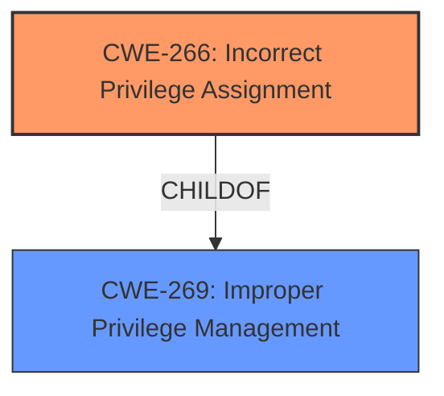

# Enhanced Analysis for CVE-2024-6286

# Summary
| CWE ID | CWE Name | Confidence | CWE Abstraction Level | CWE Vulnerability Mapping Label | CWE-Vulnerability Mapping Notes |
|---|---|---|---|---|---|
| CWE-266 | Incorrect Privilege Assignment | 0.7 | Base | Primary CWE | Allowed |

## Evidence and Confidence

*   **Confidence Score:** 0.7
*   **Evidence Strength:** LOW

## Relationship Analysis
The primary relationship considered was the parent-child relationship between class-level CWEs like CWE-269 (Improper Privilege Management) and base-level CWEs like CWE-266 (Incorrect Privilege Assignment). Given that the vulnerability description points to a specific privilege assignment issue, the base-level CWE was favored for its greater specificity. No chain relationships were relevant in this case, as the description focuses on a single, direct cause. The abstraction level was chosen to be Base because it directly reflects the **root cause** of the vulnerability, which is an incorrect assignment of privileges.



## Vulnerability Chain
The vulnerability chain consists of a single point:

1.  **Root Cause:** Incorrect Privilege Assignment (CWE-266) leading directly to the impact.

## Summary of Analysis
The analysis focused on identifying the root cause of the local privilege escalation vulnerability in Citrix Workspace app for Windows. The key phrase "Local Privilege escalation allows a low-privileged user to gain SYSTEM privileges" strongly suggests an issue with privilege management. However, without more information about the specifics, it is difficult to pinpoint the exact flaw.

Given the guidance, CWE-266 (Incorrect Privilege Assignment) seems like the best fit. The vulnerability allows a low-privileged user to gain SYSTEM privileges, indicating that the user was incorrectly assigned privileges they should not have had.

Other CWEs Considered:

*   CWE-269 (Improper Privilege Management): While relevant, it's a higher-level class and less specific than CWE-266.
*   CWE-250 (Execution with Unnecessary Privileges): Doesn't fit because the issue isn't that the process is running with elevated privileges, but rather that a user is being assigned them incorrectly.
*   CWE-732 (Incorrect Permission Assignment for Critical Resource): This CWE is more about permissions on resources, not the assignment of privileges to users.
*   CWE-862 (Missing Authorization): The vulnerability is not necessarily due to missing authorization, but more likely due to a flawed assignment of privileges, so not a good fit.
*   CWE-863 (Incorrect Authorization): Same as above, incorrect assignment vs incorrect authorization.

The selection of CWE-266 is based on the limited information available, which only mentions the privilege escalation and the low-privileged user gaining SYSTEM privileges. The evidence is not strong, since the root cause and mechanism are unknown. The confidence is not high.


## CWE Relationship Analysis

Current CWEs represent these abstraction levels: .


### Vulnerability Chain Analysis

**Chain starting from CWE-863:**
- 863 (Incorrect Authorization) - ROOT


**Chain starting from CWE-732:**
- 732 (Incorrect Permission Assignment for Critical Resource) - ROOT


### CWE Relationship Diagram

```mermaid
graph TD
    classDef primary fill:#f96,stroke:#333,stroke-width:2px
    classDef secondary fill:#69f,stroke:#333
    classDef tertiary fill:#9e9,stroke:#333
```