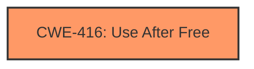

# Analysis Report for CVE-2024-6291

# Vulnerability Analysis Report: CVE-2024-6291

## Description

Use after free in Swiftshader in Google Chrome prior to 126.0.6478.126 allowed a remote attacker to potentially exploit heap corruption via a crafted HTML page. (Chromium security severity High)

## Vulnerability Description Key Phrases

- **Rootcause:** use after free
- **Impact:** potentially exploit heap corruption
- **Vector:** crafted HTML page
- **Attacker:** remote attacker
- **Product:** Google Chrome
- **Version:** prior to 126.0.6478.126
- **Component:** Swiftshader

## Analysis (with Relationship Data)

# Summary

| CWE ID  | CWE Name                                                                    | Confidence | CWE Abstraction Level | CWE Vulnerability Mapping Label | CWE-Vulnerability Mapping Notes |
| :-------- | :-------------------------------------------------------------------------- | :--------- | :-------------------- | :------------------------------ | :------------------------------ |
| CWE-416 | Use After Free                                                            | 1          | Variant               | Primary                         | Allowed                       |

## Evidence and Confidence

*   **Confidence Score:** 1
*   **Evidence Strength:** HIGH

## Relationship Analysis

The primary relationship is the direct match of the vulnerability description to CWE-416. While other CWEs like CWE-123 (Write-what-where Condition) and CWE-787 (Out-of-bounds Write) are listed as potential consequences or related issues, the core **rootcause** identified in the description and CVE summary is a **use-after-free** condition. This suggests that memory is being accessed after it has been freed, which directly corresponds to CWE-416. Other relationships like CANFOLLOW are not relevant for root cause analysis.



## Vulnerability Chain

The vulnerability chain starts with the **use-after-free** condition (CWE-416). The consequence is the potential exploitation of heap corruption, as stated in the description. The attacker exploits this via a crafted HTML page.
  - **Root Cause:** CWE-416 (**Use After Free**)
  - **Impact:** Heap corruption (as stated in description)

## Summary of Analysis

The vulnerability description explicitly states a **use-after-free** condition. The CVE Reference Links Content Summary reinforces this by listing "**Use after free**" as both the "Root cause" and one of the "Weaknesses". The primary CWE match from similar CVE descriptions is CWE-416, and it is also the top CWE. The retriever results also list CWE-416 as the top result. Given this overwhelming evidence, CWE-416 is the most appropriate mapping.

I considered other CWEs, such as CWE-123 (Write-what-where Condition) and CWE-787 (Out-of-bounds Write), based on the retriever results and relationship analysis, but these are potential consequences of the **use-after-free**, not the root cause itself. Therefore, they are not selected.

The selection of CWE-416 is at the optimal level of specificity because it accurately reflects the **rootcause** of the vulnerability as a **use-after-free** condition, which is a Variant level CWE.

Relevant CWE Information:
* CWE-416: Use After Free


## CWE Relationship Analysis

Current CWEs represent these abstraction levels: .


### Vulnerability Chain Analysis

**Chain starting from CWE-123:**
- 123 (Write-what-where Condition) - ROOT


**Chain starting from CWE-787:**
- 787 (Out-of-bounds Write) - ROOT


### CWE Relationship Diagram

```mermaid
graph TD
    classDef primary fill:#f96,stroke:#333,stroke-width:2px
    classDef secondary fill:#69f,stroke:#333
    classDef tertiary fill:#9e9,stroke:#333
```


*Report generated on 2025-07-14 01:26:35*
