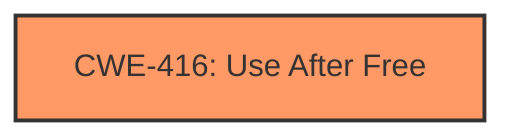

# Analysis Report for CVE-2024-6293

# Vulnerability Analysis Report: CVE-2024-6293

## Description

**Use after free** in Dawn in Google Chrome prior to 126.0.6478.126 allowed a remote attacker to potentially exploit heap corruption via a crafted HTML page. (Chromium security severity High)

## Vulnerability Description Key Phrases

- **Rootcause:** Use after free
- **Impact:** potentially exploit heap corruption
- **Vector:** crafted HTML page
- **Attacker:** remote attacker
- **Product:** Google Chrome
- **Version:** prior to 126.0.6478.126
- **Component:** Dawn

## Analysis (with Relationship Data)

# Summary
| CWE ID | CWE Name | Confidence | CWE Abstraction Level | CWE Vulnerability Mapping Label | CWE-Vulnerability Mapping Notes |
|---|---|---|---|---|---|
| CWE-416 | Use After Free | 1.0 | Variant | Allowed | Primary CWE |

## Evidence and Confidence

*   **Confidence Score:** 1.0
*   **Evidence Strength:** HIGH

## Relationship Analysis
The primary relationship influencing the selection was the direct match of the vulnerability description to CWE-416. The retriever results also strongly suggested CWE-416. The other CWEs listed were considered but deemed less relevant as they represented related but not directly applicable weaknesses. CWE-416 is a variant, which is the preferred level of abstraction.



## Vulnerability Chain
The vulnerability chain consists of a **Use after free** condition (CWE-416) which leads to potential heap corruption.
- Root cause: **Use after free** (CWE-416)
- Impact: Heap corruption

## Summary of Analysis
The vulnerability description clearly states a "**Use after free**" condition in the Dawn component of Google Chrome. This directly corresponds to CWE-416, "Use After Free". The CVE Reference Links Content Summary confirms this by explicitly stating the "**root cause**" as a "**Use-after-free error**." The primary CWE match from similar CVE descriptions also points to CWE-416. The retriever results list CWE-416 as the top candidate. All evidence points to CWE-416 as the primary weakness. Therefore, the selection of CWE-416 is based on strong evidence and aligns with the CWE specifications and mapping guidance.

Relevant CWE Information:

# Enhanced Context (25 CWEs)
The following CWEs were identified as potentially relevant to this vulnerability:

## CWE-416: Use After Free
**Abstraction Level**: Variant
**Similarity Score**: 0.77
**Source**: dense

**Description**:
The product reuses or references memory after it has been freed. At some point afterward, the memory may be allocated again and saved in another pointer, while the original pointer references a location somewhere within the new allocation. Any operations using the original pointer are no longer valid because the memory "belongs" to the code that operates on the new pointer.

**Mapping Guidance**:
- Usage: Allowed
- Rationale: This CWE entry is at the Variant level of abstraction, which is a preferred level of abstraction for mapping to the root causes of vulnerabilities.


## CWE Relationship Analysis

Current CWEs represent these abstraction levels: .


### Vulnerability Chain Analysis

**Chain starting from CWE-416:**
- 416 (Use After Free) - ROOT


### CWE Relationship Diagram

```mermaid
graph TD
    classDef primary fill:#f96,stroke:#333,stroke-width:2px
    classDef secondary fill:#69f,stroke:#333
    classDef tertiary fill:#9e9,stroke:#333
```


*Report generated on 2025-07-14 01:27:00*
