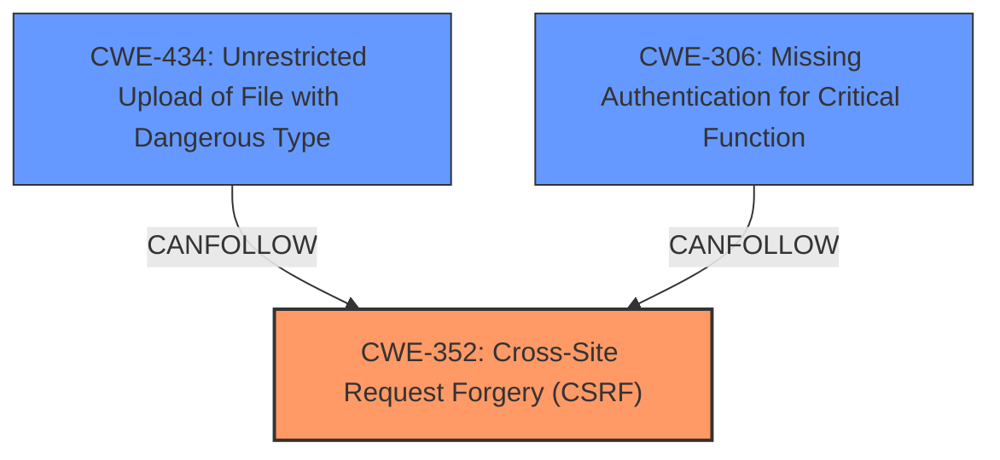

# Raw Analyzer Response for CVE-2024-6309

```markdown
# Summary
| CWE ID | CWE Name | Confidence | CWE Abstraction Level | CWE Vulnerability Mapping Label | CWE-Vulnerability Mapping Notes |
|---|---|---|---|---|---|
| **CWE-352** | Cross-Site Request Forgery (CSRF) | 1.0 | Compound | Primary | Allowed |
| CWE-434 | Unrestricted Upload of File with Dangerous Type | 0.9 | Base | Secondary | Allowed |
| CWE-306 | Missing Authentication for Critical Function | 0.7 | Base | Secondary | Allowed |

## Evidence and Confidence

*   **Confidence Score:** 0.9
*   **Evidence Strength:** HIGH

## Relationship Analysis
The primary weakness is CWE-352 Cross-Site Request Forgery (CSRF), as the vulnerability description explicitly states that the plugin is vulnerable to CSRF due to **missing nonce validation**. The secondary weaknesses involve CWE-434 Unrestricted Upload of File with Dangerous Type stemming from **missing file type validation**, and potentially CWE-306 Missing Authentication for Critical Function since the attacker is unauthenticated. CWE-352 is a Compound weakness, which aligns with it being the aggregation of multiple weaknesses. CWE-434 and CWE-306 are base level weaknesses which are the preferred level of abstraction.



## Vulnerability Chain
The vulnerability chain starts with **missing nonce validation** (part of CWE-352) and **missing file type validation** (CWE-434). The combination of these weaknesses allows **unauthenticated attackers** to perform an **arbitrary file upload** leading to potential **remote code execution**. The absence of nonce validation enables the CSRF attack, while the lack of file type validation allows the upload of dangerous files. CWE-306 Missing Authentication for Critical Function enables the unauthenticated attackers, to upload arbitrary files.

## Summary of Analysis
The initial assessment focused on identifying the root causes and their corresponding CWEs. The primary driver of this vulnerability is the **Cross-Site Request Forgery (CSRF)** vulnerability due to the **missing nonce validation** in the `afi_overview` function. This allows an attacker to forge requests on behalf of a legitimate user. A secondary weakness is the **missing file type validation** in the `upload_icons` function (CWE-434), which allows the upload of arbitrary files that could lead to remote code execution. Additionally, because the attacker is **unauthenticated**, this maps to CWE-306 Missing Authentication for Critical Function.

The relationship analysis reveals that CWE-352 is a compound weakness encompassing the **missing nonce validation**. CWE-434 and CWE-306 are independent weaknesses that amplify the impact of the CSRF vulnerability.

The evidence for CWE-352 is the explicit statement: "This is due to **missing nonce validation** in the afi_overview function".

The evidence for CWE-434 is the explicit statement: "and **missing file type validation** in the upload_icons function" which leads to arbitrary file uploads.

The evidence for CWE-306 is the explicit statement: "This makes it possible for **unauthenticated attackers** to upload arbitrary files..."

The selected CWEs are at the optimal level of specificity because they directly represent the **root causes** of the vulnerability: **missing nonce validation, missing file type validation, and missing authentication**.
```