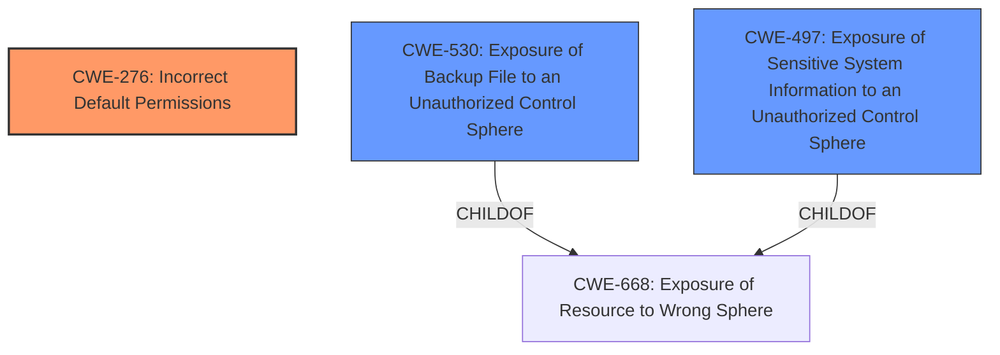

# Analysis Report for CVE-2024-6326

# Vulnerability Analysis Report: CVE-2024-6326

## Description

An exposure of sensitive information vulnerability exists in the Rockwell Automation FactoryTalk System Service. A malicious user could exploit this vulnerability by starting a back-up or restore process, which temporarily exposes private keys, passwords, pre-shared keys, and database folders when they are temporarily copied to an interim folder. This vulnerability is due to the **lack of explicit permissions set on the backup folder**. If private keys are obtained by a malicious user, they could impersonate resources on the secured network.

## Vulnerability Description Key Phrases

- **Rootcause:** lack of explicit permissions set on the backup folder
- **Impact:** ['and database folders', 'exposes private keys', 'exposure of sensitive information', 'passwords', 'pre-shared keys']
- **Vector:** starting a back-up or restore process
- **Attacker:** malicious user
- **Product:** Rockwell Automation FactoryTalk System Service

## Analysis (with Relationship Data)

# Summary
| CWE ID    | CWE Name                                                        | Confidence | CWE Abstraction Level | CWE Vulnerability Mapping Label | CWE-Vulnerability Mapping Notes |
| --------- | --------------------------------------------------------------- | ---------- | --------------------- | ------------------------------- | ------------------------------- |
| CWE-276   | Incorrect Default Permissions                                   | 0.9        | Base                  | Primary                         | Allowed                         |
| CWE-530   | Exposure of Backup File to an Unauthorized Control Sphere        | 0.7        | Variant               | Secondary                       | Allowed                         |
| CWE-497   | Exposure of Sensitive System Information to an Unauthorized Control Sphere | 0.6        | Base                  | Secondary                       | Allowed                         |

## Evidence and Confidence

*   **Confidence Score:** 0.8
*   **Evidence Strength:** HIGH

## Relationship Analysis
The primary CWE, CWE-276, is at the Base level, which is the preferred level of abstraction. It focuses on the **incorrect default permissions** being the root cause. CWE-530, a Variant, specifies the vulnerability as relating to the exposure of a backup file, and CWE-497 specifies the exposure of sensitive system information. While the vulnerability involves exposure, it is a consequence of the **lack of explicit permissions**, making CWE-276 the root cause. The other CWEs are related to the impact of the **incorrect permissions**.



## Vulnerability Chain
The vulnerability chain starts with the **lack of explicit permissions** on the backup folder (CWE-276). This leads to sensitive information (private keys, passwords, etc.) being exposed in the backup file (CWE-530 and CWE-497) to an unauthorized control sphere. A malicious user who gains access to these keys could then impersonate resources on the secured network.

## Summary of Analysis
The initial analysis, supported by the "**rootcause:** **lack of explicit permissions set on the backup folder**" statement in the vulnerability description, strongly points to CWE-276 (Incorrect Default Permissions) as the primary weakness. The CVE reference summary also supports this by stating, "The FactoryTalk System Service temporarily exposes sensitive information (private keys, passwords, pre-shared keys, database folders) during backup and restore processes due to a **lack of explicit permissions** on the backup folder."

The Retriever Results also suggest CWE-276 as the top match. The relationship analysis clarifies that the exposure vulnerabilities (CWE-530, CWE-497) are consequences of the **incorrect permissions**, not the root cause. The selected CWEs are at the optimal level of specificity, with CWE-276 at the Base level and the others at Variant and Base levels respectively.

Relevant CWE Information:

# Enhanced Context (25 CWEs)
The following CWEs were identified as potentially relevant to this vulnerability:

## CWE-266: Incorrect Privilege Assignment
**Abstraction Level**: Base
**Similarity Score**: 0.79
**Source**: dense

**Description**:
A product incorrectly assigns a privilege to a particular actor, creating an unintended sphere of control for that actor.

**Mapping Guidance**:
- Usage: Allowed
- Rationale: This CWE entry is at the Base level of abstraction, which is a preferred level of abstraction for mapping to the root causes of vulnerabilities.

## CWE-280: Improper Handling of Insufficient Permissions or Privileges
**Abstraction Level**: Base
**Similarity Score**: 0.78
**Source**: dense

**Description**:
The product does not handle or incorrectly handles when it has insufficient privileges to access resources or functionality as specified by their permissions. This may cause it to follow unexpected code paths that may leave the product in an invalid state.

**Mapping Guidance**:
- Usage: Allowed
- Rationale: This CWE entry is at the Base level of abstraction, which is a preferred level of abstraction for mapping to the root causes of vulnerabilities.

## CWE-668: Exposure of Resource to Wrong Sphere
**Abstraction Level**: Class
**Similarity Score**: 0.78
**Source**: dense

**Description**:
The product exposes a resource to the wrong control sphere, providing unintended actors with inappropriate access to the resource.

**Mapping Guidance**:
- Usage: Discouraged
- Rationale: CWE-668 is high-level and is often misused as a catch-all when lower-level CWE IDs might be applicable. It is sometimes used for low-information vulnerability reports [REF-1287]. It is a level-1 Class (i.e., a child of a Pillar). It is not useful for trend analysis.

## CWE-267: Privilege Defined With Unsafe Actions
**Abstraction Level**: Base
**Similarity Score**: 0.77
**Source**: dense

**Description**:
A particular privilege, role, capability, or right can be used to perform unsafe actions that were not intended, even when it is assigned to the correct entity.

**Mapping Guidance**:
- Usage: Allowed
- Rationale: This CWE entry is at the Base level of abstraction, which is a preferred level of abstraction for mapping to the root causes of vulnerabilities.

## CWE-274: Improper Handling of Insufficient Privileges
**Abstraction Level**: Base
**Similarity Score**: 0.77
**Source**: dense

**Description**:
The product does not handle or incorrectly handles when it has insufficient privileges to perform an operation, leading to resultant weaknesses.

**Mapping Guidance**:
- Usage: Discouraged
- Rationale: This CWE entry could be deprecated in a future version of CWE.

## CWE-276: Incorrect Default Permissions
**Abstraction Level**: Base
**Similarity Score**: 0.77
**Source**: dense

**Description**:
During installation, installed file permissions are set to allow anyone to modify those files.

**Mapping Guidance**:
- Usage: Allowed
- Rationale: This CWE entry is at the Base level of abstraction, which is a preferred level of abstraction for mapping to the root causes of vulnerabilities.

## CWE-497: Exposure of Sensitive System Information to an Unauthorized Control Sphere
**Abstraction Level**: Base
**Similarity Score**: 0.77
**Source**: dense

**Description**:
The product does not properly prevent sensitive system-level information from being accessed by unauthorized actors who do not have the same level of access to the underlying system as the product does.

**Mapping Guidance**:
- Usage: Allowed
- Rationale: This CWE entry is at the Base level of abstraction, which is a preferred level of abstraction for mapping to the root causes of vulnerabilities.

## CWE-59: Improper Link Resolution Before File Access ('Link Following')
**Abstraction Level**: Base
**Similarity Score**: 0.76
**Source**: dense

**Description**:
The product attempts to access a file based on the filename, but it does not properly prevent that filename from identifying a link or shortcut that resolves to an unintended resource.

**Mapping Guidance**:
- Usage: Allowed
- Rationale: This CWE entry is at the Base level of abstraction, which is a preferred level of abstraction for mapping to the root causes of vulnerabilities.

## CWE-345: Insufficient Verification of Data Authenticity
**Abstraction Level**: Class
**Similarity Score**: 0.75
**Source**: dense

**Description**:
The product does not sufficiently verify the origin or authenticity of data, in a way that causes it to accept invalid data.

**Mapping Guidance**:
- Usage: Discouraged
- Rationale: This CWE entry is a level-1 Class (i.e., a child of a Pillar). It might have lower-level children that would be more appropriate

## CWE-1391: Use of Weak Credentials
**Abstraction Level**: Class
**Similarity Score**: 0.75
**Source**: dense

**Description**:
The product uses weak credentials (such as a default key or hard-coded password) that can be calculated, derived, reused, or guessed by an attacker.

**Mapping Guidance**:
- Usage: Allowed-with-Review
- Rationale: This CWE entry is a Class and might have Base-level children that would be more appropriate

## CWE-863: Incorrect Authorization
**Abstraction Level**: Class
**Similarity Score**: 1868.87
**Source**: sparse

**Description**:
The product performs an authorization check when an actor attempts to access a resource or perform an action, but it does not correctly perform the check.

**Mapping Guidance**:
- Usage: Allowed-with-Review
- Rationale: This CWE entry


## CWE Relationship Analysis

Current CWEs represent these abstraction levels: .


### Vulnerability Chain Analysis

**Chain starting from CWE-274:**
- 274 (Improper Handling of Insufficient Privileges) - ROOT


**Chain starting from CWE-863:**
- 863 (Incorrect Authorization) - ROOT


### CWE Relationship Diagram

```mermaid
graph TD
    classDef primary fill:#f96,stroke:#333,stroke-width:2px
    classDef secondary fill:#69f,stroke:#333
    classDef tertiary fill:#9e9,stroke:#333
```


*Report generated on 2025-07-14 01:30:05*
