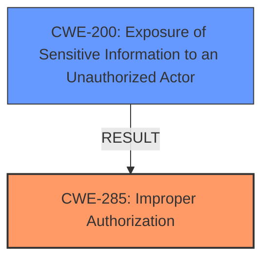

# Enhanced Analysis for CVE-2024-6336

# Summary
| CWE ID | CWE Name | Confidence | CWE Abstraction Level | CWE Vulnerability Mapping Label | CWE-Vulnerability Mapping Notes |
|---|---|---|---|---|---|
| CWE-285 | Improper Authorization | 0.8 | Class | Primary | Discouraged, but used due to lack of a more specific Base variant in the description. |
| CWE-200 | Exposure of Sensitive Information to an Unauthorized Actor | 0.7 | Class | Secondary | Discouraged, as it describes the impact rather than the root cause. |

## Evidence and Confidence

*   **Confidence Score:** 0.8
*   **Evidence Strength:** MEDIUM

## Relationship Analysis
The primary relationship influencing the CWE selection is the parent-child relationship between CWE-285 (Improper Authorization) and its potential base-level children. While CWE-285 is a Class-level CWE and generally discouraged, a more specific child was not clearly evident in the vulnerability description. CWE-200 is considered a resulting impact, and not the root cause.



## Vulnerability Chain
The vulnerability chain starts with a **Security Misconfiguration** leading to **Improper Authorization**, and finally results in **Exposure of Sensitive Information to an Unauthorized Actor**.
  - **Root Cause:** Security Misconfiguration (leading to Improper Authorization)
  - **Weakness:** Improper Authorization
  - **Impact:** Exposure of Sensitive Information

## Summary of Analysis
The analysis is based on the provided vulnerability description and the associated CVE summary. The description clearly indicates a **Security Misconfiguration** in GitHub Enterprise Server that leads to sensitive information disclosure. The CVE summary confirms this, stating that an attacker could disclose sensitive information from a private repository by exploiting organization ruleset features. This exploitation requires an organization member to explicitly change the visibility of a dependent repository from private to public.

The retriever results suggest several potential CWEs, including:
*   CWE-285 Improper Authorization
*   CWE-863 Incorrect Authorization
*   CWE-639 Authorization Bypass Through User-Controlled Key
*   CWE-200 Exposure of Sensitive Information to an Unauthorized Actor

CWE-285, while a Class-level CWE, is the most appropriate because the vulnerability involves a failure to properly authorize access to sensitive information. The lack of a more specific Base variant that directly addresses the **Security Misconfiguration** leading to **Improper Authorization** justifies using the Class-level CWE in this case. CWE-200 is more of an impact than a root cause.

The selected CWEs are at the optimal level of specificity, given the information available. A more specific Base or Variant CWE would be preferable if the description provided more details about the exact nature of the **Security Misconfiguration** that lead to the **Improper Authorization**.

Relevant CWE Information:

# Enhanced Context (25 CWEs)
The following CWEs were identified as potentially relevant to this vulnerability:

## CWE-212: Improper Removal of Sensitive Information Before Storage or Transfer
**Abstraction Level**: Base
**Similarity Score**: 0.76
**Source**: dense

**Description**:
The product stores, transfers, or shares a resource that contains sensitive information, but it does not properly remove that information before the product makes the resource available to unauthorized actors.

**Mapping Guidance**:
- Usage: Allowed
- Rationale: This CWE entry is at the Base level of abstraction, which is a preferred level of abstraction for mapping to the root causes of vulnerabilities.
*This CWE was not selected because the vulnerability is more related to authorization than to the removal of sensitive information.*

## CWE-497: Exposure of Sensitive System Information to an Unauthorized Control Sphere
**Abstraction Level**: Base
**Similarity Score**: 0.74
**Source**: dense

**Description**:
The product does not properly prevent sensitive system-level information from being accessed by unauthorized actors who do not have the same level of access to the underlying system as the product does.

**Mapping Guidance**:
- Usage: Allowed
- Rationale: This CWE entry is at the Base level of abstraction, which is a preferred level of abstraction for mapping to the root causes of vulnerabilities.
*This CWE was not selected because the vulnerability is more related to authorization than to the exposure of system information.*

## CWE-918: Server-Side Request Forgery (SSRF)
**Abstraction Level**: Base
**Similarity Score**: 0.74
**Source**: dense

**Description**:
The web server receives a URL or similar request from an upstream component and retrieves the contents of this URL, but it does not sufficiently ensure that the request is being sent to the expected destination.

**Mapping Guidance**:
- Usage: Allowed
- Rationale: This CWE entry is at the Base level of abstraction, which is a preferred level of abstraction for mapping to the root causes of vulnerabilities.
*This CWE was not selected because the vulnerability is not related to SSRF.*

## CWE-267: Privilege Defined With Unsafe Actions
**Abstraction Level**: Base
**Similarity Score**: 0.74
**Source**: dense

**Description**:
A particular privilege, role, capability, or right can be used to perform unsafe actions that were not intended, even when it is assigned to the correct entity.

**Mapping Guidance**:
- Usage: Allowed
- Rationale: This CWE entry is at the Base level of abstraction, which is a preferred level of abstraction for mapping to the root causes of vulnerabilities.
*This CWE was not selected because there is no evidence that the privileges were assigned correctly to begin with, but rather that the system failed to properly authorize access to the information.*

## CWE-538: Insertion of Sensitive Information into Externally-Accessible File or Directory
**Abstraction Level**: Base
**Similarity Score**: 0.73
**Source**: dense

**Description**:
The product places sensitive information into files or directories that are accessible to actors who are allowed to have access to the files, but not to the sensitive information.

**Mapping Guidance**:
- Usage: Allowed
- Rationale: This CWE entry is at the Base level of abstraction, which is a preferred level of abstraction for mapping to the root causes of vulnerabilities.
*This CWE was not selected because the vulnerability does not involve the insertion of sensitive information into files or directories.*

## CWE-639: Authorization Bypass Through User-Controlled Key
**Abstraction Level**: Base
**Similarity Score**: 0.73
**Source**: dense

**Description**:
The system's authorization functionality does not prevent one user from gaining access to another user's data or record by modifying the key value identifying the data.

**Mapping Guidance**:
- Usage: Allowed
- Rationale: This CWE entry is at the Base level of abstraction, which is a preferred level of abstraction for mapping to the root causes of vulnerabilities.
*This CWE was not selected because there is no evidence that the authorization bypass was through a user-controlled key.*

## CWE-209: Generation of Error Message Containing Sensitive Information
**Abstraction Level**: Base
**Similarity Score**: 0.72
**Source**: dense

**Description**:
The product generates an error message that includes sensitive information about its environment, users, or associated data.

**Mapping Guidance**:
- Usage: Allowed
- Rationale: This CWE entry is at the Base level of abstraction, which is a preferred level of abstraction for mapping to the root causes of vulnerabilities.
*This CWE was not selected because the vulnerability does not involve the generation of error messages.*

## CWE-285: Improper Authorization
**Abstraction Level**: Class
**Similarity Score**: 0.72
**Source**: dense

**Description**:
The product does not perform or incorrectly performs an authorization check when an actor attempts to access a resource or perform an action.

**Mapping Guidance**:
- Usage: Discouraged
- Rationale: CWE-285 is high-level and lower-level CWEs can frequently be used instead. It is a level-1 Class (i.e., a child of a Pillar).
*This CWE was selected because it aligns with the vulnerability description that involves a failure to properly authorize access to sensitive information, even though it is discouraged.*

## CWE-200: Exposure of Sensitive Information to an Unauthorized Actor
**Abstraction Level**: Class
**Similarity Score**: 0.72
**Source**: dense

**Description**:
The product exposes sensitive information to an actor that is not explicitly authorized to have access to that information.

**Mapping Guidance**:
- Usage: Discouraged
- Rationale: CWE-200 is commonly misused to represent the loss of confidentiality in a vulnerability, but confidentiality loss is a technical impact - not a root cause error. As of CWE 4.9, over 400 CWE entries can lead to a loss of confidentiality. Other options are often available. [REF-1287].
*This CWE was selected as a secondary CWE because it is a direct result of the improper authorization. However, it is not the


## CWE Relationship Analysis

Current CWEs represent these abstraction levels: .


### Vulnerability Chain Analysis

**Chain starting from CWE-863:**
- 863 (Incorrect Authorization) - ROOT


**Chain starting from CWE-639:**
- 639 (Authorization Bypass Through User-Controlled Key) - ROOT


### CWE Relationship Diagram

```mermaid
graph TD
    classDef primary fill:#f96,stroke:#333,stroke-width:2px
    classDef secondary fill:#69f,stroke:#333
    classDef tertiary fill:#9e9,stroke:#333
```