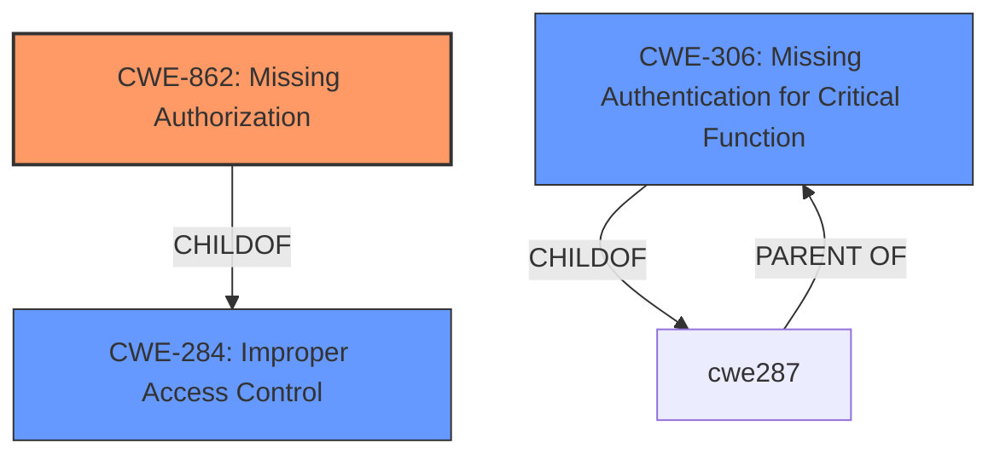

# Raw Analyzer Response for CVE-2024-6375

# Summary
| CWE ID | CWE Name | Confidence | CWE Abstraction Level | CWE Vulnerability Mapping Label | CWE-Vulnerability Mapping Notes |
|---|---|---|---|---|---|
| CWE-862 | Missing Authorization | 1.0 | Class | Primary CWE | Allowed-with-Review |
| CWE-306 | Missing Authentication for Critical Function | 0.7 | Base | Secondary Candidate | Allowed |
| CWE-284 | Improper Access Control | 0.6 | Pillar | Secondary Candidate | Discouraged |

## Evidence and Confidence

*   **Confidence Score:** 0.9
*   **Evidence Strength:** HIGH

## Relationship Analysis
The primary CWE is CWE-862 (Missing Authorization). The analysis considered CWE-306 (Missing Authentication for Critical Function) because authentication is a prerequisite for authorization. However, since the vulnerability description specifically mentions "**missing authorization check**", CWE-862 is more appropriate. CWE-284 (Improper Access Control) is a high-level classification and less specific than CWE-862, making it a less suitable primary mapping.

## Vulnerability Chain
The vulnerability chain starts with a **missing authorization check** (CWE-862). This allows unauthorized execution of a command, leading to either degradation of query performance or the revealing of chunk boundaries through timing side channels.

## Summary of Analysis
The primary vulnerability is the **missing authorization check** in the command for refining a collection shard key. This allows the command to run directly on a shard, leading to performance degradation or information disclosure via timing side channels.

The analysis is based on the explicit statement in the vulnerability description: "**rootcause:** **missing authorization check**". The CVE Reference Links Content Summary also confirms this: "**Root Cause:** A command for refining a collection shard key is missing an authorization check."

The graph relationships influenced the selection by highlighting the connection between authentication and authorization. However, the explicit mention of "**missing authorization check**" clearly points to CWE-862 as the primary weakness.

CWE-862 is the optimal level of specificity because it directly addresses the core issue of missing authorization, as opposed to a more general access control problem (CWE-284) or an authentication issue (CWE-306).

Relevant CWE Information:

# Enhanced Context (25 CWEs)
The following CWEs were identified as potentially relevant to this vulnerability:

## CWE-703: Improper Check or Handling of Exceptional Conditions
**Abstraction Level**: Pillar
**Similarity Score**: 0.73

## CWE-212: Improper Removal of Sensitive Information Before Storage or Transfer
**Abstraction Level**: Base
**Similarity Score**: 0.73

## CWE-267: Privilege Defined With Unsafe Actions
**Abstraction Level**: Base
**Similarity Score**: 0.73

## CWE-668: Exposure of Resource to Wrong Sphere
**Abstraction Level**: Class
**Similarity Score**: 0.73

## CWE-639: Authorization Bypass Through User-Controlled Key
**Abstraction Level**: Base
**Similarity Score**: 0.73

## CWE-274: Improper Handling of Insufficient Privileges
**Abstraction Level**: Base
**Similarity Score**: 0.73

## CWE-41: Improper Resolution of Path Equivalence
**Abstraction Level**: Base
**Similarity Score**: 0.73

## CWE-280: Improper Handling of Insufficient Permissions or Privileges
**Abstraction Level**: Base
**Similarity Score**: 0.72

## CWE-303: Incorrect Implementation of Authentication Algorithm
**Abstraction Level**: Base
**Similarity Score**: 0.72

## CWE-1390: Weak Authentication
**Abstraction Level**: Class
**Similarity Score**: 0.72

## CWE-639: Authorization Bypass Through User-Controlled Key
**Abstraction Level**: Base
**Similarity Score**: 1554.62

## CWE-863: Incorrect Authorization
**Abstraction Level**: Class
**Similarity Score**: 1538.33

## CWE-285: Improper Authorization
**Abstraction Level**: Class
**Similarity Score**: 1516.05

## CWE-306: Missing Authentication for Critical Function
**Abstraction Level**: Base
**Similarity Score**: 1472.25

## CWE-287: Improper Authentication
**Abstraction Level**: Class
**Similarity Score**: 1403.56

## CWE-295: Improper Certificate Validation
**Abstraction Level**: base
**Similarity Score**: 2.77

## CWE-201: Insertion of Sensitive Information Into Sent Data
**Abstraction Level**: base
**Similarity Score**: 2.73

## CWE-942: Permissive Cross-domain Policy with Untrusted Domains
**Abstraction Level**: variant
**Similarity Score**: 2.68

## CWE-306: Missing Authentication for Critical Function
**Abstraction Level**: base
**Similarity Score**: 2.47

## CWE-551: Incorrect Behavior Order: Authorization Before Parsing and Canonicalization
**Abstraction Level**: base
**Similarity Score**: 2.47

## CWE-612: Improper Authorization of Index Containing Sensitive Information
**Abstraction Level**: base
**Similarity Score**: 2.40

## CWE-613: Insufficient Session Expiration
**Abstraction Level**: base
**Similarity Score**: 2.21

## CWE-322: Key Exchange without Entity Authentication
**Abstraction Level**: base
**Similarity Score**: 2.18

## CWE-212: Improper Removal of Sensitive Information Before Storage or Transfer
**Abstraction Level**: Base
**Similarity Score**: 1.99

## CWE-472: External Control of Assumed-Immutable Web Parameter
**Abstraction Level**: base
**Similarity Score**: 1.82

**CWE-862: Missing Authorization**

*   **Technical Explanation:** The command for refining a collection shard key lacks the necessary checks to ensure that the user executing the command has the appropriate privileges. This allows unauthorized users to execute the command, potentially leading to data manipulation or information disclosure.
*   **Security Implications:** Unauthorized users can degrade query performance or reveal chunk boundaries through timing side channels.
*   **Parent-Child Relationships:** CWE-862 is a child of CWE-284 (Improper Access Control).
*   **Primary/Secondary:** Primary
*   **MITRE Mapping Guidance:** The provided guidance confirms that CWE-862 is appropriate when there is no role/privilege check after login.

**CWE-306: Missing Authentication for Critical Function**

*   **Technical Explanation:** While the primary issue is missing authorization, the absence of authentication could also contribute to the vulnerability. If the command could be executed without any authentication, then CWE-306 would be applicable.
*   **Security Implications:** An unauthenticated user could potentially exploit the command to degrade performance or reveal information.
*   **Parent-Child Relationships:** CWE-306 is a child of CWE-287 (Improper Authentication).
*   **Primary/Secondary:** Secondary
*   **MITRE Mapping Guidance:** The provided guidance indicates that CWE-306 is relevant when there is no identity check (no login).

**CWE-284: Improper Access Control**

*   **Technical Explanation:** This is a high-level CWE that could apply, but it is less specific than CWE-862.
*   **Security Implications:** General access control issues.
*   **Parent-Child Relationships:** CWE-284 is a parent of CWE-862.
*   **Primary/Secondary:** Secondary
*   **MITRE Mapping Guidance:** The guidance suggests avoiding CWE-284 if a more specific child CWE is appropriate.

**CWEs Considered but Not Used:**

*   CWE-863 (Incorrect Authorization): This CWE was considered but not used because the issue is a **missing** authorization check, not an incorrect one.
*   CWE-639 (Authorization Bypass Through User-Controlled Key): This CWE was considered but not used because the vulnerability description doesn't describe an authorization bypass through a user-controlled key.
*   CWE-295 (Improper Certificate Validation): This CWE was considered but not used because certificate validation is not mentioned in the vulnerability description.
*   CWE-269 (Improper Privilege Management): This CWE was considered but not used because the