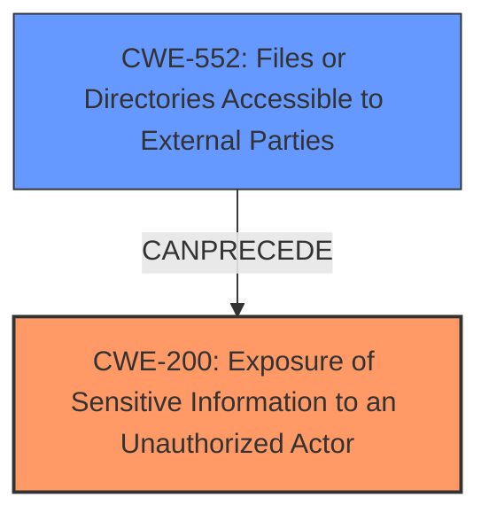

# Raw Analyzer Response for CVE-2024-6421

# Summary
| CWE ID | CWE Name | Confidence | CWE Abstraction Level | CWE Vulnerability Mapping Label | CWE-Vulnerability Mapping Notes |
|---|---|---|---|---|---|
| CWE-200 | Exposure of Sensitive Information to an Unauthorized Actor | 0.9 | Class | Primary | Discouraged |
| CWE-552 | Files or Directories Accessible to External Parties | 0.7 | Base | Secondary | Allowed |

## Evidence and Confidence

*   **Confidence Score:** 0.8
*   **Evidence Strength:** HIGH

## Relationship Analysis
The primary CWE identified is CWE-200, which is a class-level CWE. While it is generally discouraged, it accurately reflects the high-level impact of the vulnerability: sensitive information being exposed. A more specific CWE, CWE-552 (Files or Directories Accessible to External Parties), is also relevant, representing the mechanism by which the sensitive information is exposed.

## Vulnerability Chain
The vulnerability chain starts with an incorrectly configured FTP service (the **root cause**), leading to files and directories being accessible to external parties (CWE-552). This then results in the exposure of sensitive device information to an unauthorized actor (CWE-200), which is the final impact.

## Summary of Analysis
The analysis is primarily based on the provided vulnerability description and the CVE reference links content summary. The evidence clearly indicates that the vulnerability results in the exposure of sensitive information due to an incorrectly configured FTP service.

The CVE Reference Links Content Summary states:
- "The vulnerability stems from an incorrectly configured FTP service that allows anonymous access."
- "An unauthenticated remote attacker can read sensitive device information."
- "Weaknesses/vulnerabilities present: Exposure of Sensitive Information to an Unauthorized Actor (CWE-200)"

CWE-200 is initially selected as the primary CWE, as the summary explicitly mentions it. However, CWE-200 is a Class-level CWE and its usage is discouraged. A more specific weakness related to the **root cause** is preferable.

CWE-552 (Files or Directories Accessible to External Parties) is also considered because the vulnerability stems from an incorrectly configured FTP service, which allows unauthorized access to files and directories.

CWE-200 is kept as the primary CWE because the main **impact** is the exposure of sensitive information. CWE-552 becomes a secondary CWE, describing the means of exposure.

Relevant CWE Information:

# Enhanced Context (25 CWEs)
The following CWEs were identified as potentially relevant to this vulnerability:

## CWE-552: Files or Directories Accessible to External Parties
**Abstraction Level**: Base
**Similarity Score**: 0.74
**Source**: dense

**Description**:
The product makes files or directories accessible to unauthorized actors, even though they should not be.

**Mapping Guidance**:
- Usage: Allowed
- Rationale: This CWE entry is at the Base level of abstraction, which is a preferred level of abstraction for mapping to the root causes of vulnerabilities.

**CWE-200**: Exposure of Sensitive Information to an Unauthorized Actor
The product exposes sensitive information to an actor that is not explicitly authorized to have access to that information.
**Mapping Guidance**:
- Usage: Discouraged
- Rationale: CWE-200 is commonly misused to represent the loss of confidentiality in a vulnerability, but confidentiality loss is a technical impact - not a root cause error.

# Enhanced Context (25 CWEs)
The following CWEs were identified as potentially relevant to this vulnerability:

## CWE-552: Files or Directories Accessible to External Parties
**Abstraction Level**: Base
**Similarity Score**: 0.74
**Source**: dense

**Description**:
The product makes files or directories accessible to unauthorized actors, even though they should not be.

**Mapping Guidance**:
- Usage: Allowed
- Rationale: This CWE entry is at the Base level of abstraction, which is a preferred level of abstraction for mapping to the root causes of vulnerabilities.

CWE-200 is kept as the primary CWE because the main **impact** is the exposure of sensitive information. CWE-552 becomes a secondary CWE, describing the means of exposure.