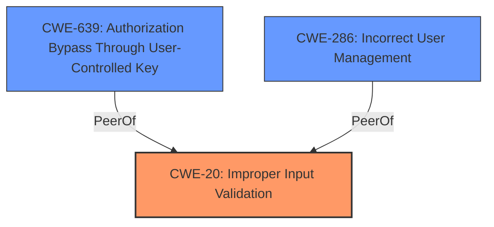

# Raw Analyzer Response for CVE-2024-6428

# Summary

| CWE ID  | CWE Name                                                                      | Confidence | CWE Abstraction Level | CWE Vulnerability Mapping Label | CWE-Vulnerability Mapping Notes |
| ------- | ----------------------------------------------------------------------------- | ---------- | ----------------------- | ------------------------------- | ----------------------------- |
| CWE-20  | CWE-20: Improper Input Validation                                              | 0.9        | Class                   | Primary                         | Discouraged                   |
| CWE-639 | CWE-639: Authorization Bypass Through User-Controlled Key                      | 0.7        | Base                    | Secondary                       | Allowed                       |
| CWE-286 | CWE-286: Incorrect User Management                                            | 0.6        | Class                   | Secondary                       | Allowed-with-Review           |

## Evidence and Confidence

*   **Confidence Score:** 0.8
*   **Evidence Strength:** MEDIUM

## Relationship Analysis

The primary relationship that impacts the decision is the parent-child relationship between CWE-20 and more specific input validation CWEs. While CWE-20 is a high-level class, the available information doesn't provide enough detail to pinpoint a more specific base or variant-level CWE related to input validation. The other potential CWEs are peers that represent related, but distinct, weaknesses.

## Vulnerability Chain

The vulnerability chain starts with **improper input validation** (CWE-20), which leads to the ability to create a user with a user-defined user ID. This can lead to broken functionality in user management. The ability to specify the user ID can be seen as **Authorization Bypass Through User-Controlled Key** (CWE-639). The resulting broken functionality in user management can be attributed to **Incorrect User Management** (CWE-286).

## Summary of Analysis

The initial analysis pointed towards **improper input validation** as the primary weakness. The vulnerability description states that Mattermost fails to prevent specifying a RemoteId when creating a new user, which allows an attacker to specify both a remoteId and the user ID. The retriever results also listed CWE-20 as a potential candidate, although it's discouraged due to its high level of abstraction. However, without more specific details on *how* the input validation is improper, it's difficult to choose a more specific CWE.

The vulnerability also exhibits characteristics of CWE-639 (Authorization Bypass Through User-Controlled Key), since the attacker is able to control the user ID, which is essentially a key value.

The impact of the vulnerability, broken user management functionality, aligns with CWE-286 (Incorrect User Management).

The evidence is primarily based on the vulnerability description itself, especially the phrase "**improper input validation**". The retriever results provide supporting evidence.

The decision to select CWE-20 is influenced by the explicit mention of **improper input validation** in the vulnerability description. While more specific CWEs would be ideal, the lack of detail prevents a more precise mapping.

The selected CWEs are at the most specific level possible given the available information. CWE-20 is a Class-level CWE, and it would be preferable to select a Base or Variant, but there is insufficient detail.

Relevant CWE Information:

# Enhanced Context (25 CWEs)

## CWE-303: Incorrect Implementation of Authentication Algorithm
**Abstraction Level**: Base
**Similarity Score**: 0.72
**Source**: dense

**Description**:
The requirements for the product dictate the use of an established authentication algorithm, but the implementation of the algorithm is incorrect.

**Mapping Guidance**:
- Usage: Allowed
- Rationale: This CWE entry is at the Base level of abstraction, which is a preferred level of abstraction for mapping to the root causes of vulnerabilities.

**Why Not Used**: This CWE is not applicable because the vulnerability is about user creation, not the authentication algorithm implementation.

## CWE-807: Reliance on Untrusted Inputs in a Security Decision
**Abstraction Level**: Base
**Similarity Score**: 0.72
**Source**: dense

**Description**:
The product uses a protection mechanism that relies on the existence or values of an input, but the input can be modified by an untrusted actor in a way that bypasses the protection mechanism.

**Mapping Guidance**:
- Usage: Allowed
- Rationale: This CWE entry is at the Base level of abstraction, which is a preferred level of abstraction for mapping to the root causes of vulnerabilities.

**Why Not Used**: While reliance on untrusted input is part of the problem, it is too general and doesn't fully capture the **improper input validation** aspect.

## CWE-1391: Use of Weak Credentials
**Abstraction Level**: Class
**Similarity Score**: 0.71
**Source**: dense

**Description**:
The product uses weak credentials (such as a default key or hard-coded password) that can be calculated, derived, reused, or guessed by an attacker.

**Mapping Guidance**:
- Usage: Allowed-with-Review
- Rationale: This CWE entry is a Class and might have Base-level children that would be more appropriate

**Why Not Used**: This CWE is not relevant because the vulnerability is not about weak credentials.

## CWE-204: Observable Response Discrepancy
**Abstraction Level**: Base
**Similarity Score**: 0.71
**Source**: dense

**Description**:
The product provides different responses to incoming requests in a way that reveals internal state information to an unauthorized actor outside of the intended control sphere.

**Mapping Guidance**:
- Usage: Allowed
- Rationale: This CWE entry is at the Base level of abstraction, which is a preferred level of abstraction for mapping to the root causes of vulnerabilities.

**Why Not Used**: This CWE is not relevant to the vulnerability.

## CWE-286: Incorrect User Management
**Abstraction Level**: Class
**Similarity Score**: 0.71
**Source**: dense

**Description**:
The product does not properly manage a user within its environment.

**Mapping Guidance**:
- Usage: Allowed-with-Review
- Rationale: This CWE entry is a Class and might have Base-level children that would be more appropriate

**Why Not Used**: Considered as a secondary weakness representing the impact of the primary weakness.

## CWE-267: Privilege Defined With Unsafe Actions
**Abstraction Level**: Base
**Similarity Score**: 0.71
**Source**: dense

**Description**:
A particular privilege, role, capability, or right can be used to perform unsafe actions that were not intended, even when it is assigned to the correct entity.

**Mapping Guidance**:
- Usage: Allowed
- Rationale: This CWE entry is at the Base level of abstraction, which is a preferred level of abstraction for mapping to the root causes of vulnerabilities.

**Why Not Used**: While related, this CWE isn't the core issue. The primary problem is the ability to specify a user ID.

## CWE-472: External Control of Assumed-Immutable Web Parameter
**Abstraction Level**: Base
**Similarity Score**: 0.70
**Source**: dense

**Description**:
The web application does not sufficiently verify inputs that are assumed to be immutable but are actually externally controllable, such as hidden form fields.

**Mapping Guidance**:
- Usage: Allowed
- Rationale: This CWE entry is at the Base level of abstraction, which is a preferred level of abstraction for mapping to the root causes of vulnerabilities.

**Why Not Used**: This CWE is more specific to web applications and assumed immutable parameters. While related, the description doesn't indicate this is the case.

## CWE-639: Authorization Bypass Through User-Controlled Key
**Abstraction Level**: Base
**Similarity Score**: 0.70
**Source**: dense

**Description**:
The system's authorization functionality does not prevent one user from gaining access to another user's data or record by modifying the key value identifying the data.

**Mapping Guidance**:
- Usage: Allowed
- Rationale: This CWE entry is at the Base level of abstraction, which is a preferred level of abstraction for mapping to the root causes of vulnerabilities.

**Why Not Used**: Considered as a secondary weakness, as the ability to control the User ID is essentially controlling a key value used for authorization.

## CWE-346: Origin Validation Error
**Abstraction Level**: Class
**Similarity Score**: 0.70
**Source**: dense

**Description**:
The product does not properly verify that the source of data or communication is valid.

**Mapping Guidance**:
- Usage: Allowed-with-Review
- Rationale: This CWE entry is a Class and might have Base-level children that would be more appropriate

**Why Not Used**: This is not related to the