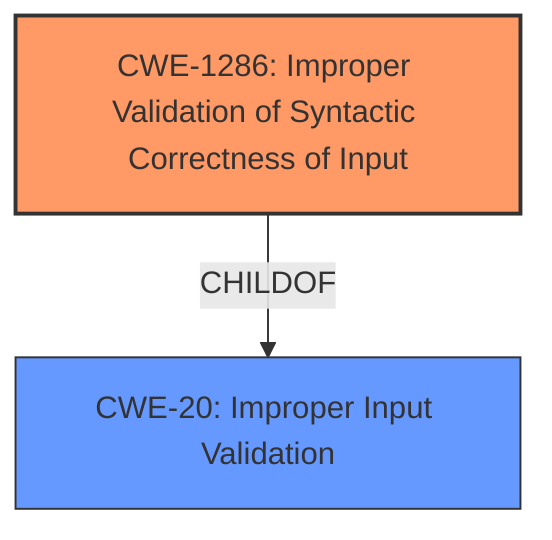

# Analysis for CVE-2024-6446

# Summary
| CWE ID | CWE Name | Confidence | CWE Abstraction Level | CWE Vulnerability Mapping Label | CWE-Vulnerability Mapping Notes |
|---|---|---|---|---|---|
| CWE-1286 | Improper Validation of Syntactic Correctness of Input | 0.8 | Base | Primary | Allowed |
| CWE-20 | Improper Input Validation | 0.6 | Class | Secondary | Allowed-with-Review |

## Evidence and Confidence

*   **Confidence Score:** 0.7
*   **Evidence Strength:** MEDIUM

## Relationship Analysis
The primary CWE, CWE-1286, is a Base level weakness, which is preferred. The vulnerability description highlights **improper input validation** of the redirect URI. CWE-20 is a higher-level class that could encompass this type of validation failure. CWE-1286 is a more precise description of the **validation failure** because it focuses on the syntax of the input, specifically the URI format.

## Vulnerability Chain
The vulnerability chain starts with **improper input validation** (CWE-1286) of the redirect URI, leading to a crafted URL being used to trick a victim. This could then lead to OAuth flow manipulation, ultimately impacting the user's trust and potentially compromising their account.

## Summary of Analysis
The initial analysis identified several potential CWEs based on retriever results. However, after a detailed review, CWE-1286 was selected as the primary CWE because it directly addresses the root cause vulnerability involving **improper validation** of the URI syntax. The vulnerability description states that the application's code does not properly sanitize the host part of the redirect URI, which aligns with CWE-1286. CWE-20 is considered as a broader secondary candidate.

The evidence from the "CVE Reference Links Content Summary" section is used to support this decision:
- "**Insufficient Input Sanitization:** The code does not properly sanitize the host part of the redirect URI, allowing an attacker to register a redirect URI like `https://giwww.tlab.com`."

Relevant CWE Information:

# Enhanced Context (25 CWEs)
The following CWEs were identified as potentially relevant to this vulnerability:

## CWE-1286: Improper Validation of Syntactic Correctness of Input
**Abstraction Level**: Base
**Similarity Score**: 0.76
**Source**: dense

**Description**:
The product receives input that is expected to be well-formed - i.e., to comply with a certain syntax - but it does not validate or incorrectly validates that the input complies with the syntax.

**Mapping Guidance**:
- Usage: Allowed
- Rationale: This CWE entry is at the Base level of abstraction, which is a preferred level of abstraction for mapping to the root causes of vulnerabilities.
## CWE-20: Improper Input Validation
**Abstraction Level**: Class
**Description**: The product receives input or data, but it does not validate or incorrectly validates that the input has the properties that are required to process the data safely and correctly.
**Mapping Guidance**:
Usage: Allowed with Review

## CWE-88: Improper Neutralization of Argument Delimiters in a Command ('Argument Injection')
**Abstraction Level**: Base
**Similarity Score**: 0.73
**Source**: dense

**Description**:
The product constructs a string for a command to be executed by a separate component
in another control sphere, but it does not properly delimit the
intended arguments, options, or switches within that command string.

**Mapping Guidance**:
- Usage: Allowed
- Rationale: This CWE entry is at the Base level of abstraction, which is a preferred level of abstraction for mapping to the root causes of vulnerabilities.

CWE-88 was considered because the crafted URL can be considered an argument. However, the core issue is with the URI's syntax, not its use as an argument to a command. Thus, it is not a suitable mapping.

## CWE-639: Authorization Bypass Through User-Controlled Key
**Abstraction Level**: Base
**Similarity Score**: 0.73
**Source**: dense

**Description**:
The system's authorization functionality does not prevent one user from gaining access to another user's data or record by modifying the key value identifying the data.

**Mapping Guidance**:
- Usage: Allowed
- Rationale: This CWE entry is at the Base level of abstraction, which is a preferred level of abstraction for mapping to the root causes of vulnerabilities.

CWE-639 was considered because the vulnerability allows an attacker to trick the user into trusting an attacker-controlled application. However, the authorization bypass is not directly through user-controlled keys, but through a crafted URL. Thus, it is not a suitable mapping.

## CWE-79: Improper Neutralization of Input During Web Page Generation ('Cross-site Scripting')
**Abstraction Level**: Base
**Similarity Score**: 983.65
**Source**: sparse

**Description**:
The product does not neutralize or incorrectly neutralizes user-controllable input before it is placed in output that is used as a web page that is served to other users.

**Mapping Guidance**:
- Usage: Allowed
- Rationale: This CWE entry is at the Base level of abstraction, which is a preferred level of abstraction for mapping to the root causes of vulnerabilities.
CWE-79 was considered because crafted URLs are a common vector for XSS. However, the vulnerability doesn't directly involve the generation of a web page with un-neutralized input.

## CWE-22: Improper Limitation of a Pathname to a Restricted Directory ('Path Traversal')
**Abstraction Level**: Base
**Similarity Score**: 985.72
**Source**: sparse

**Description**:
The product uses external input to construct a pathname that is intended to identify a file or directory that is located underneath a restricted parent directory, but the product does not properly neutralize special elements within the pathname that can cause the pathname to resolve to a location that is outside of the restricted directory.

**Mapping Guidance**:
- Usage: Allowed
- Rationale: This CWE entry is at the Base level of abstraction, which is a preferred level of abstraction for mapping to the root causes of vulnerabilities.
CWE-22 was considered, but it is not directly applicable. The vulnerability doesn't involve path traversal.

The selection of CWE-1286 is at the optimal level of specificity because it directly aligns with the **improper validation** of the redirect URI's syntax, as supported by the vulnerability description.