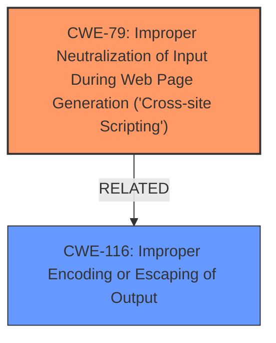

# Analysis Report for CVE-2024-6462

# Vulnerability Analysis Report: CVE-2024-6462

## Description

The DL Yandex Metrika WordPress plugin through 1.2 **does not sanitise and escape some of its settings**, which could allow high privilege users such as admin to perform Stored **Cross-Site Scripting** attacks even when the unfiltered_html capability is disallowed (for example in multisite setup)

## Vulnerability Description Key Phrases

- **Rootcause:** does not sanitise and escape some of its settings
- **Weakness:** Cross-Site Scripting
- **Impact:** Stored Cross-Site Scripting attacks
- **Attacker:** high privilege users
- **Product:** DL Yandex Metrika WordPress plugin
- **Version:** through 1.2

## Analysis (with Relationship Data)

# Summary
| CWE ID | CWE Name | Confidence | CWE Abstraction Level | CWE Vulnerability Mapping Label | CWE-Vulnerability Mapping Notes |
|---|---|---|---|---|---|
| CWE-79 | Improper Neutralization of Input During Web Page Generation ('Cross-site Scripting') | 1 | Base | Primary | Allowed |
| CWE-116 | Improper Encoding or Escaping of Output | 0.7 | Class | Secondary Candidate | Allowed-with-Review |

## Evidence and Confidence

*   **Confidence Score:** 0.9
*   **Evidence Strength:** HIGH

## Relationship Analysis
The primary relationship influencing the CWE selection is that CWE-79 is a Base level CWE, which is more specific than its parent Class CWEs. The analysis considered CWE-116 (Improper Encoding or Escaping of Output) as a related issue since the vulnerability stems from the plugin not properly sanitizing and escaping settings. The relationship between sanitization/escaping and XSS is direct, and CWE-79 directly addresses the XSS issue.



## Vulnerability Chain
The vulnerability chain starts with the plugin's **failure to sanitize and escape settings**, which leads to the **Stored Cross-Site Scripting vulnerability**. The root cause is the **lack of proper input validation (sanitization and escaping)**, and the impact is the ability for high-privilege users to inject malicious scripts.
  - **Root Cause:** **Does not sanitize and escape some of its settings**
  - **Weakness:** **Cross-Site Scripting**
  - **Impact:** Stored Cross-Site Scripting attacks

## Summary of Analysis
The analysis identified a Stored Cross-Site Scripting (XSS) vulnerability in the DL Yandex Metrika WordPress plugin. The plugin **does not sanitize and escape some of its settings**, allowing high-privilege users to inject malicious scripts.

The primary CWE selected is CWE-79 (Improper Neutralization of Input During Web Page Generation ('Cross-site Scripting')). This is based on the vulnerability description, which clearly states that the plugin **does not sanitise and escape some of its settings**, leading to the XSS vulnerability. This aligns with the CWE-79 description, which focuses on improper neutralization of input during web page generation.

The evidence from the CVE reference link also supports this: "The plugin does not sanitize and escape some of its settings, allowing for XSS attacks."

CWE-116 (Improper Encoding or Escaping of Output) was considered as a related issue because the **root cause** is the **failure to sanitize and escape settings**. However, CWE-79 is more specific to the XSS nature of the vulnerability.

The choice of CWE-79 is at the optimal level of specificity (Base), as it directly addresses the XSS weakness.

Relevant CWE Information:

# Enhanced Context (25 CWEs)
The following CWEs were identified as potentially relevant to this vulnerability:

## CWE-425: Direct Request ('Forced Browsing')
**Abstraction Level**: Base
**Similarity Score**: 0.79
**Source**: dense

**Description**:
The web application does not adequately enforce appropriate authorization on all restricted URLs, scripts, or files.

**Mapping Guidance**:
- Usage: Allowed
- Rationale: This CWE entry is at the Base level of abstraction, which is a preferred level of abstraction for mapping to the root causes of vulnerabilities.

*Not selected as there is no missing authorisation*

## CWE-472: External Control of Assumed-Immutable Web Parameter
**Abstraction Level**: Base
**Similarity Score**: 0.79
**Source**: dense

**Description**:
The web application does not sufficiently verify inputs that are assumed to be immutable but are actually externally controllable, such as hidden form fields.

**Mapping Guidance**:
- Usage: Allowed
- Rationale: This CWE entry is at the Base level of abstraction, which is a preferred level of abstraction for mapping to the root causes of vulnerabilities.

*Not selected as the issue is related to lack of sanitisation, not externally controlled parameters.*

## CWE-266: Incorrect Privilege Assignment
**Abstraction Level**: Base
**Similarity Score**: 0.78
**Source**: dense

**Description**:
A product incorrectly assigns a privilege to a particular actor, creating an unintended sphere of control for that actor.

**Mapping Guidance**:
- Usage: Allowed
- Rationale: This CWE entry is at the Base level of abstraction, which is a preferred level of abstraction for mapping to the root causes of vulnerabilities.

*Not selected as there is no incorrect privilege assignment.*

## CWE-267: Privilege Defined With Unsafe Actions
**Abstraction Level**: Base
**Similarity Score**: 0.78
**Source**: dense

**Description**:
A particular privilege, role, capability, or right can be used to perform unsafe actions that were not intended, even when it is assigned to the correct entity.

**Mapping Guidance**:
- Usage: Allowed
- Rationale: This CWE entry is at the Base level of abstraction, which is a preferred level of abstraction for mapping to the root causes of vulnerabilities.

*Not selected as there is no privilege defined with unsafe actions*

## CWE-639: Authorization Bypass Through User-Controlled Key
**Abstraction Level**: Base
**Similarity Score**: 0.77
**Source**: dense

**Description**:
The system's authorization functionality does not prevent one user from gaining access to another user's data or record by modifying the key value identifying the data.

**Mapping Guidance**:
- Usage: Allowed
- Rationale: This CWE entry is at the Base level of abstraction, which is a preferred level of abstraction for mapping to the root causes of vulnerabilities.

*Not selected as there is no missing authorisation*

## CWE-116: Improper Encoding or Escaping of Output
**Abstraction Level**: Class
**Similarity Score**: 0.77
**Source**: dense

**Description**:
The product prepares a structured message for communication with another component, but encoding or escaping of the data is either missing or done incorrectly. As a result, the intended structure of the message is not preserved.

**Mapping Guidance**:
- Usage: Allowed-with-Review
- Rationale: This CWE entry is a Class and might have Base-level children that would be more appropriate

*Selected as the rootcause of the weakness is related to lack of sanitisation, but CWE-79 is a better match.*

## CWE-74: Improper Neutralization of Special Elements in Output Used by a Downstream Component ('Injection')
**Abstraction Level**: Class
**Similarity Score**: 0.77
**Source**: dense

**Description**:
The product constructs all or part of a command, data structure, or record using externally-influenced input from an upstream component, but it does not neutralize or incorrectly neutralizes special elements that could modify how it is parsed or interpreted when it is sent to a downstream component.

**Mapping Guidance**:
- Usage: Discouraged
- Rationale: CWE-74 is high-level and often misused when lower-level weaknesses are more appropriate.

*Not selected as the issue is related to lack of sanitisation in the output, so CWE-79 is a better fit.*

## CWE-184: Incomplete List of Disallowed Inputs
**Abstraction Level**: Base
**Similarity Score**: 0.76
**Source**: dense

**Description**:
The product implements a protection mechanism that relies on a list of inputs (or properties of inputs) that are not allowed by policy or otherwise require other action to neutralize before additional processing takes place, but the list is incomplete.

**Mapping Guidance**:
- Usage: Allowed
- Rationale: This CWE entry is at the Base level of abstraction, which is a preferred level of abstraction for mapping to the root causes of vulnerabilities.

*Not selected as the weakness is not due to an incomplete list of disallowed inputs*

## CWE-434: Unrestricted Upload of File with Dangerous Type
**Abstraction Level**: Base
**Similarity Score**: 0.76
**Source**: dense

**Description**:
The product allows the upload or transfer of dangerous file types that are automatically processed within its environment.

**Mapping Guidance**:
- Usage: Allowed
- Rationale: This CWE entry is at the Base level of abstraction, which is a preferred level of abstraction for mapping to the root causes of vulnerabilities.

*Not selected as the weakness is not related to file uploads.*

## CWE-80: Improper Neutralization of Script-Related HTML Tags in a Web Page (Basic XSS)
**Abstraction Level**: Variant
**Similarity Score**: 0.76
**Source**: dense

**Description**:
The product receives input from an upstream component, but it does not neutralize or incorrectly neutralizes special characters such as "<", ">", and "&" that could be interpreted as web-scripting elements when they are sent to a downstream component that processes web


## CWE Relationship Analysis

Current CWEs represent these abstraction levels: .


### Vulnerability Chain Analysis

**Chain starting from CWE-116:**
- 116 (Improper Encoding or Escaping of Output) - ROOT


**Chain starting from CWE-80:**
- 80 (Improper Neutralization of Script-Related HTML Tags in a Web Page (Basic XSS)) - ROOT


### CWE Relationship Diagram

```mermaid
graph TD
    classDef primary fill:#f96,stroke:#333,stroke-width:2px
    classDef secondary fill:#69f,stroke:#333
    classDef tertiary fill:#9e9,stroke:#333
```


*Report generated on 2025-07-14 01:44:14*
