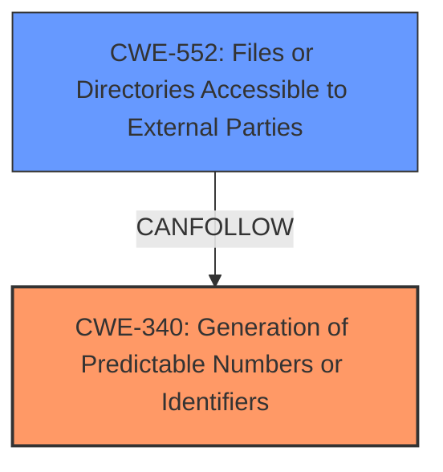

# Enhanced Analysis for CVE-2024-6477

# Summary
| CWE ID | CWE Name | Confidence | CWE Abstraction Level | CWE Vulnerability Mapping Label | CWE-Vulnerability Mapping Notes |
|---|---|---|---|---|---|
| CWE-340 | Generation of Predictable Numbers or Identifiers | 0.9 | Class | Allowed-with-Review | Primary CWE. The plugin uses **predictable filenames** when generating exports. |
| CWE-552 | Files or Directories Accessible to External Parties | 0.8 | Base | Allowed | Secondary CWE. Unauthenticated attackers can download these exports.|

## Evidence and Confidence

*   **Confidence Score:** 0.85
*   **Evidence Strength:** HIGH

## Relationship Analysis
The primary weakness is CWE-340, which leads to CWE-552. CWE-340 is a class-level CWE, and there might be a more specific base-level CWE available, but the provided information is not detailed enough to select it. CWE-552 is a base-level CWE representing the impact of the predictable identifiers.



## Vulnerability Chain
The vulnerability chain starts with the **generation of predictable filenames** (CWE-340). This leads to the impact where unauthenticated attackers can download these files (CWE-552), gaining access to sensitive information.

## Summary of Analysis
The primary weakness is the **generation of predictable filenames** (CWE-340) when an admin generates an export file. This allows unauthenticated attackers to download the files, which leads to sensitive data disclosure (CWE-552).

The vulnerability description states that the UsersWP WordPress plugin before 1.2.12 uses **predictable filenames** when an admin generates an export, which could allow unauthenticated attackers to download them and retrieve sensitive information such as IP, username, and email address.

The CVE Reference Links Content Summary confirms that the root cause is the plugin generating export files with **predictable filenames**. The impact is that unauthenticated attackers can download the export files, gaining access to sensitive information such as usernames, IP addresses, and email addresses of users.

CWE-340 (Generation of Predictable Numbers or Identifiers) is a Class-level CWE that fits the root cause. The description matches the vulnerability: The product uses a scheme that generates numbers or identifiers that are more predictable than required. The mapping guidance suggests that a more specific Base-level child might be more appropriate. However, without more information about the specific algorithm used to generate the filenames, it is not possible to select a more specific CWE.

CWE-552 (Files or Directories Accessible to External Parties) is a Base-level CWE that fits the impact. The description matches the vulnerability: The product makes files or directories accessible to unauthorized actors, even though they should not be.

CWE-425 (Direct Request ('Forced Browsing')) was considered but not selected because while it's true that the attacker can directly request the file, the root cause isn't the lack of authorization checks, but the predictability of the filename itself.

CWE-639 (Authorization Bypass Through User-Controlled Key) was considered, but it doesn't fit the vulnerability because there is no user-controlled key involved. The issue is that the filenames are predictable, not that an attacker is modifying a key to gain access to another user's data.

CWE-330 (Use of Insufficiently Random Values) was considered, but CWE-340 is a better fit because it's more specific to identifiers and numbers, whereas CWE-330 is more general.

CWE-341 (Predictable from Observable State) was considered, but it is similar to CWE-340. Since the filenames themselves are predictable, CWE-340 is a better fit for the specific weakness.


## CWE Relationship Analysis

Current CWEs represent these abstraction levels: .


### Vulnerability Chain Analysis

**Chain starting from CWE-340:**
- 340 (Generation of Predictable Numbers or Identifiers) - ROOT


**Chain starting from CWE-330:**
- 330 (Use of Insufficiently Random Values) - ROOT


### CWE Relationship Diagram

```mermaid
graph TD
    classDef primary fill:#f96,stroke:#333,stroke-width:2px
    classDef secondary fill:#69f,stroke:#333
    classDef tertiary fill:#9e9,stroke:#333
```