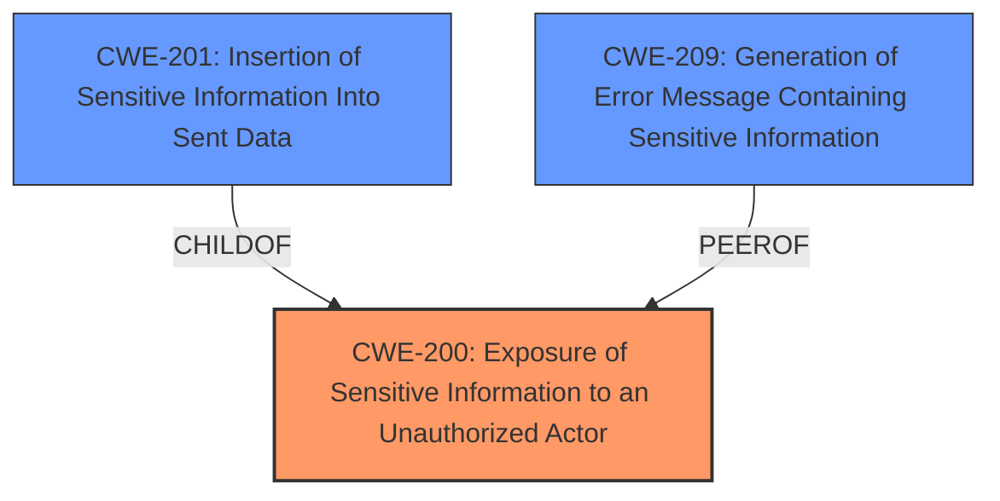

# Raw Analyzer Response for CVE-2024-6551

# Summary
| CWE ID | CWE Name | Confidence | CWE Abstraction Level | CWE Vulnerability Mapping Label | CWE-Vulnerability Mapping Notes |
|---|---|---|---|---|---|
| CWE-200 | Exposure of Sensitive Information to an Unauthorized Actor | 1.0 | Class | Primary | Allowed |
| CWE-201 | Insertion of Sensitive Information Into Sent Data | 0.7 | Base | Secondary Candidate | Allowed |
| CWE-209 | Generation of Error Message Containing Sensitive Information | 0.6 | Base | Secondary Candidate | Allowed |

## Evidence and Confidence

*   **Confidence Score:** 0.9
*   **Evidence Strength:** HIGH

## Relationship Analysis
The primary CWE is CWE-200 [Exposure of Sensitive Information to an Unauthorized Actor], which is a class-level CWE. The retriever results suggested CWE-201 [Insertion of Sensitive Information Into Sent Data] and CWE-209 [Generation of Error Message Containing Sensitive Information] as possibilities. Since the vulnerability involves the exposure of the full path due to error messages being displayed, these CWEs are related. CWE-201 is a base CWE and a parent of CWE-200. CWE-209 is a base CWE.

## Vulnerability Chain
The vulnerability chain starts with the **incorrect configuration of `display_errors` being turned on in the test files**. This leads to the **exposure of the full path of the web application** when the test file is accessed, resulting in **sensitive information being disclosed to unauthorized actors**.
  - Initial Flaw: **utilizing Symfony and leaving display_errors on within test files**
  - Resulting Weakness: Full Path Disclosure
  - Final Impact: Exposure of sensitive information to unauthorized actors.

## Summary of Analysis
The primary assessment is based on the provided evidence, which clearly indicates that the root cause is the **incorrect configuration** (`display_errors` enabled), leading to the **exposure of sensitive information**. The vulnerability description and CVE reference links content summary explicitly state that the **full path of the web application is disclosed** due to this misconfiguration.

> Vulnerability Description Key Phrases:
> - **rootcause:** **utilizing Symfony and leaving display_errors on within test files**
> - **impact:** Full Path Disclosure

> CVE Reference Links Content Summary:
> - The vulnerability is due to the GiveWP WordPress plugin using Symfony and having `display_errors` enabled within test files. Specifically, the `common.inc` file used in testing includes the line `ini_set('display_errors', 1);`.
> - Full Path Disclosure: The enabled `display_errors` setting in the test file causes the full server path of the web application to be displayed when accessing the file through a web request.

The selection of CWE-200 [Exposure of Sensitive Information to an Unauthorized Actor] is based on the fact that the vulnerability results in the exposure of the full path, which is sensitive information. The relationship graph highlights that CWE-201 [Insertion of Sensitive Information Into Sent Data] is a child of CWE-200 [Exposure of Sensitive Information to an Unauthorized Actor] and a secondary candidate.

CWE-200 [Exposure of Sensitive Information to an Unauthorized Actor] is at the class level, which is appropriate as there isn't a more specific base or variant that perfectly captures the scenario. While CWE-209 [Generation of Error Message Containing Sensitive Information] is also relevant, CWE-200 [Exposure of Sensitive Information to an Unauthorized Actor] is a more encompassing classification because the error message is just the means by which the sensitive information is exposed.

*   **CWE-200: Exposure of Sensitive Information to an Unauthorized Actor**
    *   **Technical Explanation:** The plugin **incorrectly configures error reporting**, leading to the **disclosure of the web application's full path**. This path is sensitive information that should not be exposed to unauthorized actors.
    *   **Security Implications:** Exposure of the full path can aid attackers in reconnaissance, helping them map the directory structure and potentially identify other vulnerabilities.
    *   **Relationship and Chain:** This is the final impact in the vulnerability chain.
    *   **Mapping Guidance:** The CWE is allowed and is a class level.
*   **CWE-201: Insertion of Sensitive Information Into Sent Data**
    *   **Technical Explanation:** The web server, due to misconfiguration, **inserts sensitive information (the full path)** into the data it sends back to the client in the form of an error message.
    *   **Security Implications:** Similar to CWE-200 [Exposure of Sensitive Information to an Unauthorized Actor], this can aid attackers.
    *   **Relationship and Chain:** This is a child of CWE-200 [Exposure of Sensitive Information to an Unauthorized Actor].
    *   **Mapping Guidance:** The CWE is allowed and is at the Base level of abstraction, which is a preferred level.
*   **CWE-209: Generation of Error Message Containing Sensitive Information**
    *   **Technical Explanation:** The product **generates an error message that includes sensitive information**, which in this case is the full path of the web application.
    *   **Security Implications:** This allows attackers to glean sensitive information from the error messages.
    *   **Relationship and Chain:** This is related to CWE-200 [Exposure of Sensitive Information to an Unauthorized Actor] as the error message is the means by which the information is exposed.
    *   **Mapping Guidance:** The CWE is allowed and is at the Base level of abstraction, which is a preferred level.

CWEs considered but not used:

*   CWE-22 [Improper Limitation of a Pathname to a Restricted Directory ('Path Traversal')]: While full path disclosure is related to paths, this CWE is about path traversal, which is not the case here. The vulnerability is simply exposing the full path, not allowing traversal outside of restricted directories.
*   CWE-306 [Missing Authentication for Critical Function]: This is not relevant because the vulnerability is about information disclosure, not a missing authentication check.
*   CWE-434 [Unrestricted Upload of File with Dangerous Type]: This CWE is not relevant as it deals with unrestricted uploads, which is not part of this vulnerability.
*   CWE-862 [Missing Authorization]: The vulnerability involves exposure of information due to error messages, not missing authorization checks.