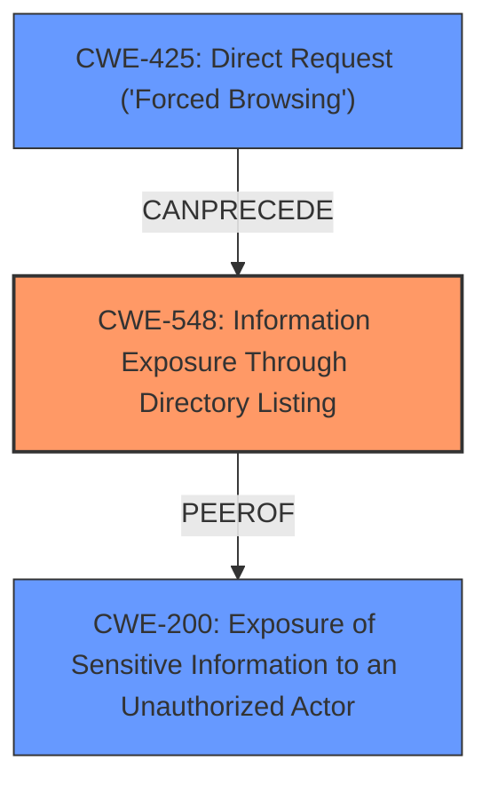

# Analysis for CVE-2024-6560

# Summary
| CWE ID | CWE Name | Confidence | CWE Abstraction Level | CWE Vulnerability Mapping Label | CWE-Vulnerability Mapping Notes |
|---|---|---|---|---|---|
| CWE-548 | Information Exposure Through Directory Listing | 0.8 | Base | Allowed | Primary CWE |
| CWE-425 | Direct Request ('Forced Browsing') | 0.5 | Base | Allowed | Secondary Candidate |
| CWE-200 | Exposure of Sensitive Information to an Unauthorized Actor | 0.4 | Class | Discouraged | Secondary Candidate |

## Evidence and Confidence

*   **Confidence Score:** 0.7
*   **Evidence Strength:** MEDIUM

## Relationship Analysis
The primary CWE, CWE-548, is related to information exposure. While other CWEs like CWE-425 and CWE-200 were considered, CWE-548 directly addresses the **full path disclosure** aspect. The hierarchical relationships did not significantly influence the selection, as the focus was on identifying the most specific and relevant CWE based on the vulnerability description.

## Vulnerability Chain
The vulnerability chain starts with the **lack of access control** on certain files, leading to the **exposure of the full path**.

1.  **Root Cause:** Missing or **Improper Access Control** on files.
2.  **Weakness:** The plugin utilizes mobiledetect without preventing direct access to the files, leading to **Full Path Disclosure**.
3.  **Impact:** Unauthenticated attackers can retrieve the full path of the web application.

## Summary of Analysis
The initial assessment considered various CWEs, but after analyzing the vulnerability description and the retriever results, CWE-548 was deemed the most appropriate due to its direct relevance to **information exposure through directory listing**. The vulnerability description clearly states that the plugin utilizing mobiledetect without preventing direct access to the files leads to **Full Path Disclosure**, which aligns with CWE-548.

The decision is based on the provided evidence and the direct match between the vulnerability and the CWE description. The selected CWE is at the optimal level of specificity, as it accurately represents the nature of the weakness.

Relevant CWE Information:

# Enhanced Context (25 CWEs)
The following CWEs were identified as potentially relevant to this vulnerability:

## CWE-425: Direct Request ('Forced Browsing')
**Abstraction Level**: Base
**Similarity Score**: 0.73
**Source**: dense

**Description**:
The web application does not adequately enforce appropriate authorization on all restricted URLs, scripts, or files.

**Mapping Guidance**:
- Usage: Allowed
- Rationale: This CWE entry is at the Base level of abstraction, which is a preferred level of abstraction for mapping to the root causes of vulnerabilities.

## CWE-548: Information Exposure Through Directory Listing
**Abstraction Level**: Base

**Description**:
The web server contains a feature that lists the files and directories in a web-accessible directory, but the feature is enabled when it should not be, or access to this feature is not properly restricted.

### Technical Explanation for Selected CWEs:

*   **CWE-548: Information Exposure Through Directory Listing**
    *   **Match:** The vulnerability allows unauthenticated attackers to retrieve the full path of the web application due to the plugin utilizing mobiledetect without preventing direct access to the files. This aligns with the CWE description, which involves listing files and directories in a web-accessible directory.
    *   **Security Implications:** Full Path Disclosure can aid attackers in reconnaissance by providing information about the server's file structure, potentially facilitating other attacks.
    *   **Relationship:** This is the primary weakness.
    *   **Mapping Guidance:** The description directly fits the CWE.
*   **CWE-425: Direct Request ('Forced Browsing')**
    *   **Match:** This vulnerability could be seen as an instance of forced browsing because the mobiledetect files are directly accessible without proper authorization.
    *   **Security Implications:** Attackers can access resources they shouldn't, potentially leading to further exploitation.
    *   **Relationship:** This could be a contributing factor, but not the primary cause.
    *   **Mapping Guidance:** The description fits, but not as directly as CWE-548.
*   **CWE-200: Exposure of Sensitive Information to an Unauthorized Actor**
    *   **Match:** While the full path can be considered sensitive information, CWE-548 is more specific to directory listing and information exposure.
    *   **Security Implications:** Exposing the full path can aid attackers in reconnaissance.
    *   **Relationship:** This is a more general CWE and not the primary cause.
    *   **Mapping Guidance:** Discouraged because it is a class-level CWE when a more specific base-level CWE is available.

### CWEs Considered but Not Used:

*   CWE-862 (Missing Authorization), CWE-639 (Authorization Bypass Through User-Controlled Key), CWE-306 (Missing Authentication for Critical Function): These CWEs relate to authorization and authentication issues. While there's a **lack of access control**, the direct result is **information exposure**, making CWE-548 more relevant.
*   CWE-352 (Cross-Site Request Forgery (CSRF)): This CWE is not applicable as the vulnerability is not related to CSRF.
*   CWE-201 (Insertion of Sensitive Information Into Sent Data): This CWE is not applicable as the vulnerability is about information exposure rather than insertion of sensitive information.
*   CWE-863 (Incorrect Authorization): Similar to CWE-862, this is related to authorization issues, but the direct result is information exposure, making CWE-548 more relevant.
*   CWE-36 (Absolute Path Traversal): The vulnerability doesn't involve path traversal.
*   CWE-471 (Modification of Assumed-Immutable Data (MAID)): This CWE is not applicable as the vulnerability is not related to modifying immutable data.