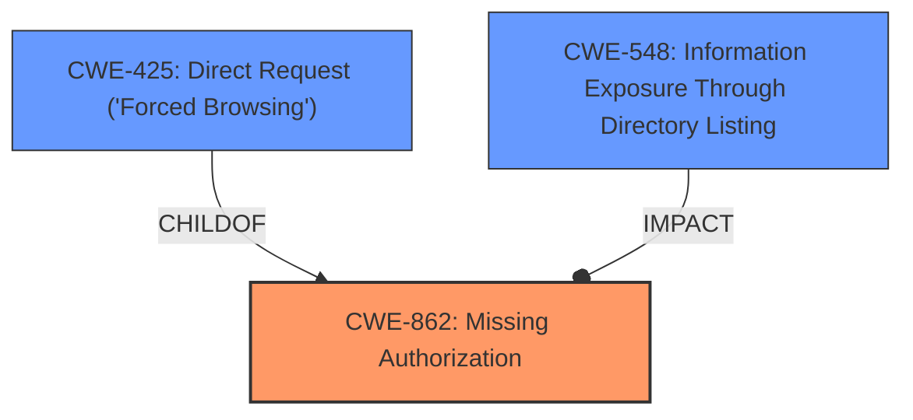

# Raw Analyzer Response for CVE-2024-6569

# Summary
| CWE ID  | CWE Name                                                                           | Confidence | CWE Abstraction Level | CWE Vulnerability Mapping Label | CWE-Vulnerability Mapping Notes |
| :-------- | :--------------------------------------------------------------------------------- | :--------- | :---------------------- | :------------------------------ | :------------------------------ |
| CWE-862   | Missing Authorization                                                              | 0.9        | Class                   | Primary                         | Allowed-with-Review           |
| CWE-548   | Information Exposure Through Directory Listing                                     | 0.7        | Base                   | Secondary                        | Allowed                   |

## Evidence and Confidence

*   **Confidence Score:** 0.8
*   **Evidence Strength:** HIGH

## Relationship Analysis
The primary weakness identified is **CWE-862 (Missing Authorization)**. This is a class-level CWE, and the vulnerability description indicates a **lack of access control** on `/forms/views/admin/create.php`. While more specific base-level CWEs exist under **CWE-862**, such as **CWE-425 (Direct Request ('Forced Browsing'))**, the provided information does not offer enough specificity to choose them confidently. **CWE-425** is a child of **CWE-862** and describes the issue of not adequately enforcing authorization on restricted URLs. **CWE-548 (Information Exposure Through Directory Listing)** is selected as a secondary CWE due to the impact of the vulnerability being Full Path Disclosure. While not a direct root cause, it is a significant consequence. **CWE-548** is related to information exposure, which aligns with the observed outcome.

## Vulnerability Chain
The vulnerability chain starts with **CWE-862 (Missing Authorization)**, where the plugin does not restrict access to `/forms/views/admin/create.php`. This **lack of access control** allows unauthenticated attackers to directly access the file. Because `display_errors` is enabled, accessing the file results in a full path disclosure, represented by **CWE-548 (Information Exposure Through Directory Listing)**.

## Summary of Analysis
The initial analysis identified **CWE-862 (Missing Authorization)** as the primary cause, stemming from the plugin **not properly restricting direct access** to a critical file. This assessment aligns with the vulnerability description and the CVE reference summary. The graph relationships further clarify the connection between the **missing authorization** and the subsequent **information exposure**. The evidence clearly points to a **lack of access control** as the root cause, making **CWE-862** the most appropriate primary classification. The secondary classification of **CWE-548** is justified by the impact of the vulnerability, which is the full path disclosure. All selected CWEs are at the optimal level of specificity, given the information available.
The vulnerability description states: "This is due the plugin **not properly restricting direct access to /forms/views/admin/create.php** and display_errors being enabled." The **rootcause** and weakness is the plugin **not properly restricting direct access**.

Relevant CWE Information:

# Enhanced Context (25 CWEs)
The following CWEs were identified as potentially relevant to this vulnerability:

## CWE-425: Direct Request ('Forced Browsing')
**Abstraction Level**: Base
**Similarity Score**: 0.77
**Source**: dense

**Description**:
The web application does not adequately enforce appropriate authorization on all restricted URLs, scripts, or files.

**Mapping Guidance**:
- Usage: Allowed
- Rationale: This CWE entry is at the Base level of abstraction, which is a preferred level of abstraction for mapping to the root causes of vulnerabilities.

*CWE-425 was considered but not used as the primary CWE because the evidence does not indicate an inadequate enforcement, but a missing authorization.*

## CWE-472: External Control of Assumed-Immutable Web Parameter
**Abstraction Level**: Base
**Similarity Score**: 0.76
**Source**: dense

**Description**:
The web application does not sufficiently verify inputs that are assumed to be immutable but are actually externally controllable, such as hidden form fields.

**Mapping Guidance**:
- Usage: Allowed
- Rationale: This CWE entry is at the Base level of abstraction, which is a preferred level of abstraction for mapping to the root causes of vulnerabilities.

*CWE-472 was considered but did not fit the vulnerability description.*

## CWE-352: Cross-Site Request Forgery (CSRF)
**Abstraction Level**: Compound
**Similarity Score**: 0.75
**Source**: dense

**Description**:
The web application does not, or can not, sufficiently verify whether a well-formed, valid, consistent request was intentionally provided by the user who submitted the request.

**Mapping Guidance**:
- Usage: Allowed
- Rationale: This is a well-known Composite of multiple weaknesses that must all occur simultaneously, although it is attack-oriented in nature.

*CWE-352 was considered but did not fit the vulnerability description.*

## CWE-639: Authorization Bypass Through User-Controlled Key
**Abstraction Level**: Base
**Similarity Score**: 0.74
**Source**: dense

**Description**:
The system's authorization functionality does not prevent one user from gaining access to another user's data or record by modifying the key value identifying the data.

**Mapping Guidance**:
- Usage: Allowed
- Rationale: This CWE entry is at the Base level of abstraction, which is a preferred level of abstraction for mapping to the root causes of vulnerabilities.

*CWE-639 was considered but did not fit the vulnerability description.*

## CWE-178: Improper Handling of Case Sensitivity
**Abstraction Level**: Base
**Similarity Score**: 0.73
**Source**: dense

**Description**:
The product does not properly account for differences in case sensitivity when accessing or determining the properties of a resource, leading to inconsistent results.

**Mapping Guidance**:
- Usage: Allowed
- Rationale: This CWE entry is at the Base level of abstraction, which is a preferred level of abstraction for mapping to the root causes of vulnerabilities.

*CWE-178 was considered but did not fit the vulnerability description.*

## CWE-201: Insertion of Sensitive Information Into Sent Data
**Abstraction Level**: Base
**Similarity Score**: 0.73
**Source**: dense

**Description**:
The code transmits data to another actor, but a portion of the data includes sensitive information that should not be accessible to that actor.

**Mapping Guidance**:
- Usage: Allowed
- Rationale: This CWE entry is at the Base level of abstraction, which is a preferred level of abstraction for mapping to the root causes of vulnerabilities.

*CWE-201 was considered but did not fit the vulnerability description.*

## CWE-434: Unrestricted Upload of File with Dangerous Type
**Abstraction Level**: Base
**Similarity Score**: 0.73
**Source**: dense

**Description**:
The product allows the upload or transfer of dangerous file types that are automatically processed within its environment.

**Mapping Guidance**:
- Usage: Allowed
- Rationale: This CWE entry is at the Base level of abstraction, which is a preferred level of abstraction for mapping to the root causes of vulnerabilities.

*CWE-434 was considered but did not fit the vulnerability description.*

## CWE-116: Improper Encoding or Escaping of Output
**Abstraction Level**: Class
**Similarity Score**: 0.72
**Source**: dense

**Description**:
The product prepares a structured message for communication with another component, but encoding or escaping of the data is either missing or done incorrectly. As a result, the intended structure of the message is not preserved.

**Mapping Guidance**:
- Usage: Allowed-with-Review
- Rationale: This CWE entry is a Class and might have Base-level children that would be more appropriate

*CWE-116 was considered but did not fit the vulnerability description.*

## CWE-862: Missing Authorization
**Abstraction Level**: Class
**Similarity Score**: 0.72
**Source**: dense

**Description**:
The product does not perform an authorization check when an actor attempts to access a resource or perform an action.

**Mapping Guidance**:
- Usage: Allowed-with-Review
- Rationale: This CWE entry is a Class and might have Base-level children that would be more appropriate

*CWE-862 was selected as the primary CWE for this vulnerability.*

## CWE-497: Exposure of Sensitive System Information to an Unauthorized Control Sphere
**Abstraction Level**: Base
**Similarity Score**: 0.72
**Source**: