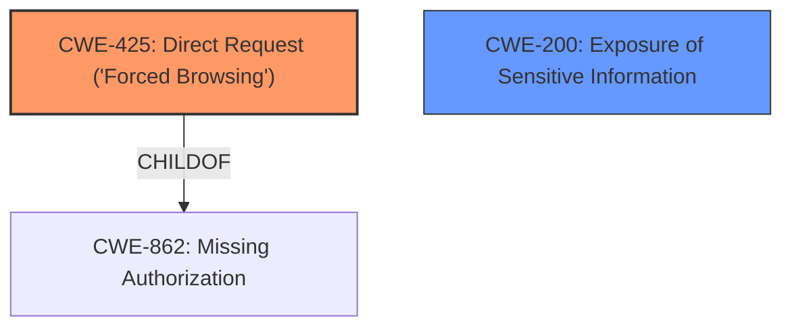

# Enhanced Analysis for CVE-2024-6573

# Summary
| CWE ID | CWE Name | Confidence | CWE Abstraction Level | CWE Vulnerability Mapping Label | CWE-Vulnerability Mapping Notes |
|---|---|---|---|---|---|
| CWE-425 | Direct Request ('Forced Browsing') | 0.9 | Base | Allowed | Primary CWE |
| CWE-200 | Exposure of Sensitive Information Through Sent Data | 0.7 | Class | Allowed-with-Review | Secondary Candidate |

## Evidence and Confidence

*   **Confidence Score:** 0.8
*   **Evidence Strength:** MEDIUM

## Relationship Analysis
The primary CWE is CWE-425 Direct Request ('Forced Browsing'). CWE-425 is a child of CWE-862 Missing Authorization. CWE-200 Exposure of Sensitive Information Through Sent Data is a class level CWE and represents the impact of the **vulnerability**. CWE-425 is chosen because it represents the **root cause** of the issue.



## Vulnerability Chain
The vulnerability chain starts with the lack of access control on the `/vendor/levelten/intel/realtime/index.php` file (CWE-425), which allows unauthenticated attackers to access the file directly. This, combined with the `display_errors` setting being enabled, leads to the exposure of the full path of the web application (CWE-200).

## Summary of Analysis
The initial analysis identified CWE-425 as the primary **root cause**, as it directly reflects the **lack of access control** on the specified file. The retriever results also listed CWE-425 with a high score. While other CWEs like CWE-306 and CWE-862 were considered, they are either too general or not as directly applicable as CWE-425. CWE-200 is considered as the secondary candidate, since it is the impact of the **root cause**.

The evidence supporting CWE-425 is: "The vulnerability is due to the Intelligence plugin not preventing direct access to the `/vendor/levelten/intel/realtime/index.php` file". This aligns perfectly with the description of CWE-425.

Relevant CWE Information:

# Enhanced Context (25 CWEs)
The following CWEs were identified as potentially relevant to this vulnerability:

## CWE-425: Direct Request ('Forced Browsing')
**Abstraction Level**: Base
**Similarity Score**: 0.74
**Source**: dense

**Description**:
The web application does not adequately enforce appropriate authorization on all restricted URLs, scripts, or files.

**Mapping Guidance**:
- Usage: Allowed
- Rationale: This CWE entry is at the Base level of abstraction, which is a preferred level of abstraction for mapping to the root causes of vulnerabilities.

## CWE-200 Exposure of Sensitive Information Through Sent Data
**Abstraction Level**: Class
**Similarity Score**: n/a

**Description**:
The software exposes sensitive information when sending data to an actor in a different control sphere.

**Mapping Guidance**:
- Usage: Allowed-with-Review
- Rationale: This CWE entry is a Class and might have Base-level children that would be more appropriate.

# Final Report

# Summary
| CWE ID | CWE Name | Confidence | CWE Abstraction Level | CWE Vulnerability Mapping Label | CWE-Vulnerability Mapping Notes |
|---|---|---|---|---|---|
| CWE-425 | Direct Request ('Forced Browsing') | 0.9 | Base | Allowed | Primary CWE |
| CWE-200 | Exposure of Sensitive Information Through Sent Data | 0.7 | Class | Allowed-with-Review | Secondary Candidate |

## Evidence and Confidence

*   **Confidence Score:** 0.8
*   **Evidence Strength:** MEDIUM

## Relationship Analysis
The primary CWE is CWE-425 Direct Request ('Forced Browsing'). CWE-425 is a child of CWE-862 Missing Authorization. CWE-200 Exposure of Sensitive Information Through Sent Data is a class level CWE and represents the impact of the **vulnerability**. CWE-425 is chosen because it represents the **root cause** of the issue.


## Vulnerability Chain
The vulnerability chain starts with the **lack of access control** on the `/vendor/levelten/intel/realtime/index.php` file (CWE-425), which allows unauthenticated attackers to access the file directly. This, combined with the `display_errors` setting being enabled, leads to the exposure of the full path of the web application (CWE-200).

## Summary of Analysis
The initial analysis identified CWE-425 as the primary **root cause**, as it directly reflects the **lack of access control** on the specified file. The retriever results also listed CWE-425 with a high score. While other CWEs like CWE-306 and CWE-862 were considered, they are either too general or not as directly applicable as CWE-425. CWE-200 is considered as the secondary candidate, since it is the impact of the **root cause**.

The evidence supporting CWE-425 is: "The vulnerability is due to the Intelligence plugin not preventing direct access to the `/vendor/levelten/intel/realtime/index.php` file". This aligns perfectly with the description of CWE-425.


## CWE Relationship Analysis

Current CWEs represent these abstraction levels: .


### Vulnerability Chain Analysis

**Chain starting from CWE-200:**
- 200 (Exposure of Sensitive Information to an Unauthorized Actor) - ROOT


**Chain starting from CWE-306:**
- 306 (Missing Authentication for Critical Function) - ROOT


### CWE Relationship Diagram

```mermaid
graph TD
    classDef primary fill:#f96,stroke:#333,stroke-width:2px
    classDef secondary fill:#69f,stroke:#333
    classDef tertiary fill:#9e9,stroke:#333
```