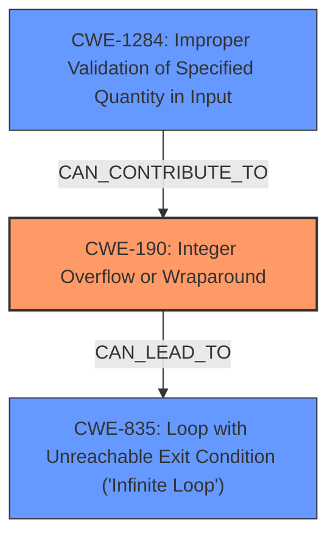

# Raw Analyzer Response for CVE-2024-6638

# Summary
| CWE ID | CWE Name | Confidence | CWE Abstraction Level | CWE Vulnerability Mapping Label | CWE-Vulnerability Mapping Notes |
|---|---|---|---|---|---|
| CWE-190 | Integer Overflow or Wraparound | 1.0 | Base | Primary | Allowed |
| CWE-835 | Loop with Unreachable Exit Condition ('Infinite Loop') | 0.7 | Base | Secondary | Allowed |
| CWE-1284 | Improper Validation of Specified Quantity in Input | 0.6 | Base | Secondary | Allowed |

## Evidence and Confidence

*   **Confidence Score:** 0.8
*   **Evidence Strength:** HIGH

## Relationship Analysis
The primary relationship is that the **Integer Overflow** (CWE-190) leads to the **Infinite Loop** (CWE-835). There is also a relationship between **Improper Input Validation** (CWE-20, not selected as primary) and **Integer Overflow** (CWE-190), as the lack of validation allows the overflow to occur. **Improper Validation of Specified Quantity in Input** (CWE-1284) could contribute to the integer overflow. The most specific CWEs (Base level) have been chosen to accurately represent the vulnerability.

## Vulnerability Chain
The vulnerability chain starts with **improper input validation** which leads to an **integer overflow** (CWE-190). The integer overflow then results in an **infinite loop** (CWE-835), causing a denial-of-service.

## Summary of Analysis
The initial analysis identified **Integer Overflow** (CWE-190) as the root cause, based on the vulnerability description explicitly stating an **integer overflow** due to **improper input validation**. The description also mentions that this leads to an **infinite loop**, so CWE-835 is included as a secondary CWE to represent the impact. The **improper input validation** is a prerequisite for the integer overflow.

The evidence is based on the "Vulnerability Description Key Phrases" section, which identifies "**integer overflow**" as a **weakness** and "**improper input validation**" as a root cause. The "CVE Reference Links Content Summary" section further supports this by stating "The vulnerability is caused by an integer overflow due to improper input validation when reading TDMS files in LabVIEW."

The graph relationships confirm that integer overflows can lead to denial-of-service conditions like infinite loops.

The selected CWEs are at the optimal level of specificity because they are base-level CWEs that accurately represent the specific weaknesses involved.

Relevant CWE Information:

*   **CWE-190: Integer Overflow or Wraparound**
    *   The vulnerability description explicitly mentions "**integer overflow**".
    *   The "CVE Reference Links Content Summary" also states that the root cause is an **integer overflow** due to **improper input validation**.
*   **CWE-835: Loop with Unreachable Exit Condition ('Infinite Loop')**
    *   The vulnerability description states that the **integer overflow** may result in an **infinite loop**.
*   **CWE-1284: Improper Validation of Specified Quantity in Input**
    *   The "**improper input validation**" mentioned in the description is related to how the quantity of data being read from the TDMS file is handled. Specifically, the LabVIEW software **does not properly validate the input data when reading TDMS files, leading to an integer overflow.**

CWE-20: Improper Input Validation was considered, but CWE-190 is more specific and accurately reflects the weakness. CWE-787, CWE-125, CWE-122 are related to memory corruption, which is not explicitly described in the vulnerability. CWE-1285 and CWE-129 are also related to input validation, but they're less directly tied to the observed **integer overflow** than CWE-1284. CWE-131, CWE-193, CWE-824, CWE-755 were also considered, but are not as directly relevant as CWE-190 and CWE-835.

# Summary
| CWE ID | CWE Name | Confidence | CWE Abstraction Level | CWE Vulnerability Mapping Label | CWE-Vulnerability Mapping Notes |
|---|---|---|---|---|---|
| CWE-190 | Integer Overflow or Wraparound | 1.0 | Base | Primary | Allowed |
| CWE-835 | Loop with Unreachable Exit Condition ('Infinite Loop') | 0.7 | Base | Secondary | Allowed |
| CWE-1284 | Improper Validation of Specified Quantity in Input | 0.6 | Base | Secondary | Allowed |

## Evidence and Confidence

*   **Confidence Score:** 0.8
*   **Evidence Strength:** HIGH

## Relationship Analysis
The primary relationship is that the **Integer Overflow** (CWE-190) leads to the **Infinite Loop** (CWE-835). There is also a relationship between **Improper Input Validation** (CWE-20, not selected as primary) and **Integer Overflow** (CWE-190), as the lack of validation allows the overflow to occur. **Improper Validation of Specified Quantity in Input** (CWE-1284) could contribute to the integer overflow. The most specific CWEs (Base level) have been chosen to accurately represent the vulnerability.

## Vulnerability Chain
The vulnerability chain starts with **improper input validation** which leads to an **integer overflow** (CWE-190). The integer overflow then results in an **infinite loop** (CWE-835), causing a denial-of-service.

## Summary of Analysis
The initial analysis identified **Integer Overflow** (CWE-190) as the root cause, based on the vulnerability description explicitly stating an **integer overflow** due to **improper input validation**. The description also mentions that this leads to an **infinite loop**, so CWE-835 is included as a secondary CWE to represent the impact. The **improper input validation** is a prerequisite for the integer overflow.

The evidence is based on the "Vulnerability Description Key Phrases" section, which identifies "**integer overflow**" as a **weakness** and "**improper input validation**" as a root cause. The "CVE Reference Links Content Summary" section further supports this by stating "The vulnerability is caused by an integer overflow due to improper input validation when reading TDMS files in LabVIEW."

The graph relationships confirm that integer overflows can lead to denial-of-service conditions like infinite loops.

The selected CWEs are at the optimal level of specificity because they are base-level CWEs that accurately represent the specific weaknesses involved.

Relevant CWE Information:

*   **CWE-190: Integer Overflow or Wraparound**
    *   The vulnerability description explicitly mentions "**integer overflow**".
    *   The "CVE Reference Links Content Summary" also states that the root cause is an **integer overflow** due to **improper input validation**.
*   **CWE-835: Loop with Unreachable Exit Condition ('Infinite Loop')**
    *   The vulnerability description states that the **integer overflow** may result in an **infinite loop**.
*   **CWE-1284: Improper Validation of Specified Quantity in Input**
    *   The "**improper input validation**" mentioned in the description is related to how the quantity of data being read from the TDMS file is handled. Specifically, the LabVIEW software **does not properly validate the input data when reading TDMS files, leading to an integer overflow.**

CWE-20: Improper Input Validation was considered, but CWE-190 is more specific and accurately reflects the weakness. CWE-78