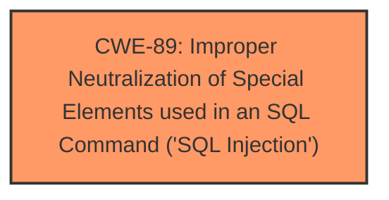

# Analysis for CVE-2024-6666

# Summary
| CWE ID | CWE Name | Confidence | CWE Abstraction Level | CWE Vulnerability Mapping Label | CWE-Vulnerability Mapping Notes |
|---|---|---|---|---|---|
| CWE-89 | Improper Neutralization of Special Elements used in an SQL Command ('SQL Injection') | 1.0 | Base | Allowed | Primary CWE: The root cause is **insufficient escaping on the user supplied parameter and lack of sufficient preparation on the existing SQL query**, leading to SQL Injection. |

## Evidence and Confidence

*   **Confidence Score:** 1.0
*   **Evidence Strength:** HIGH

## Relationship Analysis
The primary relationship is that CWE-89 is the root cause of the vulnerability, as the **insufficient neutralization** allows for **SQL injection**. There are several child CWEs of CWE-89, but the provided information doesn't give enough specificity to choose a child CWE.

## Vulnerability Chain
The vulnerability chain starts with the **lack of proper escaping and SQL query preparation**, which leads to **SQL Injection**, and ultimately results in the ability to **extract sensitive information from the database**.

## Summary of Analysis
The analysis is based on the provided evidence, which strongly indicates **SQL injection** due to **insufficient input sanitization**. The **Vulnerability Description Key Phrases** section explicitly mentions **"insufficient escaping on the user supplied parameter and lack of sufficient preparation on the existing SQL query"** as the root cause and **"SQL injection"** as the weakness. The **CVE Reference Links Content Summary** confirms this, stating that the vulnerability stems from **"insufficient sanitization and preparation of user-supplied parameters within SQL queries"** and that **"the primary vulnerability is SQL injection"**. The code diff also supports this by showing the replacement of direct string concatenation with `$wpdb->prepare()` to prevent **SQL injection**.

CWE-89 is at the optimal level of specificity because it directly addresses the root cause of the vulnerability, which is the **improper neutralization of special elements used in an SQL command**. While more specific child CWEs might exist, the current evidence does not provide enough detail to warrant a more specific classification.

Relevant CWE Information:

# Enhanced Context (25 CWEs)
The following CWEs were identified as potentially relevant to this vulnerability:

## CWE-352: Cross-Site Request Forgery (CSRF)
- Not used, as the vulnerability is SQL Injection, not CSRF.

## CWE-89: Improper Neutralization of Special Elements used in an SQL Command ('SQL Injection')
- **Selected as Primary CWE**

## CWE-472: External Control of Assumed-Immutable Web Parameter
- Not used, as the vulnerability is SQL Injection, not related to assumed-immutable web parameters.

## CWE-425: Direct Request ('Forced Browsing')
- Not used, as the vulnerability is SQL Injection, not related to direct request or forced browsing.

## CWE-639: Authorization Bypass Through User-Controlled Key
- Not used, as the vulnerability is SQL Injection, not related to authorization bypass through user-controlled key.

## CWE-116: Improper Encoding or Escaping of Output
- Not used, as the vulnerability is SQL Injection, which is more specifically about SQL commands.

## CWE-502: Deserialization of Untrusted Data
- Not used, as the vulnerability is SQL Injection, not deserialization of untrusted data.

## CWE-79: Improper Neutralization of Input During Web Page Generation ('Cross-site Scripting')
- Not used, as the vulnerability is SQL Injection, not Cross-site Scripting.

## CWE-434: Unrestricted Upload of File with Dangerous Type
- Not used, as the vulnerability is SQL Injection, not unrestricted upload of file with dangerous type.

## CWE-862: Missing Authorization
- Not used, as the vulnerability is SQL Injection, not missing authorization.