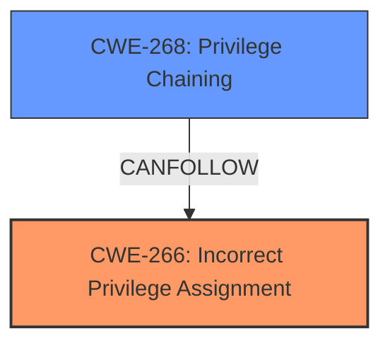

# Analysis for CVE-2024-6677

# Summary
| CWE ID | CWE Name | Confidence | CWE Abstraction Level | CWE Vulnerability Mapping Label | CWE-Vulnerability Mapping Notes |
|---|---|---|---|---|---|
| CWE-266 | Incorrect Privilege Assignment | 0.9 | Base | Allowed | Primary CWE |
| CWE-268 | Privilege Chaining | 0.6 | Base | Allowed | Secondary Candidate |

## Evidence and Confidence

*   **Confidence Score:** 0.75
*   **Evidence Strength:** LOW

## Relationship Analysis
The primary relationship considered was between CWE-266 (Incorrect Privilege Assignment) and its potential consequences. CWE-266 represents the **incorrect** assignment of a privilege, leading to privilege escalation.



## Vulnerability Chain
The chain of events is as follows:
1.  **ROOT CAUSE:** Incorrect Privilege Assignment (CWE-266) leads to
2.  **IMPACT:** Privilege Escalation.

## Summary of Analysis
The vulnerability description mentions "Privilege escalation in uberAgent". The key phrase here is "Privilege escalation". Based on the retriever results, and the provided CWE classification guidance, several CWEs were considered. The primary focus was to identify the **root cause** of the privilege escalation, rather than the impact itself.

CWE-269 (Improper Privilege Management) was explicitly discouraged in the mapping guidance because it is high-level and often describes the technical impact rather than the root cause.

CWE-266 (Incorrect Privilege Assignment) was chosen as the primary CWE because the vulnerability involves privilege escalation, and the mapping guidance suggests CWE-266 when a user is assigned the wrong role/group, leading to that escalation. However, there is not enough evidence to support this from the description.

CWE-268 (Privilege Chaining) was considered as a secondary CWE because it is related to privilege escalation scenarios. Privilege chaining can be a mechanism how the privilege escalation occurs.

Relevant CWE Information:

# Enhanced Context (25 CWEs)
The following CWEs were identified as potentially relevant to this vulnerability:

## CWE-266: Incorrect Privilege Assignment
**Abstraction Level**: Base
**Similarity Score**: 0.78
**Source**: dense

**Description**:
A product incorrectly assigns a privilege to a particular actor, creating an unintended sphere of control for that actor.

**Mapping Guidance**:
- Usage: Allowed
- Rationale: This CWE entry is at the Base level of abstraction, which is a preferred level of abstraction for mapping to the root causes of vulnerabilities.

**Relationships**:
- PARENTOF -> CWE-9
- PARENTOF -> CWE-556
- PARENTOF -> CWE-520
- PARENTOF -> CWE-1022
- CANALSOBE -> CWE-286

## CWE-268: Privilege Chaining
**Abstraction Level**: Base
**Similarity Score**: 0.78
**Source**: dense

**Description**:
The product grants privileges based on other privileges in a way that leads to an unintended bypass of access controls.

**Mapping Guidance**:
- Usage: Allowed
- Rationale: This CWE entry is at the Base level of abstraction, which is a preferred level of abstraction for mapping to the root causes of vulnerabilities.

# Complete CWE Specifications

CWE-266: Incorrect Privilege Assignment
A product **incorrectly assigns a privilege** to a particular actor, creating an unintended sphere of control for that actor.

CWE-268: Privilege Chaining
The product grants privileges based on other privileges in a way that leads to an unintended bypass of access controls.

```text

```