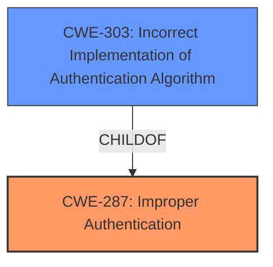

# Raw Analyzer Response for CVE-2024-6727

# Summary
| CWE ID | CWE Name | Confidence | CWE Abstraction Level | CWE Vulnerability Mapping Label | CWE-Vulnerability Mapping Notes |
|---|---|---|---|---|---|
| **CWE-287** | Improper Authentication | 0.7 | Class | Primary | Discouraged |
| CWE-303 | Incorrect Implementation of Authentication Algorithm | 0.6 | Base | Secondary | Allowed |

## Evidence and Confidence

*   **Confidence Score:** 0.7
*   **Evidence Strength:** LOW

## Relationship Analysis
The primary relationship considered was the parent-child relationship between CWE-287 (Improper Authentication) and its potential children. Although CWE-306 (Missing Authentication for Critical Function) is a child of CWE-287, the description indicates that the authentication is **broken**, not missing. CWE-303 (Incorrect Implementation of Authentication Algorithm) was considered as a more specific root cause than CWE-287.

## Vulnerability Chain
The vulnerability chain starts with a **broken authentication** mechanism, leading to the potential for unauthorized access.
  - The **Primary CWE** is CWE-287 Improper Authentication.

## Summary of Analysis
The initial assessment focused on identifying the core issue: a **broken authentication** mechanism. The Retriever Results suggested CWE-287 (Improper Authentication) as the top candidate, although it is a Class-level CWE and discouraged. The vulnerability description explicitly mentions **broken authentication**, indicating a failure in the authentication process rather than a complete absence of it. Therefore, CWE-287 is deemed the most appropriate primary CWE, as the authentication process is present but not functioning correctly. CWE-303 could be a more specific root cause.

Relevant CWE Information:

# Enhanced Context (25 CWEs)
The following CWEs were identified as potentially relevant to this vulnerability:

## CWE-303: Incorrect Implementation of Authentication Algorithm
**Abstraction Level**: Base
**Similarity Score**: 0.76
**Source**: dense

**Description**:
The requirements for the product dictate the use of an established authentication algorithm, but the implementation of the algorithm is incorrect.

**Mapping Guidance**:
- Usage: Allowed
- Rationale: This CWE entry is at the Base level of abstraction, which is a preferred level of abstraction for mapping to the root causes of vulnerabilities.

# Complete CWE Specifications

CWE-287: Improper Authentication

CWE-303: Incorrect Implementation of Authentication Algorithm

# Detailed Analysis

## CWE-287: Improper Authentication

*   **Explanation:** The vulnerability description states that the Delphix Data Control Tower has **broken authentication** due to a flaw in the `enable-scale-testing` functionality. This indicates that the system attempts to authenticate users, but the process is flawed, allowing potential bypass or unauthorized access.
*   **Match:** The description directly aligns with the definition of CWE-287, where the product does not sufficiently prove that a user is who they claim to be.
*   **Impact:** The security implication is significant, as it could allow attackers to gain unauthorized access to sensitive data or functionality within the Delphix Data Control Tower.
*   **Relationship:** CWE-287 is a class-level CWE. More specific child CWEs might exist, but the available information doesn't point definitively to a specific implementation flaw.
*   **Mapping Guidance:** While CWE-287 is discouraged because it is a Class, it is still the best fit given the limited information.
*   **Confidence:** 0.7

## CWE-303: Incorrect Implementation of Authentication Algorithm
*   **Explanation:** The vulnerability description states that the Delphix Data Control Tower has **broken authentication** due to a flaw in the `enable-scale-testing` functionality. This may indicate that the system attempts to authenticate users, but the process is flawed because the implementation of the algorithm is incorrect.
*   **Match:** The description directly aligns with the definition of CWE-303, where the implementation of the algorithm is incorrect.
*   **Impact:** The security implication is significant, as it could allow attackers to gain unauthorized access to sensitive data or functionality within the Delphix Data Control Tower.
*   **Relationship:** CWE-303 is a base-level CWE and a child of CWE-287.
*   **Mapping Guidance:** CWE-303 is allowed.
*   **Confidence:** 0.6

## Other CWEs Considered and Rejected

*   **CWE-306 (Missing Authentication for Critical Function):** Rejected because the vulnerability description indicates that the authentication is **broken**, not missing. The system attempts authentication, but it fails.
*   **CWE-862 (Missing Authorization):** Rejected because the issue appears to stem from a failure in authentication, not authorization. The problem is in verifying the user's identity, not in checking what an authenticated user is allowed to do.
*   **CWE-284 (Improper Access Control):** Rejected because the problem can be pinpointed to authentication.