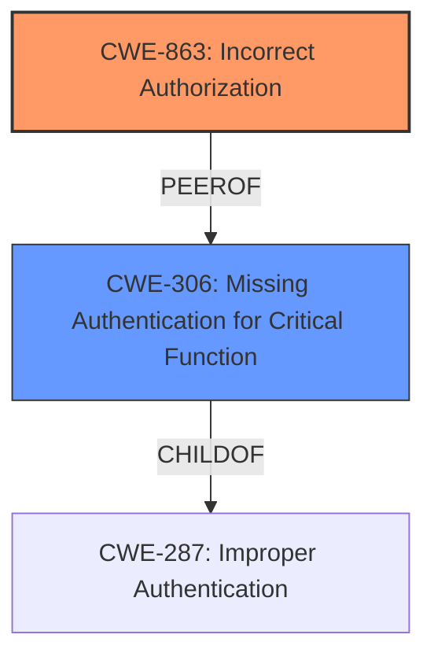

# Analysis Report for CVE-2024-6737

# Vulnerability Analysis Report: CVE-2024-6737

## Description

The access control in the Electronic Official Document Management System from 2100 TECHNOLOGY is not properly implemented, allowing remote attackers with regular privileges to access the account settings functionality and create an administrator account.

## Vulnerability Description Key Phrases

- **Rootcause:** improper access control
- **Impact:** access account settings functionality and create administrator account
- **Attacker:** remote attackers with regular privileges
- **Product:** Electronic Official Document Management System

## Analysis (with Relationship Data)

# Summary
| CWE ID | CWE Name | Confidence | CWE Abstraction Level | CWE Vulnerability Mapping Label | CWE-Vulnerability Mapping Notes |
|---|---|---|---|---|---|
| CWE-863 | Incorrect Authorization | 1.0 | Class | Primary | Allowed-with-Review |
| CWE-306 | Missing Authentication for Critical Function | 0.7 | Base | Secondary | Allowed |

## Evidence and Confidence

*   **Confidence Score:** 0.9
*   **Evidence Strength:** HIGH

## Relationship Analysis
The primary relationship that influenced my decision was the authentication versus authorization guidance. CWE-863 is a Class-level weakness, while CWE-306 is a Base-level weakness. CWE-863 is related to incorrect authorization, while CWE-306 relates to missing authentication. The vulnerability description indicates that the access control is **improperly** implemented, suggesting that there is some access control in place, but it is not implemented correctly. This implies that authentication may be present, but the authorization is flawed.



## Vulnerability Chain
The vulnerability chain starts with the **improper access control**, leading to the ability for remote attackers with regular privileges to access account settings and create administrator accounts.

## Summary of Analysis
The initial analysis considered multiple CWEs, especially around authentication and authorization. The key phrase "improper access control" and the ability to create administrator accounts pointed towards authorization issues. The distinction between authentication and authorization, as highlighted in the guidance, was crucial. The final decision was to map the vulnerability to CWE-863 (Incorrect Authorization) because the access control was **improperly** implemented, meaning the authorization check was present but flawed.

The supporting evidence includes:
- Vulnerability Description Key Phrases: "**improper access control**"
- Vulnerability Description: "The access control in the Electronic Official Document Management System from 2100 TECHNOLOGY is not properly implemented, allowing remote attackers with regular privileges to access the account settings functionality and create an administrator account."

I also considered CWE-306 (Missing Authentication for Critical Function). There isn't enough information to determine whether authentication is completely missing, so I lowered the confidence in this CWE.

The selected CWEs are at the optimal level of specificity because they directly address the root cause of the vulnerability, which is an **incorrect** access control implementation that allows unauthorized actions.

Relevant CWE Information:

# Enhanced Context (25 CWEs)
The following CWEs were identified as potentially relevant to this vulnerability:

## CWE-266: Incorrect Privilege Assignment
**Abstraction Level**: Base
**Similarity Score**: 0.74
**Source**: dense

**Description**:
A product incorrectly assigns a privilege to a particular actor, creating an unintended sphere of control for that actor.

**Mapping Guidance**:
- Usage: Allowed
- Rationale: This CWE entry is at the Base level of abstraction, which is a preferred level of abstraction for mapping to the root causes of vulnerabilities.

*NOT USED*: The vulnerability isn't about assigning the wrong privileges, but rather about incorrectly authorizing actions.

## CWE-280: Improper Handling of Insufficient Permissions or Privileges 
**Abstraction Level**: Base
**Similarity Score**: 0.74
**Source**: dense

**Description**:
The product does not handle or incorrectly handles when it has insufficient privileges to access resources or functionality as specified by their permissions. This may cause it to follow unexpected code paths that may leave the product in an invalid state.

**Mapping Guidance**:
- Usage: Allowed
- Rationale: This CWE entry is at the Base level of abstraction, which is a preferred level of abstraction for mapping to the root causes of vulnerabilities.

*NOT USED*: The vulnerability description doesn't focus on insufficient privileges, but rather **improper** access control.

## CWE-274: Improper Handling of Insufficient Privileges
**Abstraction Level**: Base
**Similarity Score**: 0.73
**Source**: dense

**Description**:
The product does not handle or incorrectly handles when it has insufficient privileges to perform an operation, leading to resultant weaknesses.

**Mapping Guidance**:
- Usage: Discouraged
- Rationale: This CWE entry could be deprecated in a future version of CWE.

*NOT USED*: The vulnerability description doesn't focus on insufficient privileges, but rather **improper** access control.

## CWE-267: Privilege Defined With Unsafe Actions
**Abstraction Level**: Base
**Similarity Score**: 0.73
**Source**: dense

**Description**:
A particular privilege, role, capability, or right can be used to perform unsafe actions that were not intended, even when it is assigned to the correct entity.

**Mapping Guidance**:
- Usage: Allowed
- Rationale: This CWE entry is at the Base level of abstraction, which is a preferred level of abstraction for mapping to the root causes of vulnerabilities.

*NOT USED*: The vulnerability description doesn't focus on privileges defined with unsafe actions.

## CWE-668: Exposure of Resource to Wrong Sphere
**Abstraction Level**: Class
**Similarity Score**: 0.73
**Source**: dense

**Description**:
The product exposes a resource to the wrong control sphere, providing unintended actors with inappropriate access to the resource.

**Mapping Guidance**:
- Usage: Discouraged
- Rationale: CWE-668 is high-level and is often misused as a catch-all when lower-level CWE IDs might be applicable. It is sometimes used for low-information vulnerability reports [REF-1287]. It is a level-1 Class (i.e., a child of a Pillar). It is not useful for trend analysis.

*NOT USED*: CWE-668 is too general and discouraged.

## CWE-41: Improper Resolution of Path Equivalence
**Abstraction Level**: Base
**Similarity Score**: 0.73
**Source**: dense

**Description**:
The product is vulnerable to file system contents disclosure through path equivalence. Path equivalence involves the use of special characters in file and directory names. The associated manipulations are intended to generate multiple names for the same object.

**Mapping Guidance**:
- Usage: Allowed
- Rationale: This CWE entry is at the Base level of abstraction, which is a preferred level of abstraction for mapping to the root causes of vulnerabilities.

*NOT USED*: The vulnerability is unrelated to path equivalence issues.

## CWE-472: External Control of Assumed-Immutable Web Parameter
**Abstraction Level**: Base
**Similarity Score**: 0.72
**Source**: dense

**Description**:
The web application does not sufficiently verify inputs that are assumed to be immutable but are actually externally controllable, such as hidden form fields.

**Mapping Guidance**:
- Usage: Allowed
- Rationale: This CWE entry is at the Base level of abstraction, which is a preferred level of abstraction for mapping to the root causes of vulnerabilities.

*NOT USED*: The vulnerability is unrelated to external control of assumed-immutable parameters.

## CWE-807: Reliance on Untrusted Inputs in a Security Decision
**Abstraction Level**: Base
**Similarity Score**: 0.72
**Source**: dense

**Description**:
The product uses a protection mechanism that relies on the existence or values of an input, but the input can be modified by an untrusted actor in a way that bypasses the protection mechanism.

**Mapping Guidance**:
- Usage: Allowed
- Rationale: This CWE entry is at the Base level of abstraction, which is a preferred level of abstraction for mapping to the root causes of vulnerabilities.

*NOT USED*: While untrusted input might be involved, the core issue is the **improper** access control.

## CWE-425: Direct Request ('Forced Browsing')
**Abstraction Level**: Base
**Similarity Score**: 0.71
**Source**: dense

**Description**:
The web application does not adequately enforce appropriate authorization on all restricted URLs, scripts, or files.

**Mapping Guidance**:
- Usage: Allowed
- Rationale: This CWE entry is at the Base level of abstraction, which is a preferred level of abstraction for mapping to the root causes of vulnerabilities.

*NOT USED*: CWE-425 is similar to CWE-862, but the vulnerability description doesn't specifically mention direct requests or forced browsing.

## CWE-639: Authorization Bypass Through User-Controlled Key
**Abstraction Level**: Base
**Similarity Score**: 0.71
**Source**: dense

**Description**:
The system's authorization functionality does not prevent one user from gaining access to another user's data or record by modifying the key value identifying the data.

**Mapping Guidance**:
- Usage: Allowed
- Rationale: This CWE entry is at the Base level of abstraction


## CWE Relationship Analysis

Current CWEs represent these abstraction levels: .


### Vulnerability Chain Analysis

**Chain starting from CWE-274:**
- 274 (Improper Handling of Insufficient Privileges) - ROOT


**Chain starting from CWE-863:**
- 863 (Incorrect Authorization) - ROOT


### CWE Relationship Diagram

```mermaid
graph TD
    classDef primary fill:#f96,stroke:#333,stroke-width:2px
    classDef secondary fill:#69f,stroke:#333
    classDef tertiary fill:#9e9,stroke:#333
```


*Report generated on 2025-07-14 02:06:06*
