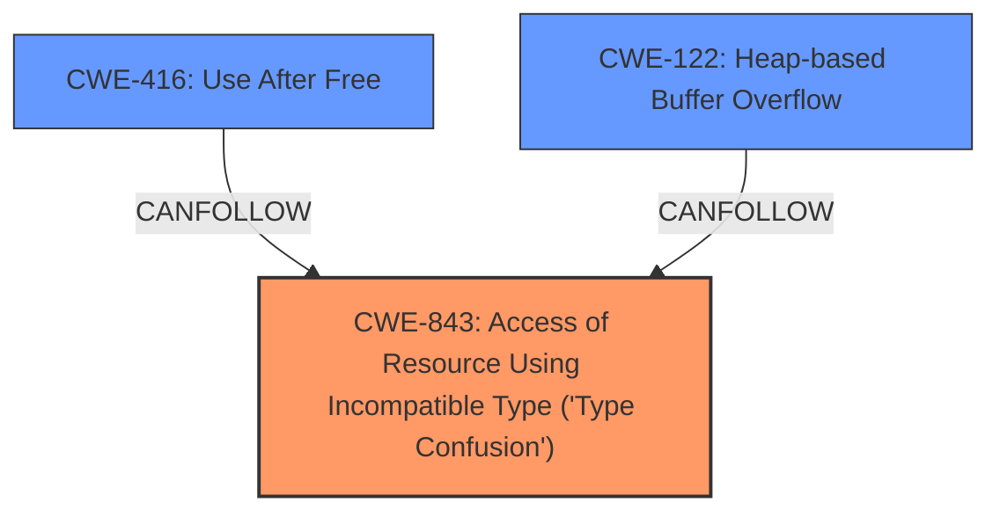

# Enhanced Analysis for CVE-2024-6773

# Summary
| CWE ID | CWE Name | Confidence | CWE Abstraction Level | CWE Vulnerability Mapping Label | CWE-Vulnerability Mapping Notes |
|---|---|---|---|---|---|
| CWE-843 | Access of Resource Using Incompatible Type ('Type Confusion') | 0.9 | Base | Primary CWE | Allowed |
| CWE-416 | Use After Free | 0.7 | Variant | Secondary Candidate | Allowed |
| CWE-122 | Heap-based Buffer Overflow | 0.6 | Variant | Secondary Candidate | Allowed |

## Evidence and Confidence

*   **Confidence Score:** 0.8
*   **Evidence Strength:** HIGH

## Relationship Analysis
The primary weakness is identified as **CWE-843** Access of Resource Using Incompatible Type ('Type Confusion'). **CWE-416** Use After Free, and **CWE-122** Heap-based Buffer Overflow are considered as secondary candidates. **CWE-843** is a base level CWE, while **CWE-416** and **CWE-122** are variant level CWEs. There are no direct parent-child relationships between these CWEs. The relationship analysis helps in understanding the potential impact of the **type confusion**, leading to memory corruption vulnerabilities.



## Vulnerability Chain
The vulnerability chain starts with an **inappropriate implementation**, leading to **type confusion** (**CWE-843**), which then potentially leads to heap corruption.

## Summary of Analysis
The vulnerability is triggered by an **inappropriate implementation** in the V8 engine that results in **type confusion**. This **type confusion** can then be exploited to cause heap corruption. The primary CWE is **CWE-843** Access of Resource Using Incompatible Type ('Type Confusion'). The evidence for this is the "CVE Reference Links Content Summary" section, which states: "Root cause of vulnerability: Type confusion in V8." The retriever results also list **CWE-843** as the top candidate.

**CWE-416** Use After Free and **CWE-122** Heap-based Buffer Overflow are considered as secondary candidates because the **type confusion** could lead to these memory corruption issues. These are listed as secondary candidates.

Relevant CWE Information:

# Enhanced Context (25 CWEs)

## CWE-843: Access of Resource Using Incompatible Type ('Type Confusion')
**Abstraction Level**: Base
**Similarity Score**: 0.80
**Source**: dense

**Description**:
The product allocates or initializes a resource such as a pointer, object, or variable using one type, but it later accesses that resource using a type that is incompatible with the original type.

**Mapping Guidance**:
- Usage: Allowed
- Rationale: This CWE entry is at the Base level of abstraction, which is a preferred level of abstraction for mapping to the root causes of vulnerabilities.

## CWE-416: Use After Free
**Abstraction Level**: Variant
**Similarity Score**: 0.74
**Source**: dense

**Description**:
The product reuses or references memory after it has been freed. At some point afterward, the memory may be allocated again and saved in another pointer, while the original pointer references a location somewhere within the new allocation. Any operations using the original pointer are no longer valid because the memory "belongs" to the code that operates on the new pointer.

**Mapping Guidance**:
- Usage: Allowed
- Rationale: This CWE entry is at the Variant level of abstraction, which is a preferred level of abstraction for mapping to the root causes of vulnerabilities.

## CWE-122: Heap-based Buffer Overflow
**Abstraction Level**: Variant
**Similarity Score**: 0.60
**Source**: sparse

**Description**:
A heap overflow condition is a buffer overflow, where the buffer that can be overwritten is allocated in the heap portion of memory, generally meaning that the buffer was allocated using a routine such as malloc().

**Mapping Guidance**:
- Usage: Allowed
- Rationale: This CWE entry is at the Variant level of abstraction, which is a preferred level of abstraction for mapping to the root causes of vulnerabilities.

I considered CWE-NVD-noinfo and CWE-NVD-Other, but these are meta CWEs and inappropriate when a more specific CWE can be assigned.


## CWE Relationship Analysis

Current CWEs represent these abstraction levels: .


### Vulnerability Chain Analysis

**Chain starting from CWE-843:**
- 843 (Access of Resource Using Incompatible Type ('Type Confusion')) - ROOT


**Chain starting from CWE-416:**
- 416 (Use After Free) - ROOT


### CWE Relationship Diagram

```mermaid
graph TD
    classDef primary fill:#f96,stroke:#333,stroke-width:2px
    classDef secondary fill:#69f,stroke:#333
    classDef tertiary fill:#9e9,stroke:#333
```