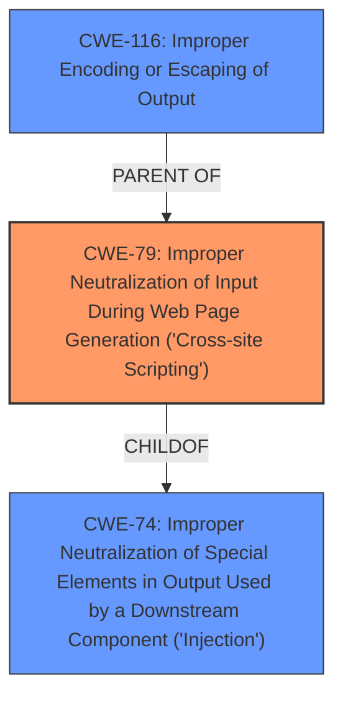

# Analysis for CVE-2024-6797

# Summary

| CWE ID   | CWE Name                                                                                 | Confidence | CWE Abstraction Level | CWE Vulnerability Mapping Label | CWE-Vulnerability Mapping Notes |
| -------- | ---------------------------------------------------------------------------------------- | ---------- | --------------------- | ------------------------------- | ------------------------------- |
| CWE-79   | Improper Neutralization of Input During Web Page Generation ('Cross-site Scripting') | 1          | Base                  | Primary                         | Allowed                         |

## Evidence and Confidence

*   **Confidence Score:** 1
*   **Evidence Strength:** HIGH

## Relationship Analysis

The primary identified CWE is CWE-79, which is a Base level CWE. This CWE is related to other CWEs through parent-child relationships. For example, CWE-79 has parents such as CWE-116 (Improper Encoding or Escaping of Output) and CWE-74 (Improper Neutralization of Special Elements in Output Used by a Downstream Component ('Injection')). However, given the explicit mention of Cross-Site Scripting, CWE-79 is the most specific and appropriate choice. The other CWEs considered were either too general (e.g., CWE-285, CWE-862) or focused on different attack vectors (e.g., CWE-352, CWE-89).

## Vulnerability Chain

The vulnerability chain starts with the **failure to sanitize and escape settings** within the DL Robots.txt WordPress plugin. This **root cause** leads directly to the **Stored Cross-Site Scripting (XSS)** vulnerability. The chain is:

1.  **Improper Input Handling:** The plugin **does not sanitise and escape some of its settings**.
2.  **Cross-Site Scripting (XSS):** This allows for **Stored Cross-Site Scripting attacks**.

The **primary CWE** is **CWE-79**, which identifies the lack of proper neutralization of input, leading to the XSS vulnerability.

## Summary of Analysis

Based on the provided evidence, the most appropriate CWE is CWE-79 (Improper Neutralization of Input During Web Page Generation ('Cross-site Scripting')). The vulnerability description explicitly mentions that the plugin **does not sanitise and escape some of its settings**, which results in a Stored Cross-Site Scripting vulnerability. The CVE Reference Links Content Summary reinforces this by stating that the **root cause** is that the plugin **does not sanitize and escape some of its settings**, allowing for XSS attacks.

The Retriever Results also list CWE-79, but with a lower score than other candidates. However, due to the explicit mention of XSS in both the vulnerability description and the CVE summary, CWE-79 is the most accurate and specific CWE to assign.

The abstraction level of CWE-79 is Base, which is the preferred level. Other considered CWEs like CWE-862 (Missing Authorization) or CWE-352 (Cross-Site Request Forgery) do not directly address the **root cause** of the XSS vulnerability.

**Supporting Evidence:**

*   Vulnerability Description: "**does not sanitise and escape some of its settings**, which could allow high privilege users such as admin to perform **Stored Cross-Site Scripting attacks**"
*   CVE Reference Links Content Summary: "The plugin **does not sanitize and escape some of its settings**, allowing for XSS attacks."

**Explanation:**

CWE-79 directly addresses the **improper neutralization of input** that leads to the XSS vulnerability. The plugin's failure to sanitize and escape settings allows an attacker to inject malicious scripts that are then stored and executed in the context of other users' browsers. This aligns perfectly with the description and examples provided for CWE-79.

**Other CWEs Considered but Not Used:**

*   CWE-352 (Cross-Site Request Forgery (CSRF)): While CSRF is a common web vulnerability, it is not the primary issue in this case. The vulnerability description focuses on the **lack of input sanitization**, leading to XSS, not on the forging of requests.
*   CWE-862 (Missing Authorization): Although authorization issues might exist, the **root cause** described is the lack of input sanitization, not a missing authorization check. Therefore, CWE-862 is not the most appropriate choice.
*   CWE-89 (Improper Neutralization of Special Elements used in an SQL Command ('SQL Injection')): SQL Injection is related to database queries, but this vulnerability involves unsanitized input leading to XSS, making CWE-89 irrelevant.
*   CWE-116 (Improper Encoding or Escaping of Output): This is a class-level CWE and a parent of CWE-79. While encoding and escaping are related to preventing XSS, CWE-79 is more specific to the vulnerability described.
*   CWE-434 (Unrestricted Upload of File with Dangerous Type): This CWE is not applicable as the vulnerability does not involve file uploads.
*   CWE-96 (Improper Neutralization of Directives in Statically Saved Code ('Static Code Injection')): Static code injection is not the primary issue, as the vulnerability involves XSS through settings.