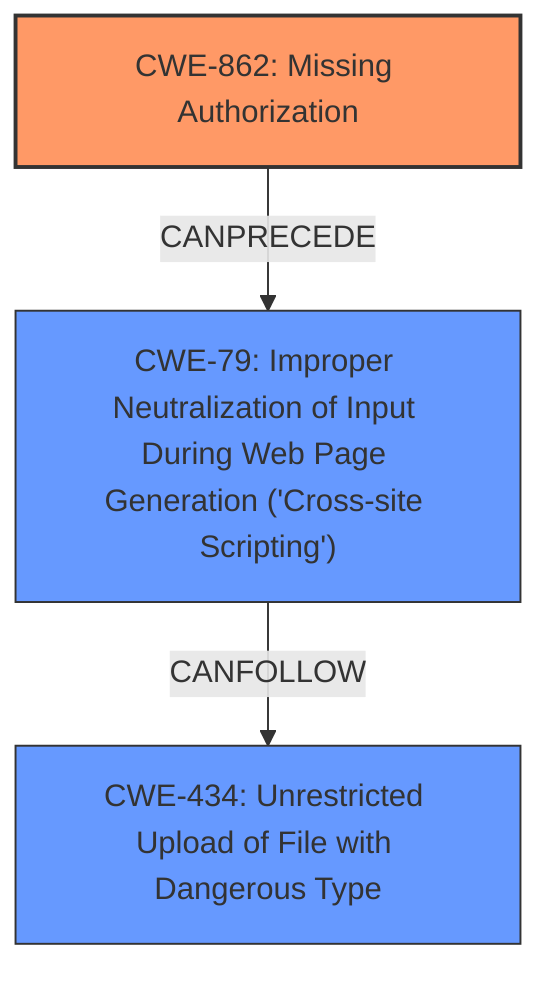

# Raw Analyzer Response for CVE-2024-6828

# Summary

| CWE ID  | CWE Name                                                                      | Confidence | CWE Abstraction Level | CWE Vulnerability Mapping Label | CWE-Vulnerability Mapping Notes |
| :-------- | :---------------------------------------------------------------------------- | :--------- | :-------------------- | :------------------------------ | :------------------------------ |
| CWE-862   | Missing Authorization                                                         | 0.9        | Class                 | Primary CWE                     | Allowed-with-Review             |
| CWE-79    | Improper Neutralization of Input During Web Page Generation ('Cross-site Scripting') | 0.8        | Base                  | Secondary Candidate             | Allowed                       |
| CWE-434   | Unrestricted Upload of File with Dangerous Type                               | 0.7        | Base                  | Secondary Candidate             | Allowed                       |

## Evidence and Confidence

*   **Confidence Score:** 0.8
*   **Evidence Strength:** HIGH

## Relationship Analysis

The primary weakness is **CWE-862 [Missing Authorization]**, as the vulnerability stems from a lack of proper authorization checks. This leads to the secondary weakness of **CWE-79 [Improper Neutralization of Input During Web Page Generation ('Cross-site Scripting')]** because the attacker can upload malicious JSON files, potentially leading to stored XSS. Additionally, **CWE-434 [Unrestricted Upload of File with Dangerous Type]** is relevant because the vulnerability allows the upload of JSON files without proper restrictions, leading to potential code execution.

## Vulnerability Chain

The vulnerability chain starts with **CWE-862 [Missing Authorization]**, which allows an unauthenticated attacker to upload JSON files. This leads to **CWE-79 [Improper Neutralization of Input During Web Page Generation ('Cross-site Scripting')]**, as the uploaded JSON files can contain malicious code that is not properly neutralized, leading to XSS attacks. In some cases, this can further lead to Remote Code Execution (RCE). Finally, **CWE-434 [Unrestricted Upload of File with Dangerous Type]** results from the lack of file type restrictions in the upload functionality.

## Summary of Analysis

The initial analysis focused on identifying the root cause of the vulnerability, which is the **missing authorization and capability checks**. The vulnerability description explicitly mentions **"missing authorization and capability checks"** as the root cause, leading to the selection of **CWE-862 [Missing Authorization]**. The subsequent impact of the vulnerability includes the ability to upload JSON files, leading to potential XSS attacks (**CWE-79 [Improper Neutralization of Input During Web Page Generation ('Cross-site Scripting')]**) and, in some cases, Remote Code Execution (RCE) as well as the unrestricted file upload (**CWE-434 [Unrestricted Upload of File with Dangerous Type]**). The graph relationships influenced the final selection by highlighting the chain of events, from the initial lack of authorization to the resulting XSS and potential RCE. The selected CWEs are at the optimal level of specificity, with **CWE-862 [Missing Authorization]** being a Class and **CWE-79 [Improper Neutralization of Input During Web Page Generation ('Cross-site Scripting')]** and **CWE-434 [Unrestricted Upload of File with Dangerous Type]** being Base level CWEs.

# Relevant CWE Information:

## CWE-862: Missing Authorization
**Technical Explanation:** The product does not perform an authorization check before allowing access to a resource or the execution of a function. In this case, the `Redux_Color_Scheme_Import` function lacks authorization checks, allowing unauthenticated users to upload JSON files.
**Security Implications:** An attacker can bypass intended access restrictions, potentially leading to unauthorized data access, modification, or execution of arbitrary code.
**Relationship:** **CWE-862 [Missing Authorization]** is a Class-level CWE.
**Mapping Guidance Influence:** The guidance recommends using **CWE-862 [Missing Authorization]** when the application doesn't check whether the user is authorized at all.

## CWE-79: Improper Neutralization of Input During Web Page Generation ('Cross-site Scripting')
**Technical Explanation:** The product does not properly neutralize user-controlled input before including it in a web page. In this case, the uploaded JSON files can contain malicious code that is not properly neutralized, leading to XSS attacks.
**Security Implications:** An attacker can inject malicious scripts into web pages, which are then executed by other users' browsers, potentially leading to session hijacking, defacement, or redirection to malicious sites.
**Relationship:** **CWE-79 [Improper Neutralization of Input During Web Page Generation ('Cross-site Scripting')]** is a Base-level CWE.
**Mapping Guidance Influence:** The guidance recommends using **CWE-79 [Improper Neutralization of Input During Web Page Generation ('Cross-site Scripting')]** when the product does not properly neutralize input during web page generation.

## CWE-434: Unrestricted Upload of File with Dangerous Type
**Technical Explanation:** The product allows the upload of dangerous file types without proper restrictions. In this case, the vulnerability allows the upload of JSON files without proper restrictions, which can lead to potential code execution.
**Security Implications:** An attacker can upload malicious files that are then executed by the system, potentially leading to arbitrary code execution.
**Relationship:** **CWE-434 [Unrestricted Upload of File with Dangerous Type]** is a Base-level CWE.
**Mapping Guidance Influence:** The guidance recommends using **CWE-434 [Unrestricted Upload of File with Dangerous Type]** when the product allows the unrestricted upload of dangerous file types.

### CWEs Considered but Not Used:

*   **CWE-284 [Improper Access Control]**: While this is a broader category encompassing authorization issues, **CWE-862 [Missing Authorization]** is more specific to the **missing authorization** checks and therefore a better fit.
*   **CWE-352 [Cross-Site Request Forgery (CSRF)]**: This CWE is not applicable as the vulnerability is due to **missing authorization** rather than CSRF.
*   **CWE-863 [Incorrect Authorization]**: This CWE is not applicable as there are no authorization checks performed at all, it's missing.
*   **CWE-138 [Improper Neutralization of Special Elements]**: While this is related to input validation, **CWE-79 [Improper Neutralization of Input During Web Page Generation ('Cross-site Scripting')]** is more specific to the context of web page generation and XSS.
*   **CWE-116 [Improper Encoding or Escaping of Output]**: This is similar to **CWE-79 [Improper Neutralization of Input During Web Page Generation ('Cross-site Scripting')]**, but **CWE-79 [Improper Neutralization of Input During Web Page Generation ('Cross-site Scripting')]** is more specific to the context of XSS.
*   **CWE-502 [Deserialization of Untrusted Data]**: This CWE might be applicable if the JSON deserialization is mishandled. However, the description emphasizes the lack of authorization and XSS as primary concerns.
*   **CWE-1275 [Sensitive Cookie with Improper SameSite Attribute]**: This is not directly relevant to the described vulnerability.
*   **CWE-306 [Missing Authentication for Critical Function]**: While related to authentication, the problem is more specifically related to authorization within the Redux_Color_Scheme_Import function, making **CWE-862 [Missing Authorization]** a more accurate fit.