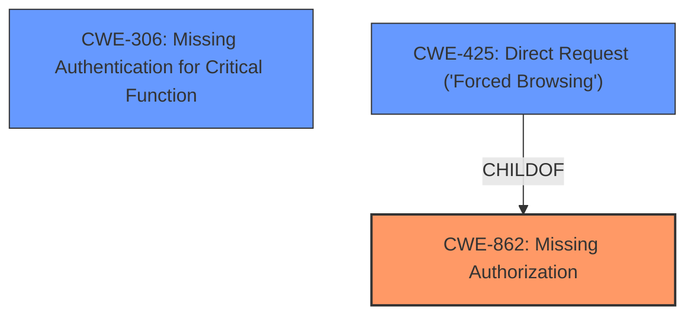

# Analysis for CVE-2024-6846

# Summary
| CWE ID | CWE Name | Confidence | CWE Abstraction Level | CWE Vulnerability Mapping Label | CWE-Vulnerability Mapping Notes |
|---|---|---|---|---|---|
| CWE-862 | Missing Authorization | 1.0 | Class | Allowed-with-Review | Primary CWE: The plugin **does not perform an authorization check** when an actor attempts to access a resource or perform an action. |
| CWE-306 | Missing Authentication for Critical Function | 0.8 | Base | Allowed | Secondary CWE: The plugin **does not perform any authentication** for functionality that requires a provable user identity or consumes a significant amount of resources. |
| CWE-425 | Direct Request ('Forced Browsing') | 0.7 | Base | Allowed | Secondary CWE: The web application **does not adequately enforce appropriate authorization** on all restricted URLs, scripts, or files. |

## Evidence and Confidence

*   **Confidence Score:** 0.9
*   **Evidence Strength:** HIGH

## Relationship Analysis
The primary CWE is CWE-862 [Missing Authorization], which is a Class-level CWE. While it is recommended to use Base-level CWEs where possible, the vulnerability description clearly indicates a **missing authorization** check on specific REST routes. CWE-862 is related to CWE-425 [Direct Request ('Forced Browsing')] and CWE-306 [Missing Authentication for Critical Function] through hierarchical relationships. CWE-425 is a child of CWE-862, representing a specific case of missing authorization in web applications. CWE-306 represents missing authentication for critical functions.

## Vulnerability Chain
The vulnerability chain starts with the **lack of access validation** on REST routes, leading to an unauthenticated user's ability to purge error and chat logs.
1.  **Root Cause:** **Missing Authorization** (CWE-862) - The plugin does not check if the user is authorized to perform the action.
2.  **Impact:** Unauthenticated user can purge error and chat logs.

## Summary of Analysis
The primary weakness is the **missing authorization** check on REST routes, which allows unauthenticated users to purge logs. The evidence is clear from the vulnerability description and the CVE reference summary. The retriever results also prioritize CWE-862 [Missing Authorization], CWE-306 [Missing Authentication for Critical Function], and CWE-425 [Direct Request ('Forced Browsing')], supporting the selection of these CWEs. The final decision is based on the evidence provided. The selected CWEs are at the optimal level of specificity, with CWE-862 [Missing Authorization] as the primary cause and CWE-306 [Missing Authentication for Critical Function] and CWE-425 [Direct Request ('Forced Browsing')] as contributing factors.

Relevant CWE Information:

# Enhanced Context (25 CWEs)
The following CWEs were identified as potentially relevant to this vulnerability:

## CWE-352: Cross-Site Request Forgery (CSRF)
**Abstraction Level**: Compound
**Similarity Score**: 0.71
**Source**: dense

**Description**:
The web application does not, or can not, sufficiently verify whether a well-formed, valid, consistent request was intentionally provided by the user who submitted the request.

**Mapping Guidance**:
- Usage: Allowed
- Rationale: This is a well-known Composite of multiple weaknesses that must all occur simultaneously, although it is attack-oriented in nature.

*Not Selected:* CSRF requires a different attack vector and isn't directly supported by the evidence.

## CWE-472: External Control of Assumed-Immutable Web Parameter
**Abstraction Level**: Base
**Similarity Score**: 0.69
**Source**: dense

**Description**:
The web application does not sufficiently verify inputs that are assumed to be immutable but are actually externally controllable, such as hidden form fields.

**Mapping Guidance**:
- Usage: Allowed
- Rationale: This CWE entry is at the Base level of abstraction, which is a preferred level of abstraction for mapping to the root causes of vulnerabilities.

*Not Selected:* This CWE isn't relevant because the vulnerability isn't related to the modification of assumed-immutable web parameters.

## CWE-639: Authorization Bypass Through User-Controlled Key
**Abstraction Level**: Base
**Similarity Score**: 0.68
**Source**: dense

**Description**:
The system's authorization functionality does not prevent one user from gaining access to another user's data or record by modifying the key value identifying the data.

**Mapping Guidance**:
- Usage: Allowed
- Rationale: This CWE entry is at the Base level of abstraction, which is a preferred level of abstraction for mapping to the root causes of vulnerabilities.

*Not Selected:* This CWE isn't applicable as the bypass isn't specifically through user-controlled keys but rather a complete **lack of authorization** check.

## CWE-425: Direct Request ('Forced Browsing')
**Abstraction Level**: Base
**Similarity Score**: 0.68
**Source**: dense

**Description**:
The web application does not adequately enforce appropriate authorization on all restricted URLs, scripts, or files.

**Mapping Guidance**:
- Usage: Allowed
- Rationale: This CWE entry is at the Base level of abstraction, which is a preferred level of abstraction for mapping to the root causes of vulnerabilities.

*Selected as Secondary:* The application **does not adequately enforce appropriate authorization** on all restricted URLs, scripts, or files.

## CWE-862: Missing Authorization
**Abstraction Level**: Class
**Similarity Score**: 0.68
**Source**: dense

**Description**:
The product does not perform an authorization check when an actor attempts to access a resource or perform an action.

**Mapping Guidance**:
- Usage: Allowed-with-Review
- Rationale: This CWE entry is a Class and might have Base-level children that would be more appropriate

*Selected as Primary:* The plugin **does not perform an authorization check** when an actor attempts to access a resource or perform an action.

## CWE-863: Incorrect Authorization
**Abstraction Level**: Class
**Similarity Score**: 0.67
**Source**: dense

**Description**:
The product performs an authorization check when an actor attempts to access a resource or perform an action, but it does not correctly perform the check.

**Mapping Guidance**:
- Usage: Allowed-with-Review
- Rationale: This CWE entry is a Class and might have Base-level children that would be more appropriate

*Not Selected:* The issue is the complete **absence of an authorization check**, not an incorrect one.

## CWE-116: Improper Encoding or Escaping of Output
**Abstraction Level**: Class
**Similarity Score**: 0.67
**Source**: dense

**Description**:
The product prepares a structured message for communication with another component, but encoding or escaping of the data is either missing or done incorrectly. As a result, the intended structure of the message is not preserved.

**Mapping Guidance**:
- Usage: Allowed-with-Review
- Rationale: This CWE entry is a Class and might have Base-level children that would be more appropriate

*Not Selected:* The vulnerability isn't related to encoding or escaping of output.

## CWE-306: Missing Authentication for Critical Function
**Abstraction Level**: Base
**Similarity Score**: 0.66
**Source**: dense

**Description**:
The product does not perform any authentication for functionality that requires a provable user identity or consumes a significant amount of resources.

**Mapping Guidance**:
- Usage: Allowed
- Rationale: This CWE entry is at the Base level of abstraction, which is a preferred level of abstraction for mapping to the root causes of vulnerabilities.

*Selected as Secondary:* The plugin **does not perform any authentication** for functionality that requires a provable user identity or consumes a significant amount of resources.

## CWE-1286: Improper Validation of Syntactic Correctness of Input
**Abstraction Level**: Base
**Similarity Score**: 0.66
**Source**: dense

**Description**:
The product receives input that is expected to be well-formed - i.e., to comply with a certain syntax - but it does not validate or incorrectly validates that the input complies with the syntax.

**Mapping Guidance**:
- Usage: Allowed
- Rationale: This CWE entry is at the Base level of abstraction, which is a preferred level of abstraction for mapping to the root causes of vulnerabilities.

*Not Selected:* The vulnerability isn't related to input validation.

## CWE-1390: Weak Authentication
**Abstraction Level**: Class
**Similarity Score**: 0.66
**Source**: dense

**Description**:
The product uses an authentication mechanism to restrict access to specific users