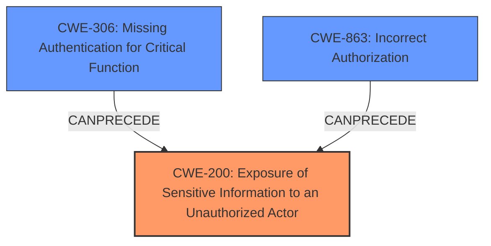

# Raw Analyzer Response for CVE-2024-6861

# Summary
| CWE ID | CWE Name | Confidence | CWE Abstraction Level | CWE Vulnerability Mapping Label | CWE-Vulnerability Mapping Notes |
|---|---|---|---|---|---|
| CWE-200 | Exposure of Sensitive Information to an Unauthorized Actor | 0.9 | Class | Allowed | Primary CWE |
| CWE-306 | Missing Authentication for Critical Function | 0.6 | Base | Allowed | Secondary Candidate |
| CWE-863 | Incorrect Authorization | 0.5 | Class | Allowed-with-Review | Secondary Candidate |

## Evidence and Confidence

*   **Confidence Score:** 0.9
*   **Evidence Strength:** HIGH

## Relationship Analysis
The primary CWE selected is CWE-200 [Exposure of Sensitive Information to an Unauthorized Actor], a Class-level CWE. The vulnerability involves the exposure of sensitive admin authentication keys due to an insecurely configured GraphQL API that allows unauthenticated access to product settings via introspection.

CWE-200 [Exposure of Sensitive Information to an Unauthorized Actor] is a Class-level CWE. While it has child CWEs, none of them specifically address the case of exposure through an API introspection feature.

CWE-306 [Missing Authentication for Critical Function] was considered because the GraphQL API lacked authentication for accessing sensitive settings, but it's secondary because the core issue is the exposure of data, not the complete absence of authentication for the API itself.

CWE-863 [Incorrect Authorization] was also considered because the API's authorization mechanisms were insufficient to prevent the exposure of sensitive data. However, it is not as precise as CWE-200 [Exposure of Sensitive Information to an Unauthorized Actor] which focuses on the exposure of sensitive data due to the **introspection feature** enabled.

## Vulnerability Chain
The vulnerability chain starts with the **introspection feature** being enabled by default, leading to the **exposure of sensitive admin authentication keys**, which then allows attackers to gain full control of the product's REST API.

-   **Root Cause:** Insecure default configuration of GraphQL API with **introspection feature** enabled.
-   **Weakness:** **Exposure of OAuth secrets** through API responses without authentication.
-   **Impact:** An attacker can obtain OAuth consumer\_key and OAuth consumer\_secret and can then authenticate as foreman\_api\_admin, potentially gaining full control of the product's REST API.

## Summary of Analysis
The initial assessment focused on the **exposure of sensitive information** and the **lack of authentication**. The evidence provided in the CVE description and summary strongly supports the classification of CWE-200 [Exposure of Sensitive Information to an Unauthorized Actor] as the primary CWE because the core issue is that sensitive information is being exposed without proper authorization, facilitated by the introspection feature.

The graph relationships influenced the decision to include CWE-306 [Missing Authentication for Critical Function] and CWE-863 [Incorrect Authorization] as secondary CWEs, acknowledging the roles of missing authentication and incorrect authorization in enabling the vulnerability.

The selected CWEs are at an appropriate level of specificity. CWE-200 [Exposure of Sensitive Information to an Unauthorized Actor] directly addresses the nature of the vulnerability. The evidence directly states "If introspection is enabled (usually by default), it allow attackers to query a settings type without any authentication and retrieve the product settings, including the OAuth consumer_key and OAuth consumer_secret properties."

Relevant CWE Information:

# Enhanced Context (25 CWEs)
The following CWEs were identified as potentially relevant to this vulnerability:

## CWE-497: Exposure of Sensitive System Information to an Unauthorized Control Sphere
**Abstraction Level**: Base
**Similarity Score**: 0.77
**Source**: dense

**Description**:
The product does not properly prevent sensitive system-level information from being accessed by unauthorized actors who do not have the same level of access to the underlying system as the product does.

**Mapping Guidance**:
- Usage: Allowed
- Rationale: This CWE entry is at the Base level of abstraction, which is a preferred level of abstraction for mapping to the root causes of vulnerabilities.

## CWE-212: Improper Removal of Sensitive Information Before Storage or Transfer
**Abstraction Level**: Base
**Similarity Score**: 0.77
**Source**: dense

**Description**:
The product stores, transfers, or shares a resource that contains sensitive information, but it does not properly remove that information before the product makes the resource available to unauthorized actors.

**Mapping Guidance**:
- Usage: Allowed
- Rationale: This CWE entry is at the Base level of abstraction, which is a preferred level of abstraction for mapping to the root causes of vulnerabilities.

## CWE-538: Insertion of Sensitive Information into Externally-Accessible File or Directory
**Abstraction Level**: Base
**Similarity Score**: 0.76
**Source**: dense

**Description**:
The product places sensitive information into files or directories that are accessible to actors who are allowed to have access to the files, but not to the sensitive information.

**Mapping Guidance**:
- Usage: Allowed
- Rationale: This CWE entry is at the Base level of abstraction, which is a preferred level of abstraction for mapping to the root causes of vulnerabilities.

## CWE-668: Exposure of Resource to Wrong Sphere
**Abstraction Level**: Class
**Similarity Score**: 0.75
**Source**: dense

**Description**:
The product exposes a resource to the wrong control sphere, providing unintended actors with inappropriate access to the resource.

**Mapping Guidance**:
- Usage: Discouraged
- Rationale: CWE-668 is high-level and is often misused as a catch-all when lower-level CWE IDs might be applicable. It is sometimes used for low-information vulnerability reports [REF-1287]. It is a level-1 Class (i.e., a child of a Pillar). It is not useful for trend analysis.

## CWE-807: Reliance on Untrusted Inputs in a Security Decision
**Abstraction Level**: Base
**Similarity Score**: 0.75
**Source**: dense

**Description**:
The product uses a protection mechanism that relies on the existence or values of an input, but the input can be modified by an untrusted actor in a way that bypasses the protection mechanism.

**Mapping Guidance**:
- Usage: Allowed
- Rationale: This CWE entry is at the Base level of abstraction, which is a preferred level of abstraction for mapping to the root causes of vulnerabilities.

## CWE-303: Incorrect Implementation of Authentication Algorithm
**Abstraction Level**: Base
**Similarity Score**: 0.75
**Source**: dense

**Description**:
The requirements for the product dictate the use of an established authentication algorithm, but the implementation of the algorithm is incorrect.

**Mapping Guidance**:
- Usage: Allowed
- Rationale: This CWE entry is at the Base level of abstraction, which is a preferred level of abstraction for mapping to the root causes of vulnerabilities.

## CWE-1391: Use of Weak Credentials
**Abstraction Level**: Class
**Similarity Score**: 0.75
**Source**: dense

**Description**:
The product uses weak credentials (such as a default key or hard-coded password) that can be calculated, derived, reused, or guessed by an attacker.

**Mapping Guidance**:
- Usage: Allowed-with-Review
- Rationale: This CWE entry is a Class and might have Base-level children that would be more appropriate

## CWE-639: Authorization Bypass Through User-Controlled Key
**Abstraction Level**: Base
**Similarity Score**: 0.75
**Source**: dense

**Description**:
The system's authorization functionality does not prevent one user from gaining access to another user's data or record by modifying the key value identifying the data.

**Mapping Guidance**:
- Usage: Allowed
- Rationale: This CWE entry is at the Base level of abstraction, which is a preferred level of abstraction for mapping to the root causes of vulnerabilities.

## CWE-1390: Weak Authentication
**Abstraction Level**: Class
**Similarity Score**: 0.74
**Source**: dense

**Description**:
The product uses an authentication mechanism to restrict access to specific users or identities, but the mechanism does not sufficiently prove that the claimed identity is correct.

**Mapping Guidance**:
- Usage: Allowed-with-Review
- Rationale: This CWE entry is a Class and might have Base-level children that would be more appropriate

## CWE-472: External Control of Assumed-Immutable Web Parameter
**Abstraction Level**: Base
**Similarity Score**: 0.74
**Source**: dense

**Description**:
The web application does not sufficiently verify inputs that are assumed to be immutable but are