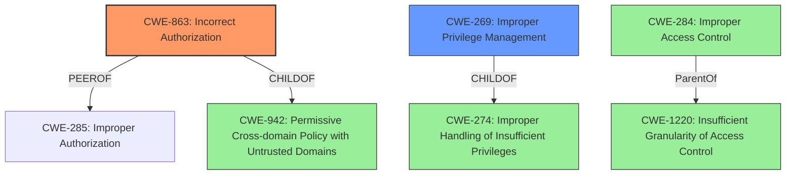

# Analysis Report for CVE-2024-6908

# Vulnerability Analysis Report: CVE-2024-6908

## Description

**Improper privilege management** in Yugabyte Platform allows authenticated admin users to escalate privileges to SuperAdmin via a crafted PUT HTTP request, potentially leading to unauthorized access to sensitive system functions and data.

## Vulnerability Description Key Phrases

- **Rootcause:** Improper privilege management
- **Impact:** escalate privileges to SuperAdmin
- **Vector:** crafted PUT HTTP request
- **Attacker:** authenticated admin users
- **Product:** Yugabyte Platform

## Analysis (with Relationship Data)

# Summary
| CWE ID | CWE Name | Confidence | CWE Abstraction Level | CWE Vulnerability Mapping Label | CWE-Vulnerability Mapping Notes |
|---|---|---|---|---|---|
| CWE-863 | Incorrect Authorization | 0.9 | Class | Allowed-with-Review | Primary CWE. The product performs an authorization check when an actor attempts to access a resource or perform an action, but it does not correctly perform the check. |
| CWE-269 | Improper Privilege Management | 0.7 | Class | Discouraged | Secondary candidate. The product does not properly assign, modify, track, or check privileges for an actor, creating an unintended sphere of control for that actor. |

## Evidence and Confidence

*   **Confidence Score:** 0.9
*   **Evidence Strength:** HIGH

## Relationship Analysis
The primary CWE is CWE-863 Incorrect Authorization, which is a class-level CWE. The secondary CWE is CWE-269 Improper Privilege Management, which is also a class-level CWE.
CWE-863 is preferred because it is more specific to the authorization check that is performed incorrectly, allowing the admin user to escalate privileges. CWE-269 is a more general class describing improper handling of privileges, which makes it a good secondary match.



## Vulnerability Chain
The vulnerability chain starts with an **improper authorization** check (CWE-863) which leads to **improper privilege management** (CWE-269), enabling an authenticated admin user to escalate privileges to SuperAdmin, ultimately leading to unauthorized access to sensitive system functions and data.

## Summary of Analysis
The vulnerability description indicates that the root cause is related to **improper privilege management**.
The CVE reference links content summary confirms that the vulnerability stems from **improper authorization** controls, specifically the ability for an administrator to elevate their privileges to SuperAdmin through manual PUT requests. This includes both creating a user as SuperAdmin, or changing an existing user's role to SuperAdmin.

Based on the evidence, the primary CWE is CWE-863 Incorrect Authorization, which occurs when "The product performs an authorization check when an actor attempts to access a resource or perform an action, but it does not correctly perform the check." This aligns with the vulnerability description where the authorization check is performed, but it is not done correctly, allowing an admin user to escalate privileges to SuperAdmin via a crafted PUT HTTP request.

CWE-269 Improper Privilege Management is a class-level CWE that describes a situation where "The product does not properly assign, modify, track, or check privileges for an actor, creating an unintended sphere of control for that actor." This is a secondary CWE because the root cause is the incorrect authorization check (CWE-863) which leads to the improper privilege management (CWE-269).

The chosen CWEs are at an appropriate level of specificity because they accurately represent the root cause and the resulting weakness.
The guidance indicates that **"Authorization logic is present but flawed"** should be mapped to **CWE-863**.

Other CWEs considered but not used:

*   CWE-284 Improper Access Control: This is a more generic CWE and is not as specific as CWE-863.
*   CWE-285 Improper Authorization: This CWE is similar to CWE-863, but CWE-863 is preferred because it is more specific.
*   CWE-862 Missing Authorization: This CWE is not applicable because the authorization check is performed, but it is not done correctly.
*   CWE-287 Improper Authentication: This CWE is not applicable because the vulnerability is related to authorization, not authentication.
*   CWE-1220 Insufficient Granularity of Access Control: This CWE is not applicable because the vulnerability is not related to the granularity of access control.
*   CWE-306 Missing Authentication for Critical Function: This CWE is not applicable because the vulnerability is related to authorization, not authentication.
*   CWE-89 Improper Neutralization of Special Elements used in an SQL Command ('SQL Injection'): This CWE is not applicable because the vulnerability is not related to SQL injection.
*   CWE-842 Placement of User into Incorrect Group: This CWE is not applicable because the vulnerability is not related to the placement of users into incorrect groups.
*   CWE-613 Insufficient Session Expiration: This CWE is not applicable because the vulnerability is not related to session expiration.
*   CWE-266 Incorrect Privilege Assignment: This CWE is related to assigning the incorrect privilege. The issue is that an existing admin can obtain additional privleges.


## CWE Relationship Analysis

Current CWEs represent these abstraction levels: .


### Vulnerability Chain Analysis

**Chain starting from CWE-274:**
- 274 (Improper Handling of Insufficient Privileges) - ROOT


**Chain starting from CWE-863:**
- 863 (Incorrect Authorization) - ROOT


### CWE Relationship Diagram

```mermaid
graph TD
    classDef primary fill:#f96,stroke:#333,stroke-width:2px
    classDef secondary fill:#69f,stroke:#333
    classDef tertiary fill:#9e9,stroke:#333
```


*Report generated on 2025-07-14 02:16:58*
