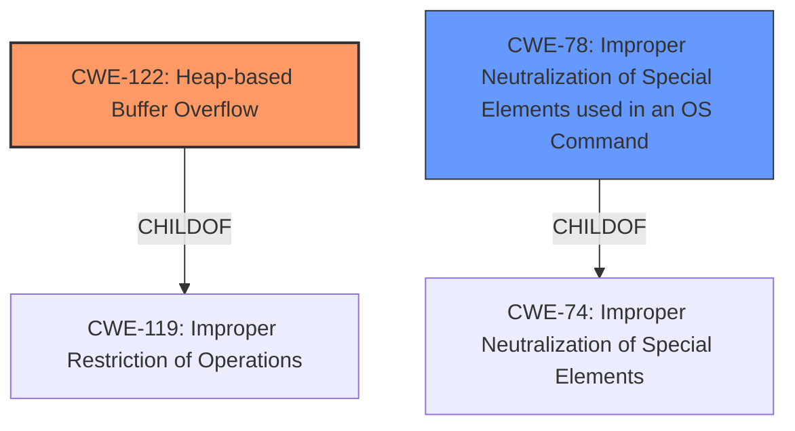

# Analysis for CVE-2024-6973

# Summary
| CWE ID | CWE Name | Confidence | CWE Abstraction Level | CWE Vulnerability Mapping Label | CWE-Vulnerability Mapping Notes |
|---|---|---|---|---|---|
| CWE-122 | Heap-based Buffer Overflow | 0.6 | Variant | Primary | Allowed |
| CWE-78 | Improper Neutralization of Special Elements used in an OS Command ('OS Command Injection') | 0.4 | Base | Secondary | Allowed |

## Evidence and Confidence

*   **Confidence Score:** 0.6
*   **Evidence Strength:** LOW

## Relationship Analysis
The primary relationship considered was the child-of relationship between CWE-119 (Improper Restriction of Operations within the Bounds of a Memory Buffer) and CWE-122 (Heap-based Buffer Overflow), a variant of buffer overflow. Also considered was the CANALSOBE between CWE-78 (Improper Neutralization of Special Elements used in an OS Command) and CWE-88 (Improper Neutralization of Argument Delimiters in a Command). The chosen CWEs are at the base or variant level, reflecting a relatively specific identification of the **root cause**.

## Vulnerability Chain
The vulnerability chain starts with a crafted URL leading to a heap-based buffer overflow that could then allow remote code execution. This could also be related to command injection if the crafted URLs are used in a command.

## Summary of Analysis
The vulnerability description indicates Remote Code Execution via crafted URLs in the Cato Windows SDP client. While the description is succinct, the mention of "crafted URLs" alongside "Remote Code Execution" suggests a potential buffer overflow situation, specifically a heap-based overflow given the nature of URL handling and memory allocation.

The primary mapping is CWE-122, Heap-based Buffer Overflow, because crafted URLs can potentially lead to a **buffer overflow** when processed, particularly if the application **does not properly** validate or sanitize the URL before using it to allocate memory on the heap.

The secondary mapping is CWE-78, Improper Neutralization of Special Elements used in an OS Command ('OS Command Injection'), because crafted URLs can be used to inject commands if the application uses them in constructing OS commands.

The confidence score is 0.6 due to the limited information in the vulnerability description. Additional information would be needed to confirm the exact mechanism of the vulnerability.

The evidence is weak because there is no "CVE Reference Links Content Summary" section, so confidence is lower.

Relevant CWE Information:

# Enhanced Context (25 CWEs)
The following CWEs were identified as potentially relevant to this vulnerability:

## CWE-346: Origin Validation Error
**Abstraction Level**: Class
**Similarity Score**: 0.76
**Source**: dense

**Description**:
The product **does not properly** verify that the source of data or communication is valid.

**Mapping Guidance**:
- Usage: Allowed-with-Review
- Rationale: This CWE entry is a Class and might have Base-level children that would be more appropriate

## CWE-74: Improper Neutralization of Special Elements in Output Used by a Downstream Component ('Injection')
**Abstraction Level**: Class
**Similarity Score**: 0.74
**Source**: dense

**Description**:
The product constructs all or part of a command, data structure, or record using externally-influenced input from an upstream component, but it **does not neutralize** or incorrectly neutralizes special elements that could modify how it is parsed or interpreted when it is sent to a downstream component.

**Mapping Guidance**:
- Usage: Discouraged
- Rationale: CWE-74 is high-level and often misused when lower-level weaknesses are more appropriate.

## CWE-78: Improper Neutralization of Special Elements used in an OS Command ('OS Command Injection')
**Abstraction Level**: base
**Similarity Score**: 4.31
**Source**: graph

**Description**:
CWE-78: Improper Neutralization of Special Elements used in an OS Command ('OS Command Injection')

**Mapping Guidance**:
- Usage: Allowed
- Rationale: This CWE entry is at the Base level of abstraction, which is a preferred level of abstraction for mapping to the root causes of vulnerabilities.

## CWE-88: Improper Neutralization of Argument Delimiters in a Command ('Argument Injection')
**Abstraction Level**: Base
**Similarity Score**: 2.48
**Source**: graph

**Description**:
The product constructs a string for a command to be executed by a separate component
in another control sphere, but it **does not properly** delimit the
intended arguments, options, or switches within that command string.

**Mapping Guidance**:
- Usage: Allowed
- Rationale: This CWE entry is at the Base level of abstraction, which is a preferred level of abstraction for mapping to the root causes of vulnerabilities.

## CWE-122: Heap-based Buffer Overflow
**Abstraction Level**: Variant
**Similarity Score**: 316.91
**Source**: sparse

**Description**:
A heap overflow condition is a buffer overflow, where the buffer that can be overwritten is allocated in the heap portion of memory, generally meaning that the buffer was allocated using a routine such as malloc().

**Mapping Guidance**:
- Usage: Allowed
- Rationale: This CWE entry is at the Variant level of abstraction, which is a preferred level of abstraction for mapping to the root causes of vulnerabilities.