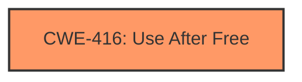

# Enhanced Analysis for CVE-2024-6998

# Summary
| CWE ID | CWE Name | Confidence | CWE Abstraction Level | CWE Vulnerability Mapping Label | CWE-Vulnerability Mapping Notes |
|---|---|---|---|---|---|
| CWE-416 | Use After Free | 1.0 | Variant | Primary | Allowed |

## Evidence and Confidence

*   **Confidence Score:** 1.0
*   **Evidence Strength:** HIGH

## Relationship Analysis
The primary relationship is that CWE-416 is a variant. There are CANFOLLOW relationships to CWE-754, CWE-364, CWE-362, CWE-1265, and CANPRECEDE relationship to CWE-123, forming potential vulnerability chains. The Variant level is the preferred level of abstraction.



## Vulnerability Chain
The vulnerability chain starts with the **use after free** condition (CWE-416), leading to potential heap corruption.

## Summary of Analysis
The analysis is based on the provided evidence, which includes the vulnerability description key phrases, CVE reference links content summary, and retriever results. The vulnerability description explicitly states "Use after free in User Education". The CVE reference links content summary confirms "root_cause": "Use after free" and "weaknesses": ["Use after free"]. The retriever results also list CWE-416 as the top candidate. Therefore, CWE-416 is the most appropriate CWE for this vulnerability. The selection is at the optimal level of specificity (Variant).

Relevant CWE Information:

# Enhanced Context (25 CWEs)
The following CWEs were identified as potentially relevant to this vulnerability:

## CWE-416: Use After Free
**Abstraction Level**: Variant
**Similarity Score**: 0.79
**Source**: dense

**Description**:
The product reuses or references memory after it has been freed. At some point afterward, the memory may be allocated again and saved in another pointer, while the original pointer references a location somewhere within the new allocation. Any operations using the original pointer are no longer valid because the memory "belongs" to the code that operates on the new pointer.

**Mapping Guidance**:
- Usage: Allowed
- Rationale: This CWE entry is at the Variant level of abstraction, which is a preferred level of abstraction for mapping to the root causes of vulnerabilities.

CWE-416 is selected because the vulnerability description explicitly mentions "use after free" as the root cause. The CWE description aligns perfectly with the vulnerability.

# Detailed Analysis of Other Candidate CWEs:

*   **CWE-366: Race Condition within a Thread**: While a race condition could potentially lead to a use-after-free, the provided information explicitly identifies the use-after-free as the root cause, not a race condition.
*   **CWE-415: Double Free**: Similar to the race condition, a double free could also lead to memory corruption, but the description explicitly states a use-after-free.
*   **CWE-362: Concurrent Execution using Shared Resource with Improper Synchronization ('Race Condition')**: This is similar to CWE-366, and the same justification applies. The description explicitly states a use-after-free.
*   **CWE-911: Improper Update of Reference Count**: While an improper reference count could lead to a use-after-free, the description explicitly states a use-after-free.
*   **CWE-843: Access of Resource Using Incompatible Type ('Type Confusion')**: Type confusion could potentially lead to memory corruption, but the provided information explicitly identifies the use-after-free as the root cause.
*   **CWE-123: Write-what-where Condition**: This is a potential impact of a use-after-free, not the root cause.
*   **CWE-772: Missing Release of Resource after Effective Lifetime**: While a missing release of a resource could lead to a use-after-free, the description explicitly states a use-after-free.
*   **CWE-120: Buffer Copy without Checking Size of Input ('Classic Buffer Overflow')**: This is a different type of memory corruption vulnerability, and does not match the "use after free" description.
*   **CWE-476: NULL Pointer Dereference**: This is a different type of memory access issue, and does not match the "use after free" description.
*   **CWE-590: Free of Memory not on the Heap**: This is a different type of memory management issue, and does not match the "use after free" description.
*   **CWE-1265: Unintended Reentrant Invocation of Non-reentrant Code Via Nested Calls**: This is a different type of reentrancy issue, and does not match the "use after free" description.
*   **CWE-1021: Improper Restriction of Rendered UI Layers or Frames**: This is a UI issue, not a memory management issue.
*   **CWE-451: User Interface (UI) Misrepresentation of Critical Information**: This is a UI issue, not a memory management issue.
*   **CWE-356: Product UI does not Warn User of Unsafe Actions**: This is a UI issue, not a memory management issue.
*   **CWE-754: Improper Check for Unusual or Exceptional Conditions**: This is a general error handling issue, not a memory management issue.
*   **CWE-116: Improper Encoding or Escaping of Output**: This is an input validation issue, not a memory management issue.
*   **CWE-367: Time-of-check Time-of-use (TOCTOU) Race Condition**: This is a race condition issue, but the description explicitly states a use-after-free.
*   **CWE-404: Improper Resource Shutdown or Release**: This is a resource management issue, but the description explicitly states a use-after-free.


## CWE Relationship Analysis

Current CWEs represent these abstraction levels: .


### Vulnerability Chain Analysis

**Chain starting from CWE-416:**
- 416 (Use After Free) - ROOT


**Chain starting from CWE-476:**
- 476 (NULL Pointer Dereference) - ROOT


### CWE Relationship Diagram

```mermaid
graph TD
    classDef primary fill:#f96,stroke:#333,stroke-width:2px
    classDef secondary fill:#69f,stroke:#333
    classDef tertiary fill:#9e9,stroke:#333
```