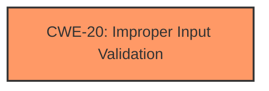

# Enhanced Analysis for CVE-2024-7014

# Summary
| CWE ID | CWE Name | Confidence | CWE Abstraction Level | CWE Vulnerability Mapping Label | CWE-Vulnerability Mapping Notes |
|---|---|---|---|---|---|
| CWE-20 | Improper Input Validation | 0.6 | Class |  | Allowed-with-Review |

## Evidence and Confidence

*   **Confidence Score:** 0.6
*   **Evidence Strength:** LOW

## Relationship Analysis
The selected CWE, CWE-20, is a class-level CWE. While the information provided is limited, it suggests that the application is not properly validating the input (malicious apps disguised as videos). There are no explicit relationships defined in the provided data that directly influenced the selection due to the limited context.



## Vulnerability Chain
The vulnerability chain starts with the **EvilVideo vulnerability**, which is the **root cause**. The impact is the ability to send malicious apps disguised as videos. A missing link in the chain is the specific input validation failure.

## Summary of Analysis
Based on the very limited information, the most appropriate CWE is CWE-20 (Improper Input Validation). The description states that the "**EvilVideo vulnerability**" allows sending malicious apps disguised as videos. This implies that the application is not properly validating the input, allowing malicious apps to bypass security checks by disguising themselves as videos.

The evidence is very weak because the provided "CVE Reference Links Content Summary" states that the provided content is **UNRELATED**. The retriever results do not clearly point to any one CWE, but the description "sending malicious apps disguised as videos" seems to me that the application is not properly validating the input.

The other CWEs were considered but not used because the vulnerability description is too high-level:
*   CWE-116: Improper Encoding or Escaping of Output - Not enough information to suggest encoding or escaping issues.
*   CWE-939: Improper Authorization in Handler for Custom URL Scheme - Authorization is not explicitly mentioned.
*   CWE-863: Incorrect Authorization - Authorization is not explicitly mentioned.
*   CWE-770: Allocation of Resources Without Limits or Throttling - Resource allocation is not mentioned.
*   CWE-400: Uncontrolled Resource Consumption - Resource consumption is not mentioned.
*   CWE-285: Improper Authorization - Authorization is not explicitly mentioned.
*   CWE-1284: Improper Validation of Specified Quantity in Input - Quantity validation is not mentioned.
*   CWE-862: Missing Authorization - Authorization is not explicitly mentioned.
*   CWE-926: Improper Export of Android Application Components - Component export is not mentioned.
*   CWE-410: Insufficient Resource Pool - Resource pool issues are not mentioned.

Because there is very limited information, I have chosen a class level CWE.


## CWE Relationship Analysis

Current CWEs represent these abstraction levels: .


### Vulnerability Chain Analysis

**Chain starting from CWE-863:**
- 863 (Incorrect Authorization) - ROOT


**Chain starting from CWE-1284:**
- 1284 (Improper Validation of Specified Quantity in Input) - ROOT


### CWE Relationship Diagram

```mermaid
graph TD
    classDef primary fill:#f96,stroke:#333,stroke-width:2px
    classDef secondary fill:#69f,stroke:#333
    classDef tertiary fill:#9e9,stroke:#333
```