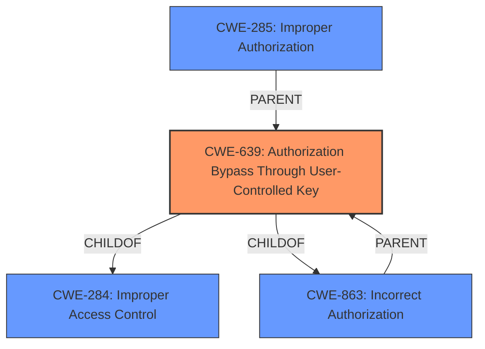

# Analysis for CVE-2024-7040

# Summary
| CWE ID | CWE Name | Confidence | CWE Abstraction Level | CWE Vulnerability Mapping Label | CWE-Vulnerability Mapping Notes |
|---|---|---|---|---|---|
| CWE-639 | Authorization Bypass Through User-Controlled Key | 0.9 | Base | Allowed | Primary CWE |
| CWE-863 | Incorrect Authorization | 0.7 | Class | Allowed-with-Review | Secondary Candidate |
| CWE-285 | Improper Authorization | 0.6 | Class | Discouraged | Secondary Candidate |

## Evidence and Confidence

*   **Confidence Score:** 0.9
*   **Evidence Strength:** HIGH

## Relationship Analysis
The primary CWE selected is CWE-639 (Authorization Bypass Through User-Controlled Key), which is a Base level CWE. This CWE is a child of CWE-284 (Improper Access Control) and CWE-863 (Incorrect Authorization). CWE-863 and CWE-285 are considered as higher-level classifications (Class) and are less specific. The relationship analysis supports selecting the more specific base-level CWE when the evidence aligns, as it does in this case.

## Vulnerability Chain
The vulnerability chain starts with **improper access control**. Specifically, the vulnerability lies in the ability to modify the `user_id` parameter to view chats of other administrators. This leads to the ability to view sensitive information of other admin accounts.

Vulnerability Chain:
1.  **Improper Access Control** (CWE-284): A general access control issue.
2.  **Authorization Bypass Through User-Controlled Key** (CWE-639): Modifying the `user_id` parameter bypasses authorization checks.
3.  **Information Exposure**: Viewing chats of other administrators.

## Summary of Analysis
The initial assessment identified **improper access control** as the root cause. The vulnerability description clearly states that by modifying the `user_id` parameter, it is possible to view chats of any administrator, including those of other admin accounts.

The evidence for this is: "On the frontend admin page, administrators are intended to view only the chats of non-admin members. However, by modifying the user_id parameter, it is possible to view the chats of any administrator, including those of other admin (owner) accounts."

Based on the retriever results and the guidance provided, CWE-639 (Authorization Bypass Through User-Controlled Key) is the most specific and appropriate CWE. It accurately captures the **rootcause**, which is the ability to bypass authorization by manipulating the `user_id` parameter. The other options, such as CWE-863 (Incorrect Authorization) and CWE-285 (Improper Authorization), are broader and less descriptive of the specific vulnerability mechanism.

The selected CWE is at the optimal level of specificity (Base) as it pinpoints the exact mechanism of the vulnerability (user-controlled key leading to authorization bypass).

Relevant CWE Information:

*   **CWE-639: Authorization Bypass Through User-Controlled Key**
    *   **Technical Explanation:** The vulnerability allows an attacker (in this case, an administrator) to gain unauthorized access to resources (chats) by manipulating a user-controlled key (the `user_id` parameter). The system's authorization mechanism fails to prevent this manipulation from granting access to data that should be restricted.
    *   **Security Implications:** Unauthorized access to sensitive information, such as private chats of other administrators, potentially leading to data breaches or other security incidents.
    *   **Relationship:** This is a child of CWE-284 (Improper Access Control) and CWE-863 (Incorrect Authorization).
    *   **Mapping Guidance Influence:** The MITRE mapping guidance explicitly allows for the use of CWE-639.
*   **CWE-863: Incorrect Authorization**
    *   **Technical Explanation:** The application attempts to perform an authorization check, but the check is flawed. In this case, the intended authorization logic is to restrict admin users to only view chats of non-admin members. However, this logic is bypassed by modifying the `user_id`.
    *   **Security Implications:** Unauthorized access to sensitive information of other administrators.
    *   **Relationship:** This is a parent of CWE-639 (Authorization Bypass Through User-Controlled Key).
    *   **Mapping Guidance Influence:** The MITRE mapping guidance allows for the use of CWE-863, but it recommends using more specific child CWEs when possible.
*   **CWE-285: Improper Authorization**
    *   **Technical Explanation:** The application does not properly perform an authorization check when an actor attempts to access a resource or perform an action.
    *   **Security Implications:** Unauthorized access to sensitive information of other administrators.
    *   **Relationship:** This is a parent of CWE-639 (Authorization Bypass Through User-Controlled Key).
    *   **Mapping Guidance Influence:** The MITRE mapping guidance discourages the use of CWE-285 when lower-level CWEs can be used instead.