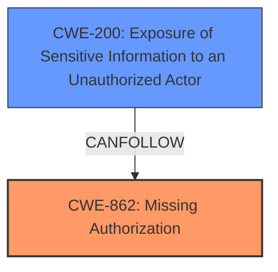

# Analysis for CVE-2024-7045

# Summary
| CWE ID | CWE Name | Confidence | CWE Abstraction Level | CWE Vulnerability Mapping Label | CWE-Vulnerability Mapping Notes |
|---|---|---|---|---|---|
| CWE-862 | Missing Authorization | 0.9 | Base | Allowed | Primary CWE: The application does not check whether the user is authorized at all. |
| CWE-200 | Exposure of Sensitive Information to an Unauthorized Actor | 0.7 | Class | Discouraged | Secondary CWE: Information disclosure is a consequence of the missing authorization. |

## Evidence and Confidence

*   **Confidence Score:** 0.8
*   **Evidence Strength:** MEDIUM

## Relationship Analysis
The primary weakness is CWE-862 Missing Authorization, which is a Base level CWE. The vulnerability involves the application not checking whether the attacker is authorized to access the prompt information. CWE-200 Exposure of Sensitive Information to an Unauthorized Actor is included as a secondary weakness because the lack of authorization leads to the exposure of sensitive prompt data. CWE-200 is a Class level CWE and a potential impact of CWE-862.

## Vulnerability Chain
The vulnerability chain starts with **improper access control** due to the **missing authorization** check (CWE-862). This leads to the attacker being able to view any prompts and obtain arbitrary prompt information (CWE-200).

## Summary of Analysis
The initial analysis identified that the **rootcause** of the vulnerability is **improper access control**, which leads to an attacker viewing any prompts. The key phrase "**improper access control**" in the vulnerability description points towards an authorization issue. The retriever results listed CWE-285 Improper Authorization, CWE-306 Missing Authentication for Critical Function, and CWE-863 Incorrect Authorization as top candidates. However, after analyzing the vulnerability description and the CWE specifications, CWE-862 Missing Authorization was chosen as the primary CWE since the application does not check whether the user is authorized to access the prompt information. The access to prompt information leads to exposure of sensitive information, thus CWE-200 Exposure of Sensitive Information to an Unauthorized Actor is added as a secondary CWE. This assessment is based on the evidence provided in the vulnerability description. The selected CWEs are at the optimal level of specificity.

CWE-285, CWE-306, and CWE-863 were considered but not used. CWE-285 is too general. CWE-306 is related to missing authentication, but the vulnerability is about missing authorization, not authentication. CWE-863 Incorrect Authorization implies that there is an authorization check, but it is flawed, which is not the case here. CWE-284 Improper Access Control was also considered, but it is a high-level category.