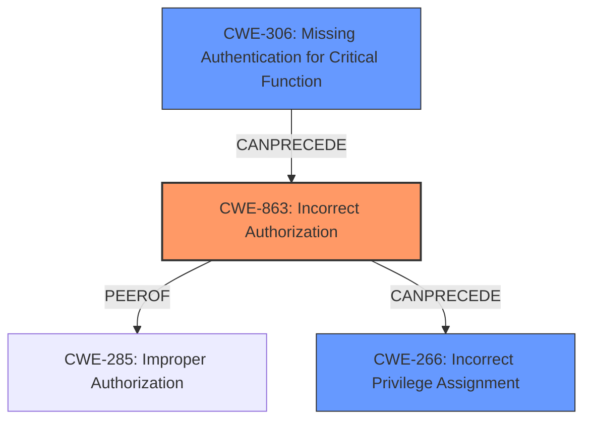

# Analysis Report for CVE-2024-7096

# Vulnerability Analysis Report: CVE-2024-7096

## Description

A **privilege escalation vulnerability** exists in multiple [Vendor Name] products due to a **business logic flaw** in SOAP admin services. A malicious actor can create a new user with elevated permissions only when all of the following conditions are met * SOAP admin services are accessible to the attacker. * The deployment includes an internally used attribute that is not part of the default WSO2 product configuration. * At least one custom role exists with non-default permissions. * The attacker has knowledge of the custom role and the internal attribute used in the deployment. Exploiting this vulnerability allows malicious actors to assign higher privileges to self-registered users, bypassing intended access control mechanisms.

## Vulnerability Description Key Phrases

- **Rootcause:** business logic flaw
- **Weakness:** privilege escalation vulnerability
- **Impact:** privilege escalation
- **Attacker:** malicious actor
- **Product:** [Vendor Name] products
- **Component:** SOAP admin services

## Analysis (with Relationship Data)

# Summary
| CWE ID | CWE Name | Confidence | CWE Abstraction Level | CWE Vulnerability Mapping Label | CWE-Vulnerability Mapping Notes |
|---|---|---|---|---|---|
| CWE-863 | Incorrect Authorization | 0.9 | Class | Allowed-with-Review | Primary CWE. The application performs an authorization check, but it does so incorrectly due to a **business logic flaw**. |
| CWE-266 | Incorrect Privilege Assignment | 0.7 | Base | Allowed | Secondary candidate. A malicious actor can create a new user with elevated permissions. |
| CWE-306 | Missing Authentication for Critical Function | 0.6 | Base | Allowed | Secondary candidate. SOAP admin services are accessible to the attacker. |

## Evidence and Confidence

*   **Confidence Score:** 0.8
*   **Evidence Strength:** MEDIUM

## Relationship Analysis
The primary CWE is CWE-863, which is a Class-level CWE. While it is generally preferred to map to Base or Variant level CWEs, the specific nature of the **business logic flaw** causing an incorrect authorization check makes it a suitable choice. CWE-266, Incorrect Privilege Assignment, is a potential child of CWE-269 Improper Privilege Management and relates to the ability to create new users with elevated permissions. CWE-306, Missing Authentication for Critical Function, relates to the accessibility of SOAP admin services without proper authentication.



## Vulnerability Chain
The vulnerability chain starts with potentially missing or weak authentication (CWE-306) for SOAP admin services, which leads to an incorrect authorization check (CWE-863) due to a **business logic flaw**. This incorrect authorization allows a malicious actor to create new users with elevated permissions (CWE-266), resulting in a **privilege escalation vulnerability**.

## Summary of Analysis
The primary focus is on the **business logic flaw** that leads to incorrect authorization. The vulnerability description clearly states that an attacker can create a new user with elevated permissions due to this flaw.

The vulnerability description provides the following evidence:

*   "A **privilege escalation vulnerability** exists...due to a **business logic flaw** in SOAP admin services."
*   "A malicious actor can create a new user with elevated permissions..."

CWE-863 is selected as the primary CWE because it represents the incorrect authorization check caused by the **business logic flaw**. CWE-266 is a secondary CWE because it describes the direct consequence of the incorrect authorization - the ability to assign elevated privileges. CWE-306 is included as a secondary CWE because the accessibility of SOAP admin services is a prerequisite for exploiting the vulnerability.

Other CWEs Considered:

*   CWE-269: Improper Privilege Management - This is a high-level CWE and less specific than CWE-863 and CWE-266.
*   CWE-285: Improper Authorization - Similar to CWE-863, but CWE-863 is more specific because it explicitly mentions that the authorization check is incorrect.
*   CWE-306: Missing Authentication for Critical Function - While authentication might be missing, the primary issue is the flawed authorization logic, making CWE-863 more relevant.


## CWE Relationship Analysis

Current CWEs represent these abstraction levels: .


### Vulnerability Chain Analysis

**Chain starting from CWE-863:**
- 863 (Incorrect Authorization) - ROOT


**Chain starting from CWE-306:**
- 306 (Missing Authentication for Critical Function) - ROOT


### CWE Relationship Diagram

```mermaid
graph TD
    classDef primary fill:#f96,stroke:#333,stroke-width:2px
    classDef secondary fill:#69f,stroke:#333
    classDef tertiary fill:#9e9,stroke:#333
```


*Report generated on 2025-07-14 02:27:54*
