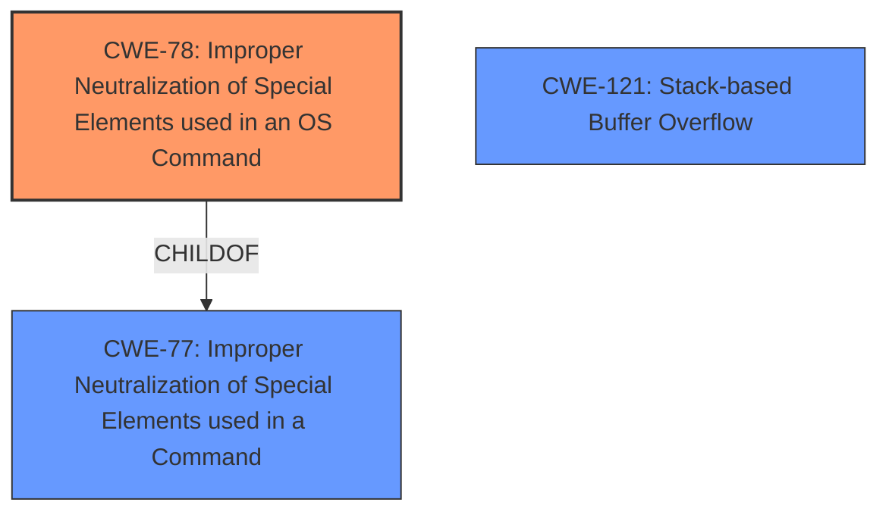

# Analysis for CVE-2024-7158

# Summary
| CWE ID | CWE Name | Confidence | CWE Abstraction Level | CWE Vulnerability Mapping Label | CWE-Vulnerability Mapping Notes |
|---|---|---|---|---|---|
| CWE-78 | Improper Neutralization of Special Elements used in an OS Command ('OS Command Injection') | 1.0 | Base | Allowed | Primary CWE: The **command injection** vulnerability due to improper neutralization of special elements in the `telnet_enabled` parameter. |
| CWE-121 | Stack-based Buffer Overflow | 0.5 | Variant | Allowed | Secondary candidate: The Github document mentions a possible buffer overflow due to the uncontrolled input of the 'telnet_enabled' parameter. |

## Evidence and Confidence

*   **Confidence Score:** 0.8
*   **Evidence Strength:** MEDIUM

## Relationship Analysis
The primary relationship that influences the CWE selection is the parent-child relationship between CWE-77 (Improper Neutralization of Special Elements used in a Command) and CWE-78 (Improper Neutralization of Special Elements used in an OS Command). CWE-78 is a more specific child of CWE-77, focusing explicitly on OS commands, which aligns directly with the vulnerability description. The description mentions that the manipulation of the `telnet_enabled` argument leads to **command injection**, making CWE-78 the more appropriate choice.

## Vulnerability Chain
The vulnerability chain starts with the **improper neutralization** of the `telnet_enabled` parameter, leading to **command injection**.

1.  **Root Cause:** CWE-78 Improper Neutralization of Special Elements used in an OS Command ('OS Command Injection')
2.  **Impact:** Arbitrary command execution on the router.

## Summary of Analysis
The analysis is based on the vulnerability description, which explicitly states that the manipulation of the `telnet_enabled` argument leads to **command injection**. The "CVE Reference Links Content Summary" section confirms this, stating that the root cause is a lack of proper input sanitization and that the `telnet_enabled` parameter is not validated before use. This directly aligns with the description of CWE-78. The retriever results also support this selection, with CWE-78 being a top candidate.

CWE-77 (Improper Neutralization of Special Elements used in a Command ('Command Injection')) was considered but deemed less specific than CWE-78, as the vulnerability involves the execution of OS commands.
CWE-89 (Improper Neutralization of Special Elements used in an SQL Command ('SQL Injection')) and CWE-79 (Improper Neutralization of Input During Web Page Generation ('Cross-site Scripting')) were also considered but rejected as they do not accurately describe the vulnerability, which involves OS command execution rather than SQL injection or cross-site scripting.
CWE-121 (Stack-based Buffer Overflow) was considered as a possible secondary CWE as this was noted in the Github document but not explicitly described in the vulnerability description.

The choice of CWE-78 is at the optimal level of specificity because it directly addresses the root cause of the vulnerability, which is the improper neutralization of special elements in an OS command.