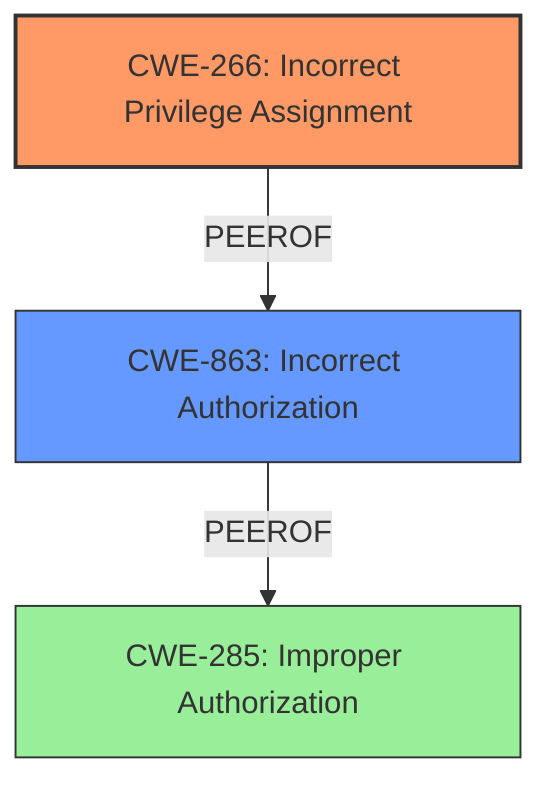

# Analysis Report for CVE-2024-7291

# Vulnerability Analysis Report: CVE-2024-7291

## Description

The JetFormBuilder plugin for WordPress is vulnerable to privilege escalation in all versions up to, and including, 3.3.4.1. This is due to **improper restriction on user meta fields**. This makes it possible for authenticated attackers, with administrator-level and above permissions, to register as super-admins on the sites configured as multi-sites.

## Vulnerability Description Key Phrases

- **Rootcause:** improper restriction on user meta fields
- **Impact:** privilege escalation
- **Attacker:** authenticated attackers with administrator-level permissions
- **Product:** JetFormBuilder plugin for WordPress
- **Version:** up to and including 3.3.4.1

## Analysis (with Relationship Data)

# Summary
| CWE ID | CWE Name | Confidence | CWE Abstraction Level | CWE Vulnerability Mapping Label | CWE-Vulnerability Mapping Notes |
|---|---|---|---|---|---|
| CWE-266 | Incorrect Privilege Assignment | 0.9 | Base | Primary | Allowed |
| CWE-863 | Incorrect Authorization | 0.7 | Class | Secondary | Allowed-with-Review |

## Evidence and Confidence

*   **Confidence Score:** 0.9
*   **Evidence Strength:** HIGH

## Relationship Analysis
The primary CWE is CWE-266, a base-level weakness that precisely captures the incorrect privilege assignment. CWE-863 is a class-level weakness that is related, but less specific. The guidance provided, privileges vs permissions, directed toward CWE-266. There are other related CWEs, but these are not as clearly supported by the evidence.



## Vulnerability Chain
The vulnerability chain starts with **improper restriction on user meta fields** (CWE-266), which leads to privilege escalation. An attacker with administrator-level permissions can exploit this to become a super-admin. The chain is:
1.  **Incorrect Privilege Assignment** (CWE-266) - **ROOT CAUSE**: Due to **improper restriction on user meta fields**.
2.  Privilege Escalation - IMPACT: An attacker gains super-admin privileges.

## Summary of Analysis
The initial assessment focused on the **improper restriction on user meta fields**, which is the **root cause** of the vulnerability. The provided information clearly indicates that the plugin **incorrectly** assigns privileges, allowing administrators to escalate their privileges to super-admin.

The CWE guidance on Privileges vs Permissions clearly points to CWE-266 as the best fit when a user is assigned the wrong role due to misconfiguration or faulty logic. The vulnerability description states that authenticated attackers with administrator-level permissions can register as super-admins, which aligns perfectly with the description of CWE-266. The technical details confirm that the code fails to prevent modification of restricted user meta keys, such as `wp_capabilities`, which directly controls user roles and permissions. This evidence makes a strong case for CWE-266 as the primary CWE.

The selected CWE is at the Base level of abstraction, which is the preferred level for mapping root causes. This level of specificity ensures that the CWE accurately represents the vulnerability.

Relevant CWE Information:

# Enhanced Context (25 CWEs)
The following CWEs were identified as potentially relevant to this vulnerability:

## CWE-266: Incorrect Privilege Assignment
**Abstraction Level**: Base
**Similarity Score**: 0.78
**Source**: dense

**Description**:
A product **incorrectly assigns** a privilege to a particular actor, creating an unintended sphere of control for that actor.

**Mapping Guidance**:
- Usage: Allowed
- Rationale: This CWE entry is at the Base level of abstraction, which is a preferred level of abstraction for mapping to the root causes of vulnerabilities.

## CWE-863: Incorrect Authorization
**Abstraction Level**: Class
**Similarity Score**: 2003.74
**Source**: sparse

**Description**:
The product performs an authorization check when an actor attempts to access a resource or perform an action, but it **does not correctly perform the check**.

**Mapping Guidance**:
- Usage: Allowed-with-Review
- Rationale: This CWE entry is a Class and might have Base-level children that would be more appropriate

## CWE-285: Improper Authorization
**Abstraction Level**: Class
**Similarity Score**: 1925.84
**Source**: sparse

**Description**:
The product does not perform or **incorrectly performs** an authorization check when an actor attempts to access a resource or perform an action.

**Mapping Guidance**:
- Usage: Discouraged
- Rationale: CWE-285 is high-level and lower-level CWEs can frequently be used instead. It is a level-1 Class (i.e., a child of a Pillar).

## CWE-862: Missing Authorization
**Abstraction Level**: Class
**Similarity Score**: 1836.14
**Source**: sparse

**Description**:
The product **does not perform an authorization check** when an actor attempts to access a resource or perform an action.

**Mapping Guidance**:
- Usage: Allowed-with-Review
- Rationale: This CWE entry is a Class and might have Base-level children that would be more appropriate


## CWE Relationship Analysis

Current CWEs represent these abstraction levels: .


### Vulnerability Chain Analysis

**Chain starting from CWE-266:**
- 266 (Incorrect Privilege Assignment) - ROOT


**Chain starting from CWE-863:**
- 863 (Incorrect Authorization) - ROOT


### CWE Relationship Diagram

```mermaid
graph TD
    classDef primary fill:#f96,stroke:#333,stroke-width:2px
    classDef secondary fill:#69f,stroke:#333
    classDef tertiary fill:#9e9,stroke:#333
```


*Report generated on 2025-07-14 02:34:35*
