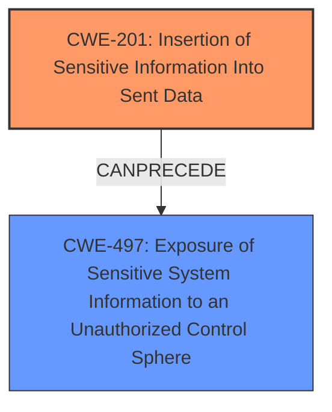

# Raw Analyzer Response for CVE-2024-7319

# Summary
| CWE ID | CWE Name | Confidence | CWE Abstraction Level | CWE Vulnerability Mapping Label | CWE-Vulnerability Mapping Notes |
|---|---|---|---|---|---|
| CWE-201 | Insertion of Sensitive Information Into Sent Data | 0.8 | Base | Primary | Allowed |
| CWE-497 | Exposure of Sensitive System Information to an Unauthorized Control Sphere | 0.6 | Base | Secondary | Allowed |

## Evidence and Confidence

*   **Confidence Score:** 0.7
*   **Evidence Strength:** MEDIUM

## Relationship Analysis
The primary relationship influencing the decision is that of cause and effect. The **incomplete fix** (root cause not explicitly mapped, but implied) leads to the **insertion of sensitive data** into sent data, which in turn leads to the **exposure of sensitive system information**.

## Vulnerability Chain
The vulnerability chain starts with an **incomplete fix** for CVE-2023-1625. The **incomplete fix** is not explicitly mapped but results in **CWE-201: Insertion of Sensitive Information Into Sent Data**, as sensitive information is being included in the data being sent when it should not be. This then leads to **CWE-497: Exposure of Sensitive System Information to an Unauthorized Control Sphere**.

## Summary of Analysis
The initial analysis focused on the **incomplete fix** as the primary cause, leading to the **disclosure of sensitive information**. The most relevant CWEs identified were **CWE-201: Insertion of Sensitive Information Into Sent Data** and **CWE-497: Exposure of Sensitive System Information to an Unauthorized Control Sphere**.

The vulnerability description states: "An **incomplete fix** for CVE-2023-1625 was found in openstack-heat. Sensitive information may possibly be disclosed through the OpenStack stack abandon command with the hidden feature set to True and the CVE-2023-1625 fix applied." This suggests that the **incomplete fix** resulted in the application not properly preventing sensitive information from being included in the sent data.

**CWE-201: Insertion of Sensitive Information Into Sent Data** is selected as the primary CWE as it directly describes the **weakness** where sensitive information is being inserted into the data that is being sent.
**CWE-497: Exposure of Sensitive System Information to an Unauthorized Control Sphere** is a secondary CWE because it describes the result of the **insertion of sensitive information**, namely that sensitive system information is exposed to an unauthorized control sphere.

The selected CWEs are at the optimal level of specificity, as they directly address the **root cause** and impact of the vulnerability as described in the provided text.

Relevant CWE Information:

*   **CWE-201: Insertion of Sensitive Information Into Sent Data**: The code transmits data to another actor, but a portion of the data includes sensitive information that should not be accessible to that actor. This aligns with the vulnerability description, where sensitive information is being disclosed through the `openstack stack abandon` command.
*   **CWE-497: Exposure of Sensitive System Information to an Unauthorized Control Sphere**: The product does not properly prevent sensitive system-level information from being accessed by unauthorized actors who do not have the same level of access to the underlying system as the product does. This aligns with the potential for sensitive information to be disclosed through the `openstack stack abandon` command.

CWEs considered but not used:

*   CWE-668: Exposure of Resource to Wrong Sphere: This is a class-level CWE and too general. While it's true that resources are being exposed to the wrong sphere, the more specific CWE-201 and CWE-497 better capture the nature of the vulnerability.
*   CWE-79: Improper Neutralization of Input During Web Page Generation ('Cross-site Scripting'): Not relevant because the vulnerability does not involve web page generation or cross-site scripting.
*   CWE-434: Unrestricted Upload of File with Dangerous Type: Not relevant because the vulnerability does not involve file uploads.
*   CWE-125: Out-of-bounds Read: Not relevant because the vulnerability does not involve out-of-bounds reads.
*   CWE-825: Expired Pointer Dereference: Not relevant because the vulnerability does not involve pointer dereferences.
*   CWE-824: Access of Uninitialized Pointer: Not relevant because the vulnerability does not involve uninitialized pointers.
*   CWE-73: External Control of File Name or Path: Not relevant because the vulnerability does not involve file names or paths.
*   CWE-88: Improper Neutralization of Argument Delimiters in a Command ('Argument Injection'): Not relevant because the vulnerability does not involve argument injection.
*   CWE-212: Improper Removal of Sensitive Information Before Storage or Transfer: Not relevant because the vulnerability does not involve storage or transfer.