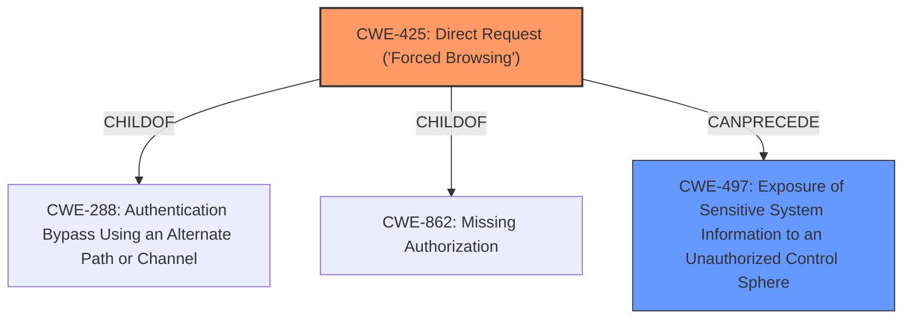

# Enhanced Analysis for CVE-2024-7328

# Summary
| CWE ID | CWE Name | Confidence | CWE Abstraction Level | CWE Vulnerability Mapping Label | CWE-Vulnerability Mapping Notes |
|---|---|---|---|---|---|
| CWE-425 | Direct Request ('Forced Browsing') | 0.9 | Base | Primary | Allowed |
| CWE-497 | Exposure of Sensitive System Information to an Unauthorized Control Sphere | 0.7 | Base | Secondary | Allowed |

## Evidence and Confidence

*   **Confidence Score:** 0.8
*   **Evidence Strength:** MEDIUM

## Relationship Analysis
The primary relationship that influenced my decision was the ChildOf relationship, specifically how CWE-425 is a child of higher-level authorization CWEs. I also considered the potential for a chain relationship where **improper access control** (CWE-425) leads directly to **information disclosure** (CWE-497). The base abstraction level was chosen for both CWEs to represent the specific nature of the weaknesses.



## Vulnerability Chain
The vulnerability chain starts with **improper access control** (CWE-425), allowing unauthorized direct requests. This then leads to **information disclosure** (CWE-497) by exposing the server's root directory and PHP information.

## Summary of Analysis
The initial analysis focused on the **information disclosure** aspect, but a deeper dive into the root cause revealed that the core issue is the **lack of proper access control**. The evidence from the "CVE Reference Links Content Summary" clearly states that the files are accessible "without proper authentication or authorization checks". This supports the selection of CWE-425. CWE-497 is then mapped as a secondary weakness, as it directly results from the **improper access control**. Both selected CWEs are at the base level, providing sufficient specificity for the vulnerability. The retriever results and graph relationships helped confirm the relevance of these CWEs.

Relevant CWE Information:

# Enhanced Context (25 CWEs)
The following CWEs were identified as potentially relevant to this vulnerability:

## CWE-425: Direct Request ('Forced Browsing')
**Abstraction Level**: Base
**Similarity Score**: 0.79
**Source**: dense

**Description**:
The web application does not adequately enforce appropriate authorization on all restricted URLs, scripts, or files.

**Mapping Guidance**:
- Usage: Allowed
- Rationale: This CWE entry is at the Base level of abstraction, which is a preferred level of abstraction for mapping to the root causes of vulnerabilities.

**Justification:** The vulnerability description explicitly states that the affected files are accessible without proper authentication or authorization checks. This aligns perfectly with the description of CWE-425, which addresses the failure to enforce appropriate authorization on restricted URLs. The evidence: *"These files are accessible without proper authentication or authorization checks."*
## CWE-497: Exposure of Sensitive System Information to an Unauthorized Control Sphere
**Abstraction Level**: Base
**Similarity Score**: 0.77
**Source**: dense

**Description**:
The product does not properly prevent sensitive system-level information from being accessed by unauthorized actors who do not have the same level of access to the underlying system as the product does.

**Mapping Guidance**:
- Usage: Allowed
- Rationale: This CWE entry is at the Base level of abstraction, which is a preferred level of abstraction for mapping to the root causes of vulnerabilities.

**Justification:** Because the file is accessible without authentication (CWE-425), it leads to the exposure of sensitive information. The evidence: *"Accessing `/t.php` or `/upload/t.php` reveals sensitive information, including the web server's root directory path."*

## CWE-79: Improper Neutralization of Input During Web Page Generation ('Cross-site Scripting')
**Abstraction Level**: Base
**Similarity Score**: 0.75
**Source**: dense

**Description**:
The product does not neutralize or incorrectly neutralizes user-controllable input before it is placed in output that is used as a web page that is served to other users.

**Mapping Guidance**:
- Usage: Allowed
- Rationale: This CWE entry is at the Base level of abstraction, which is a preferred level of abstraction for mapping to the root causes of vulnerabilities.

**Justification:** Not used. While XSS is a common web vulnerability, the description doesn't indicate any user-controlled input being reflected without sanitization. The vulnerability is about directly accessing files that disclose sensitive information.

## CWE-434: Unrestricted Upload of File with Dangerous Type
**Abstraction Level**: Base
**Similarity Score**: 0.79
**Source**: dense

**Description**:
The product allows the upload or transfer of dangerous file types that are automatically processed within its environment.

**Mapping Guidance**:
- Usage: Allowed
- Rationale: This CWE entry is at the Base level of abstraction, which is a preferred level of abstraction for mapping to the root causes of vulnerabilities.

**Justification:** Not used. The vulnerability description doesn't indicate any file upload functionality. The issue is about directly accessing existing files.

## CWE-89: Improper Neutralization of Special Elements used in an SQL Command ('SQL Injection')
**Abstraction Level**: Base
**Similarity Score**: 1027.11
**Source**: sparse

**Description**:
The product constructs all or part of an SQL command using externally-influenced input from an upstream component, but it does not neutralize or incorrectly neutralizes special elements that could modify the intended SQL command when it is sent to a downstream component. Without sufficient removal or quoting of SQL syntax in user-controllable inputs, the generated SQL query can cause those inputs to be interpreted as SQL instead of ordinary user data.

**Mapping Guidance**:
- Usage: Allowed
- Rationale: This CWE entry is at the Base level of abstraction, which is a preferred level of abstraction for mapping to the root causes of vulnerabilities.

**Justification:** Not used. The vulnerability description doesn't suggest any SQL interaction or **improper neutralization** of SQL elements.


## CWE Relationship Analysis

Current CWEs represent these abstraction levels: .


### Vulnerability Chain Analysis

**Chain starting from CWE-288:**
- 288 (Authentication Bypass Using an Alternate Path or Channel) - ROOT


**Chain starting from CWE-89:**
- 89 (Improper Neutralization of Special Elements used in an SQL Command ('SQL Injection')) - ROOT


### CWE Relationship Diagram

```mermaid
graph TD
    classDef primary fill:#f96,stroke:#333,stroke-width:2px
    classDef secondary fill:#69f,stroke:#333
    classDef tertiary fill:#9e9,stroke:#333
```