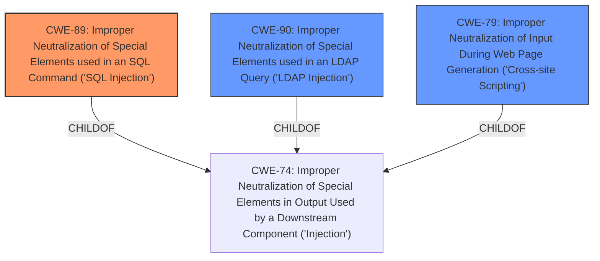

# Analysis Report for CVE-2024-7385

# Vulnerability Analysis Report: CVE-2024-7385

## Description

The WordPress Simple HTML Sitemap plugin for WordPress is vulnerable to SQL Injection via the id parameter in all versions up to, and including, 3.1 due to **insufficient escaping on the user supplied parameter and lack of sufficient preparation on the existing SQL query**. This makes it possible for authenticated attackers, with Administrator-level access and above, to append additional SQL queries into already existing queries that can be used to extract sensitive information from the database.

## Vulnerability Description Key Phrases

- **Rootcause:** insufficient escaping on the user supplied parameter and lack of sufficient preparation on the existing SQL query
- **Weakness:** SQL injection
- **Impact:** extract sensitive information from the database
- **Vector:** id parameter
- **Attacker:** authenticated attackers with Administrator-level access
- **Product:** WordPress Simple HTML Sitemap plugin
- **Version:** up to and including 3.1

## Analysis (with Relationship Data)

# Summary
| CWE ID | CWE Name | Confidence | CWE Abstraction Level | CWE Vulnerability Mapping Label | CWE-Vulnerability Mapping Notes |
|---|---|---|---|---|---|
| CWE-89 | Improper Neutralization of Special Elements used in an SQL Command ('SQL Injection') | 1.0 | Base | Allowed | Primary CWE: The plugin is vulnerable to SQL injection due to **insufficient escaping** and **lack of sufficient preparation on the existing SQL query**. |

## Evidence and Confidence

*   **Confidence Score:** 1.0
*   **Evidence Strength:** HIGH

## Relationship Analysis
The primary relationship considered was the parent-child relationship. CWE-89 is a base-level CWE, which is the preferred level. Other CWEs considered were at higher abstraction levels, making CWE-89 the most specific and appropriate choice.



## Vulnerability Chain
The vulnerability chain starts with **insufficient escaping on the user supplied parameter and lack of sufficient preparation on the existing SQL query**, which leads to **SQL Injection**, and finally results in the ability to extract sensitive information from the database.

## Summary of Analysis
The analysis is based on the provided vulnerability description and the CVE reference links content summary. The description clearly states that the plugin is vulnerable to **SQL injection** due to "**insufficient escaping on the user supplied parameter and lack of sufficient preparation on the existing SQL query**." The CVE reference content provides the vulnerable code snippet, confirming the **insufficient input sanitization** as the root cause.

CWE-89 is the most appropriate choice because it directly addresses the **improper neutralization of special elements used in an SQL command**, leading to **SQL injection**.

Other CWEs like CWE-79 (Cross-Site Scripting) and CWE-90 (LDAP Injection) were considered but not selected because the vulnerability is specifically related to **SQL injection**, not XSS or LDAP injection. CWE-116 (Improper Encoding or Escaping of Output) was also considered, but the primary issue is the construction of the SQL query, not the encoding or escaping of output.


## CWE Relationship Analysis

Current CWEs represent these abstraction levels: .


### Vulnerability Chain Analysis

**Chain starting from CWE-90:**
- 90 (Improper Neutralization of Special Elements used in an LDAP Query ('LDAP Injection')) - ROOT


**Chain starting from CWE-89:**
- 89 (Improper Neutralization of Special Elements used in an SQL Command ('SQL Injection')) - ROOT


### CWE Relationship Diagram

```mermaid
graph TD
    classDef primary fill:#f96,stroke:#333,stroke-width:2px
    classDef secondary fill:#69f,stroke:#333
    classDef tertiary fill:#9e9,stroke:#333
```


*Report generated on 2025-07-14 02:39:01*
