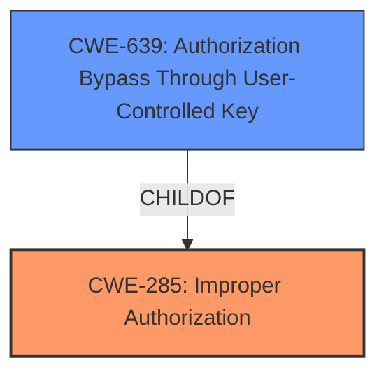

# Raw Analyzer Response for CVE-2024-7476

# Summary
| CWE ID | CWE Name | Confidence | CWE Abstraction Level | CWE Vulnerability Mapping Label | CWE-Vulnerability Mapping Notes |
|---|---|---|---|---|---|
| CWE-285 | Improper Authorization | 0.9 | Class | Primary | Allowed-with-Review |
| CWE-639 | Authorization Bypass Through User-Controlled Key | 0.7 | Base | Secondary | Allowed |

## Evidence and Confidence

*   **Confidence Score:** 0.8
*   **Evidence Strength:** HIGH

## Relationship Analysis
The primary relationship influencing the decision is the parent-child relationship between CWE-285 (Improper Authorization) and potentially more specific CWEs. However, based on the provided information, CWE-285 seems to capture the core issue. CWE-639 (Authorization Bypass Through User-Controlled Key) is considered as a possible secondary CWE due to the nature of the vulnerability enabling a user to modify templates of other users.

## Vulnerability Chain
The vulnerability chain starts with **broken access control** (Improper Authorization), which allows an authenticated attacker to modify templates belonging to other users via a crafted HTTP POST request. The mitigation involves adding project ID checks to SQL queries, preventing unauthorized access or modification of data.

## Summary of Analysis
The initial assessment pointed towards an authorization issue, which the evidence strongly supports. The key phrase "**broken access control**" and the description of the vulnerability allowing modification of other users' templates clearly indicate an authorization problem. The provided CVE Reference Links Content Summary reinforces this by stating that the original code lacked proper access control and project ID checks, enabling unauthorized data access and modification.

The retriever results also list CWE-285 (Improper Authorization) as a strong candidate. While there are more specific CWEs, the available information doesn't pinpoint the precise mechanism of the authorization failure, making CWE-285 the most appropriate choice.

CWE-639 (Authorization Bypass Through User-Controlled Key) is also considered because the vulnerability involves modifying templates of other users, implying a bypass of authorization through a user-controlled key (the template ID). However, since the primary issue is the improper authorization check, CWE-285 is selected as the primary CWE.

Relevant CWE Information:

# Enhanced Context (25 CWEs)
The following CWEs were identified as potentially relevant to this vulnerability:

## CWE-639: Authorization Bypass Through User-Controlled Key
**Abstraction Level**: Base
**Similarity Score**: 0.75
**Source**: dense

**Description**:
The system's authorization functionality does not prevent one user from gaining access to another user's data or record by modifying the key value identifying the data.

**Mapping Guidance**:
- Usage: Allowed
- Rationale: This CWE entry is at the Base level of abstraction, which is a preferred level of abstraction for mapping to the root causes of vulnerabilities.

## CWE-285: Improper Authorization
**Abstraction Level**: Class
**Similarity Score**: 1766.27
**Source**: sparse

**Description**:
The product does not perform or incorrectly performs an authorization check when an actor attempts to access a resource or perform an action.

**Mapping Guidance**:
- Usage: Discouraged
- Rationale: CWE-285 is high-level and lower-level CWEs can frequently be used instead. It is a level-1 Class (i.e., a child of a Pillar).

Based on the provided vulnerability description, the primary **weakness** is "**broken access control**" which allows "an authenticated attacker to modify any users templates by sending a crafted HTTP POST request to the /v1/templates/{id}/versions endpoint."
This indicates that the server is not properly checking if the authenticated user has the privileges to modify the requested template.

The "CVE Reference Links Content Summary" confirms that the **root cause of vulnerability** is that "The code was updated to include project ID checks in SQL queries to prevent unauthorized access to data. The original code lacked these checks, potentially allowing users to access or modify data belonging to other projects."

Based on the above, CWE-285, Improper Authorization is chosen as the primary CWE, with a confidence of 0.9.
CWE-639 is chosen as a secondary CWE, with a confidence of 0.7

CWEs Considered but Not Used:

*   CWE-284 (Improper Access Control): While this is a general access control issue, CWE-285 is more specific as it relates to authorization.
*   CWE-863 (Incorrect Authorization): This could be a possibility, but the description doesn't specify that the authorization check exists but is incorrect, only that access control is **broken**.
*   CWE-306 (Missing Authentication for Critical Function): The attacker is authenticated, so this CWE doesn't apply.
*   CWE-425 (Direct Request ('Forced Browsing')): This is about missing authorization on URLs, but the vulnerability is about modifying templates, so this is less relevant.
*   CWE-639 (Authorization Bypass Through User-Controlled Key): While there is unauthorized access to data, the vulnerability is more about general improper authorization.